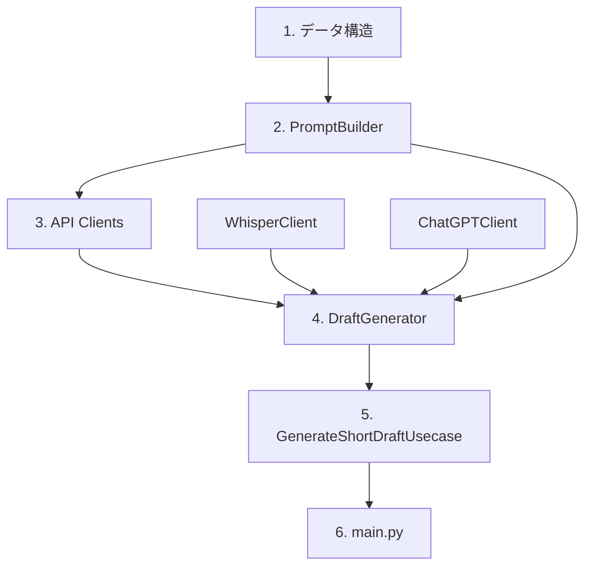

# ショート動画設計図生成プロジェクト - 実装手順書

> **注意**: プロジェクトの全体像については [`project/summary.md`](../project/summary.md) を参照してください。

## 実装手順

### 実装戦略

構成の末端（依存関係の最下層）から実装し、各段階でIntegration Testによる動作検証を行います。

**テスト方針**:
- `INTEGRATION_TEST=true` 環境変数が設定されている場合のみ、実際のLLM APIを使用したテストを実行
- CIでは実行せず、開発者のローカル環境でのみ実行
- モックを使った単体テストは優先度が低いため、Integration Test中心で進める

### 実装順序



### Phase 1: データ構造の実装

**実装対象**:
- `TranscriptionSegment`
- `TranscriptionResult`
- `ShortVideoProposal`
- `DraftResult`
- `GenerateResult`

**実装ファイル**:
```
src/models/
├── __init__.py
├── transcription.py
├── draft.py
└── result.py
```

**テスト内容**:
- データクラスの基本的な生成・アクセステスト
- バリデーション機能のテスト

**完了条件**:
- 全データ構造が定義され、型チェック（mypy）が通る
- 基本的なデータ操作テストが通る

### Phase 2: PromptBuilderの実装

**実装対象**:
- `PromptBuilder`クラス
- `build_draft_prompt`メソッド

**実装ファイル**:
```
src/builders/
├── __init__.py
└── prompt_builder.py
```

**テスト内容**:
- サンプルの`TranscriptionResult`からプロンプト生成テスト
- プロンプトの形式・内容検証

**完了条件**:
- 文字起こし結果から適切なプロンプトが生成される
- プロンプトの品質が手動確認で妥当

### Phase 3: API Clientsの実装

#### 3-1: WhisperClientの実装

**実装対象**:
- `WhisperClient`クラス
- `transcribe`メソッド
- 音声抽出機能（ffmpeg連携）

**実装ファイル**:
```
src/clients/
├── __init__.py
└── whisper_client.py
```

**テスト内容** (`INTEGRATION_TEST=true`):
- 実際の音声ファイルでWhisper API呼び出しテスト
- タイムスタンプ付きセグメント生成テスト
- エラーハンドリング（不正ファイル、API障害）テスト

**完了条件**:
- 実際の音声ファイルから正確な文字起こしが取得できる
- タイムスタンプが適切に設定される

#### 3-2: ChatGPTClientの実装

**実装対象**:
- `ChatGPTClient`クラス
- `generate_draft`メソッド

**実装ファイル**:
```
src/clients/
└── chatgpt_client.py
```

**テスト内容** (`INTEGRATION_TEST=true`):
- 実際のプロンプトでChatGPT API呼び出しテスト
- 企画書形式の出力検証テスト
- レート制限・エラーハンドリングテスト

**完了条件**:
- 実際のプロンプトから構造化された企画書が生成される
- API呼び出しが安定して動作する

### Phase 4: DraftGeneratorの実装

**実装対象**:
- `DraftGenerator`クラス
- `generate_draft`メソッド
- 中間データ管理機能

**実装ファイル**:
```
src/service/
├── __init__.py
└── draft_generator.py
```

**テスト内容** (`INTEGRATION_TEST=true`):
- 実際の動画ファイルを使用したエンドツーエンドテスト
- WhisperClient → PromptBuilder → ChatGPTClientの連携テスト
- 中間ファイル（文字起こし_{video_name}.json）の生成・保存テスト

**完了条件**:
- 動画ファイルから企画書まで一貫した処理が動作する
- 中間データが適切に保存・管理される

### Phase 5: GenerateShortDraftUsecaseの実装

**実装対象**:
- `GenerateShortDraftUsecase`クラス
- `execute`メソッド
- 入力検証・出力ファイル管理

**実装ファイル**:
```
src/usecases/
├── __init__.py
└── generate_short_draft_usecase.py
```

**テスト内容** (`INTEGRATION_TEST=true`):
- 実際の動画ファイルでの全体フローテスト
- 出力ファイル（企画案_{video_name}.md, 字幕_{video_name}.srt）の生成テスト
- エラーケース（存在しないファイル、権限エラー）テスト

**完了条件**:
- 動画ファイルから最終出力まで完全に動作する
- エラーハンドリングが適切に機能する

### Phase 6: main.pyの実装

**実装対象**:
- CLIインターフェース
- 引数解析・バリデーション
- DIコンテナの初期化

**実装ファイル**:
```
src/
└── main.py
```

**テスト内容** (`INTEGRATION_TEST=true`):
- コマンドライン実行での全体動作テスト
- 各種オプション・引数の動作確認
- 実際の使用シナリオでのテスト

**完了条件**:
- CLIとして完全に動作する
- ユーザビリティが確保されている

### 各Phase共通のテスト設定

#### テスト環境設定

**pytest設定** (`pytest.ini`):
```ini
[tool:pytest]
markers =
    integration: marks tests as integration tests (deselect with '-m "not integration"')
```

**テスト実行方法**:
```bash
# Integration Testを含む全テスト実行
INTEGRATION_TEST=true pytest

# Integration Testを除外して実行（CI用）
pytest -m "not integration"
```

#### 必要な環境変数

**開発・テスト用** (`.env.test`):
```
OPENAI_API_KEY=your_test_api_key
CHATGPT_MODEL=gpt-4
WHISPER_MODEL=whisper-1
INTEGRATION_TEST=true
```

#### テストデータ

**準備するテストファイル**:
```
tests/fixtures/
├── sample_video.mp4      # 短い動画ファイル（30秒程度）
├── sample_audio.wav      # 音声ファイル
└── expected_outputs/     # 期待される出力例
    ├── 企画案_sample.md
    └── 字幕_sample.srt
```

### 実装完了の判定基準

各Phaseで以下の条件を満たした場合に次のPhaseに進む：

1. **コード品質**:
   - mypy型チェックが通る
   - flake8リンターが通る
   - blackフォーマッターが適用されている

2. **テスト**:
   - Integration Testが全て通る
   - 手動での動作確認が完了している

3. **ドキュメント**:
   - 各クラス・メソッドにdocstringが記載されている
   - README.mdの該当部分が更新されている

### トラブルシューティング

#### API制限への対応
- OpenAI APIのレート制限に注意
- テスト実行時は適切な間隔を空ける
- API呼び出し失敗時のリトライ機能を実装

#### 開発効率化
- 各Phaseで中間出力を保存し、次回実行時に再利用
- テスト用の短い動画ファイルを使用
- ログ出力を充実させ、デバッグを容易にする

この実装手順により、依存関係の下位から段階的に実装し、各段階で実際のAPIを使用した動作検証を行うことで、確実に動作するシステムを構築できます。
