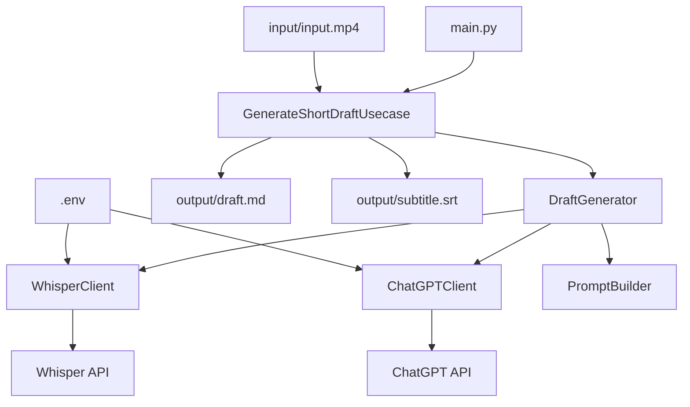

# ショート動画設計図生成プロジェクト設計書

## プロジェクト概要

単一の動画ファイルを入力として、ショート動画作成用の設計図（企画書）を自動生成するPythonプロジェクト。

### 主要機能
- 動画ファイルからWhisper APIを使用した音声文字起こし
- ChatGPT APIを使用したショート動画企画書の生成
- 切り抜き箇所（開始・終了時刻）、タイトル案、キャプション案を含むマークダウン形式の企画書出力
- SRT形式の字幕ファイル出力

### 技術要件
- Python 3.8+
- Poetry（パッケージ管理）
- mypy（型チェック）
- 依存性注入（DI）パターンの採用
- ローカルCLIとして動作

## システムアーキテクチャ

### 全体構成図



### レイヤー構成

1. **Presentation Layer** (`main.py`)
   - CLIインターフェース
   - 引数解析とバリデーション

2. **Application Layer** (`usecases/`)
   - ビジネスロジックの調整
   - 各サービスの呼び出し順序制御

3. **Domain Layer** (`service/`)
   - コアビジネスロジック
   - データ変換処理

4. **Infrastructure Layer** (`clients/`, `builders/`)
   - 外部API連携
   - プロンプト生成

## クラス設計

### 1. GenerateShortDraftUsecase
```python
class GenerateShortDraftUsecase:
    def __init__(self, draft_generator: DraftGenerator) -> None
    def execute(self, video_path: str, output_dir: str) -> GenerateResult
```

**責務**:
- ショート動画企画書生成の全体フローを制御
- 入力検証と出力ファイル管理

### 2. DraftGenerator
```python
class DraftGenerator:
    def __init__(
        self,
        whisper_client: WhisperClient,
        chatgpt_client: ChatGPTClient,
        prompt_builder: PromptBuilder
    ) -> None
    def generate_draft(self, video_path: str) -> DraftResult
```

**責務**:
- 音声文字起こしとAI企画書生成の調整
- 中間データの管理

### 3. WhisperClient
```python
class WhisperClient:
    def __init__(self, api_key: str) -> None
    def transcribe(self, audio_path: str) -> TranscriptionResult
```

**責務**:
- Whisper APIとの通信
- 音声ファイルの文字起こし
- タイムスタンプ付きテキストの生成

### 4. ChatGPTClient
```python
class ChatGPTClient:
    def __init__(self, api_key: str, model: str = "gpt-4") -> None
    def generate_draft(self, prompt: str) -> str
```

**責務**:
- ChatGPT APIとの通信
- 企画書テキストの生成

### 5. PromptBuilder
```python
class PromptBuilder:
    def build_draft_prompt(self, transcription: TranscriptionResult) -> str
```

**責務**:
- ChatGPT用プロンプトの構築
- 文字起こし結果の整形

## データ構造

### TranscriptionResult
```python
@dataclass
class TranscriptionSegment:
    start_time: float
    end_time: float
    text: str

@dataclass
class TranscriptionResult:
    segments: List[TranscriptionSegment]
    full_text: str
```

### DraftResult
```python
@dataclass
class ShortVideoProposal:
    title: str
    start_time: float
    end_time: float
    caption: str
    key_points: List[str]

@dataclass
class DraftResult:
    proposals: List[ShortVideoProposal]
    original_transcription: TranscriptionResult
```

### GenerateResult
```python
@dataclass
class GenerateResult:
    draft_file_path: str
    subtitle_file_path: str
    success: bool
    error_message: Optional[str] = None
```

## 処理フロー詳細

### メイン処理フロー
1. **入力検証** (`main.py`)
   - 動画ファイルの存在確認
   - 出力ディレクトリの作成

2. **音声抽出・文字起こし** (`WhisperClient`)
   - 動画から音声抽出（ffmpeg使用）
   - Whisper APIで文字起こし実行
   - タイムスタンプ付きセグメント生成

3. **企画書生成** (`ChatGPTClient` + `PromptBuilder`)
   - 文字起こし結果からプロンプト構築
   - ChatGPT APIで企画書生成
   - 構造化データへの変換

4. **ファイル出力** (`DraftGenerator`)
   - マークダウン形式の企画書出力
   - SRT形式の字幕ファイル出力

### エラーハンドリング
- API呼び出し失敗時のリトライ機能
- 不正な動画ファイル形式の検出
- ネットワークエラーの適切な処理

## ディレクトリ構造

```
shortmovie-draft-generator2/
├── pyproject.toml
├── README.md
├── .env.example
├── .gitignore
├── src/
│   ├── __init__.py
│   ├── main.py
│   ├── usecases/
│   │   ├── __init__.py
│   │   └── generate_short_draft_usecase.py
│   ├── service/
│   │   ├── __init__.py
│   │   └── draft_generator.py
│   ├── clients/
│   │   ├── __init__.py
│   │   ├── chatgpt_client.py
│   │   └── whisper_client.py
│   └── builders/
│       ├── __init__.py
│       └── prompt_builder.py
├── tests/
│   ├── __init__.py
│   ├── test_usecases/
│   ├── test_service/
│   ├── test_clients/
│   └── test_builders/
├── input/
│   ├── .gitkeep
│   └── input.mp4 (gitignore)
├── intermediate/
│   ├── .gitkeep
│   ├── audio.wav (gitignore)
│   └── transcription.json (gitignore)
└── output/
    ├── .gitkeep
    ├── draft.md (gitignore)
    └── subtitle.srt (gitignore)
```

## 設定管理

### 環境変数 (.env)
```
OPENAI_API_KEY=your_openai_api_key_here
CHATGPT_MODEL=gpt-4
WHISPER_MODEL=whisper-1
```

### 依存関係 (pyproject.toml)
```toml
[tool.poetry.dependencies]
python = "^3.8"
openai = "^1.0.0"
python-dotenv = "^1.0.0"
click = "^8.0.0"
ffmpeg-python = "^0.2.0"

[tool.poetry.group.dev.dependencies]
mypy = "^1.0.0"
pytest = "^7.0.0"
black = "^23.0.0"
flake8 = "^6.0.0"
```

## 出力形式

### 企画書 (draft.md)
```markdown
# ショート動画企画書

## 動画情報
- 元動画: input.mp4
- 生成日時: 2025-01-09 23:53:00

## 提案1: [タイトル]
- **開始時刻**: 00:01:30
- **終了時刻**: 00:02:00
- **キャプション**: [キャプション内容]
- **キーポイント**:
  - ポイント1
  - ポイント2

## 提案2: [タイトル]
...
```

### 字幕ファイル (subtitle.srt)
```
1
00:00:00,000 --> 00:00:03,000
[文字起こし内容1]

2
00:00:03,000 --> 00:00:06,000
[文字起こし内容2]
```

## 将来拡張への考慮

### Google Drive連携
- `clients/`に`GoogleDriveClient`を追加
- 入出力パスをGoogle Drive URLに対応

### Cloud Functions / GitHub Actions対応
- 環境変数による設定切り替え
- ログ出力の標準化
- バッチ処理モードの追加

## 依存性注入の実装

### DIコンテナ
```python
class DIContainer:
    def __init__(self) -> None:
        self._whisper_client = WhisperClient(os.getenv("OPENAI_API_KEY"))
        self._chatgpt_client = ChatGPTClient(os.getenv("OPENAI_API_KEY"))
        self._prompt_builder = PromptBuilder()
        self._draft_generator = DraftGenerator(
            self._whisper_client,
            self._chatgpt_client,
            self._prompt_builder
        )
        self._usecase = GenerateShortDraftUsecase(self._draft_generator)

    def get_usecase(self) -> GenerateShortDraftUsecase:
        return self._usecase
```

この設計により、テスタビリティが向上し、将来的な機能拡張にも柔軟に対応できます。
