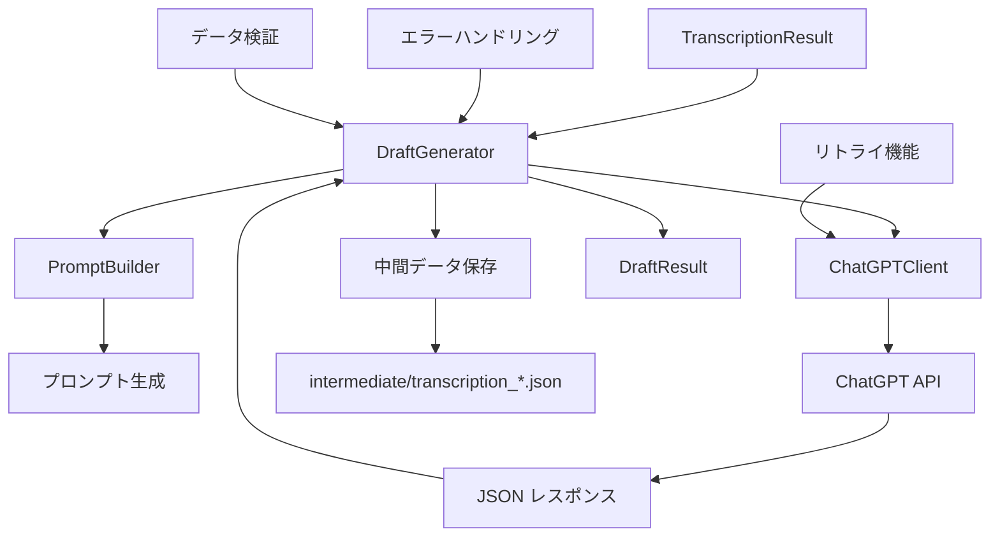
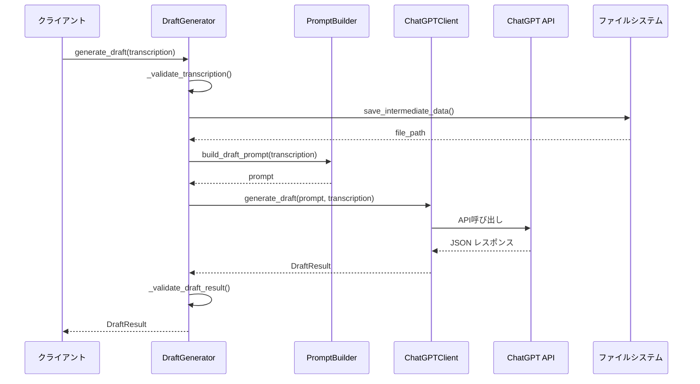

# Phase4: DraftGenerator実装設計書

## 概要

ショート動画設計図生成プロジェクトのPhase4として、文字起こし結果からAI企画書生成への変換を担当する`DraftGenerator`クラスを実装します。
Phase2の`PromptBuilder`とPhase3の`ChatGPTClient`を組み合わせて、`TranscriptionResult`から`DraftResult`への変換を行います。

## 実装対象

### 1. ディレクトリ構造

```
src/
├── __init__.py
├── models/          # Phase1で実装済み
├── builders/        # Phase2で実装予定
├── clients/         # Phase3で実装予定
└── service/
    ├── __init__.py
    └── draft_generator.py    # 新規実装
```

### 2. DraftGeneratorクラスの設計

#### 2.1 基本仕様

```python
from typing import Optional, Dict, Any
import json
import os
from pathlib import Path
from ..models.transcription import TranscriptionResult
from ..models.draft import DraftResult
from ..builders.prompt_builder import PromptBuilder
from ..clients.chatgpt_client import ChatGPTClient

class DraftGenerator:
    """企画書生成サービス

    文字起こし結果からAI企画書生成への変換を担当します。
    PromptBuilderでプロンプトを構築し、ChatGPTClientで企画書を生成し、
    中間データの管理も行います。

    Attributes:
        chatgpt_client: ChatGPT APIクライアント
        prompt_builder: プロンプト構築クラス
        intermediate_dir: 中間ファイル保存ディレクトリ

    Example:
        >>> from src.builders.prompt_builder import PromptBuilder
        >>> from src.clients.chatgpt_client import ChatGPTClient
        >>> prompt_builder = PromptBuilder()
        >>> chatgpt_client = ChatGPTClient("your-api-key")
        >>> generator = DraftGenerator(chatgpt_client, prompt_builder)
        >>> result = generator.generate_draft(transcription)
        >>> print(f"生成された企画数: {len(result.proposals)}")
    """

    def __init__(
        self,
        chatgpt_client: ChatGPTClient,
        prompt_builder: PromptBuilder,
        intermediate_dir: Optional[str] = None
    ) -> None:
        """DraftGeneratorを初期化

        Args:
            chatgpt_client: ChatGPT APIクライアント
            prompt_builder: プロンプト構築クラス
            intermediate_dir: 中間ファイル保存ディレクトリ（Noneの場合は"intermediate/"）

        Raises:
            ValueError: 引数が無効な場合
            OSError: 中間ディレクトリの作成に失敗した場合
        """

    def generate_draft(self, transcription: TranscriptionResult) -> DraftResult:
        """文字起こし結果から企画書を生成

        Args:
            transcription: 文字起こし結果

        Returns:
            企画書生成結果（DraftResult）

        Raises:
            DraftGenerationError: 企画書生成に失敗した場合
            IntermediateFileError: 中間ファイルの保存に失敗した場合
        """
```

#### 2.2 中間データ管理機能

```python
def save_intermediate_data(
    self,
    transcription: TranscriptionResult,
    filename: Optional[str] = None
) -> str:
    """中間データ（文字起こし結果）をJSONファイルに保存

    Args:
        transcription: 保存する文字起こし結果
        filename: 保存ファイル名（Noneの場合は自動生成）

    Returns:
        保存されたファイルのパス

    Raises:
        IntermediateFileError: ファイル保存に失敗した場合
    """

def load_intermediate_data(self, file_path: str) -> TranscriptionResult:
    """中間データファイルから文字起こし結果を読み込み

    Args:
        file_path: 読み込むファイルのパス

    Returns:
        読み込まれた文字起こし結果

    Raises:
        FileNotFoundError: ファイルが存在しない場合
        IntermediateFileError: ファイル読み込みに失敗した場合
    """
```

### 3. データ構造の拡張

#### 3.1 ShortVideoProposalクラスの更新

Phase3の設計に基づいて、既存の`ShortVideoProposal`クラスに新しいフィールドを追加する必要があります：

```python
@dataclass
class ShortVideoProposal:
    """ショート動画の企画提案（拡張版）"""
    title: str                    # 動画タイトル
    start_time: float            # 切り抜き開始時刻（秒）
    end_time: float              # 切り抜き終了時刻（秒）
    caption: str                 # キャプション
    key_points: List[str]        # キーポイントのリスト
    first_impact: str            # 冒頭2秒のインパクトフレーズ（新規追加）
    last_conclusion: str         # 最後の結論・オチ（新規追加）
    summary: str                 # 動画の主題（新規追加）
```

### 4. エラーハンドリング設計

#### 4.1 カスタム例外クラス

```python
class DraftGeneratorError(Exception):
    """DraftGenerator関連のベース例外"""
    pass

class DraftGenerationError(DraftGeneratorError):
    """企画書生成エラー"""
    def __init__(self, message: str, cause: Optional[Exception] = None):
        super().__init__(message)
        self.cause = cause

class IntermediateFileError(DraftGeneratorError):
    """中間ファイル操作エラー"""
    def __init__(self, message: str, file_path: str, operation: str):
        super().__init__(message)
        self.file_path = file_path
        self.operation = operation  # "save" or "load"

class ValidationError(DraftGeneratorError):
    """データ検証エラー"""
    def __init__(self, message: str, field_name: Optional[str] = None):
        super().__init__(message)
        self.field_name = field_name
```

#### 4.2 エラー処理とリトライ機能

```python
def _generate_draft_with_retry(
    self,
    prompt: str,
    transcription: TranscriptionResult,
    max_retries: int = 2
) -> DraftResult:
    """リトライ機能付き企画書生成

    Args:
        prompt: 生成されたプロンプト
        transcription: 元の文字起こし結果
        max_retries: 最大リトライ回数

    Returns:
        企画書生成結果

    Raises:
        DraftGenerationError: 最大リトライ回数を超えた場合
    """
```

### 5. 実装仕様

#### 5.1 src/service/__init__.py

```python
"""ビジネスロジックサービスパッケージ"""

from .draft_generator import DraftGenerator, DraftGeneratorError, DraftGenerationError, IntermediateFileError

__all__ = [
    "DraftGenerator",
    "DraftGeneratorError",
    "DraftGenerationError",
    "IntermediateFileError",
]
```

#### 5.2 src/service/draft_generator.py

```python
"""企画書生成サービスモジュール"""

import json
import os
from datetime import datetime
from pathlib import Path
from typing import Optional, Dict, Any

from ..models.transcription import TranscriptionResult, TranscriptionSegment
from ..models.draft import DraftResult, ShortVideoProposal
from ..builders.prompt_builder import PromptBuilder
from ..clients.chatgpt_client import ChatGPTClient, ChatGPTClientError


class DraftGeneratorError(Exception):
    """DraftGenerator関連のベース例外"""
    pass


class DraftGenerationError(DraftGeneratorError):
    """企画書生成エラー"""
    def __init__(self, message: str, cause: Optional[Exception] = None):
        super().__init__(message)
        self.cause = cause


class IntermediateFileError(DraftGeneratorError):
    """中間ファイル操作エラー"""
    def __init__(self, message: str, file_path: str, operation: str):
        super().__init__(message)
        self.file_path = file_path
        self.operation = operation


class ValidationError(DraftGeneratorError):
    """データ検証エラー"""
    def __init__(self, message: str, field_name: Optional[str] = None):
        super().__init__(message)
        self.field_name = field_name


class DraftGenerator:
    """企画書生成サービス

    文字起こし結果からAI企画書生成への変換を担当します。
    PromptBuilderでプロンプトを構築し、ChatGPTClientで企画書を生成し、
    中間データの管理も行います。

    Example:
        >>> from src.builders.prompt_builder import PromptBuilder
        >>> from src.clients.chatgpt_client import ChatGPTClient
        >>> prompt_builder = PromptBuilder()
        >>> chatgpt_client = ChatGPTClient("your-api-key")
        >>> generator = DraftGenerator(chatgpt_client, prompt_builder)
        >>> result = generator.generate_draft(transcription)
        >>> print(f"生成された企画数: {len(result.proposals)}")
        生成された企画数: 5
    """

    def __init__(
        self,
        chatgpt_client: ChatGPTClient,
        prompt_builder: PromptBuilder,
        intermediate_dir: Optional[str] = None
    ) -> None:
        """DraftGeneratorを初期化

        Args:
            chatgpt_client: ChatGPT APIクライアント
            prompt_builder: プロンプト構築クラス
            intermediate_dir: 中間ファイル保存ディレクトリ

        Raises:
            ValueError: 引数が無効な場合
            OSError: 中間ディレクトリの作成に失敗した場合
        """
        if not chatgpt_client:
            raise ValueError("ChatGPTClientが指定されていません")
        if not prompt_builder:
            raise ValueError("PromptBuilderが指定されていません")

        self.chatgpt_client = chatgpt_client
        self.prompt_builder = prompt_builder

        # 中間ディレクトリの設定
        if intermediate_dir:
            self.intermediate_dir = Path(intermediate_dir)
        else:
            self.intermediate_dir = Path("intermediate")

        # ディレクトリの作成
        try:
            self.intermediate_dir.mkdir(parents=True, exist_ok=True)
        except OSError as e:
            raise OSError(f"中間ディレクトリの作成に失敗しました: {self.intermediate_dir} - {str(e)}")

    def generate_draft(self, transcription: TranscriptionResult) -> DraftResult:
        """文字起こし結果から企画書を生成

        Args:
            transcription: 文字起こし結果

        Returns:
            企画書生成結果（DraftResult）

        Raises:
            DraftGenerationError: 企画書生成に失敗した場合
            IntermediateFileError: 中間ファイルの保存に失敗した場合
        """
        try:
            # 入力データの検証
            self._validate_transcription(transcription)

            # 中間データの保存
            intermediate_file = self.save_intermediate_data(transcription)

            # プロンプトの構築
            prompt = self.prompt_builder.build_draft_prompt(transcription)

            # 企画書生成（リトライ機能付き）
            draft_result = self._generate_draft_with_retry(prompt, transcription)

            return draft_result

        except ChatGPTClientError as e:
            raise DraftGenerationError(f"ChatGPT APIでの企画書生成に失敗しました: {str(e)}", cause=e)
        except Exception as e:
            raise DraftGenerationError(f"企画書生成中に予期しないエラーが発生しました: {str(e)}", cause=e)

    def save_intermediate_data(
        self,
        transcription: TranscriptionResult,
        filename: Optional[str] = None
    ) -> str:
        """中間データ（文字起こし結果）をJSONファイルに保存

        Args:
            transcription: 保存する文字起こし結果
            filename: 保存ファイル名（Noneの場合は自動生成）

        Returns:
            保存されたファイルのパス

        Raises:
            IntermediateFileError: ファイル保存に失敗した場合
        """
        try:
            # ファイル名の生成
            if not filename:
                timestamp = datetime.now().strftime("%Y%m%d_%H%M%S")
                filename = f"transcription_{timestamp}.json"

            file_path = self.intermediate_dir / filename

            # データの辞書形式への変換
            data = {
                "segments": [
                    {
                        "start_time": segment.start_time,
                        "end_time": segment.end_time,
                        "text": segment.text
                    }
                    for segment in transcription.segments
                ],
                "full_text": transcription.full_text,
                "created_at": datetime.now().isoformat()
            }

            # JSONファイルに保存
            with open(file_path, 'w', encoding='utf-8') as f:
                json.dump(data, f, ensure_ascii=False, indent=2)

            return str(file_path)

        except Exception as e:
            raise IntermediateFileError(
                f"中間データの保存に失敗しました: {str(e)}",
                str(file_path) if 'file_path' in locals() else filename or "unknown",
                "save"
            )

    def load_intermediate_data(self, file_path: str) -> TranscriptionResult:
        """中間データファイルから文字起こし結果を読み込み

        Args:
            file_path: 読み込むファイルのパス

        Returns:
            読み込まれた文字起こし結果

        Raises:
            FileNotFoundError: ファイルが存在しない場合
            IntermediateFileError: ファイル読み込みに失敗した場合
        """
        if not os.path.exists(file_path):
            raise FileNotFoundError(f"中間データファイルが見つかりません: {file_path}")

        try:
            with open(file_path, 'r', encoding='utf-8') as f:
                data = json.load(f)

            # データの検証
            if "segments" not in data or "full_text" not in data:
                raise IntermediateFileError(
                    "中間データファイルの形式が不正です",
                    file_path,
                    "load"
                )

            # TranscriptionSegmentオブジェクトの復元
            segments = []
            for segment_data in data["segments"]:
                segment = TranscriptionSegment(
                    start_time=float(segment_data["start_time"]),
                    end_time=float(segment_data["end_time"]),
                    text=segment_data["text"]
                )
                segments.append(segment)

            return TranscriptionResult(
                segments=segments,
                full_text=data["full_text"]
            )

        except json.JSONDecodeError as e:
            raise IntermediateFileError(
                f"JSONファイルの解析に失敗しました: {str(e)}",
                file_path,
                "load"
            )
        except Exception as e:
            raise IntermediateFileError(
                f"中間データの読み込みに失敗しました: {str(e)}",
                file_path,
                "load"
            )

    def _generate_draft_with_retry(
        self,
        prompt: str,
        transcription: TranscriptionResult,
        max_retries: int = 2
    ) -> DraftResult:
        """リトライ機能付き企画書生成

        Args:
            prompt: 生成されたプロンプト
            transcription: 元の文字起こし結果
            max_retries: 最大リトライ回数

        Returns:
            企画書生成結果

        Raises:
            DraftGenerationError: 最大リトライ回数を超えた場合
        """
        last_exception = None

        for attempt in range(max_retries + 1):
            try:
                # ChatGPT APIで企画書生成
                draft_result = self.chatgpt_client.generate_draft(prompt, transcription)

                # 生成結果の検証
                self._validate_draft_result(draft_result)

                return draft_result

            except Exception as e:
                last_exception = e

                # 最後の試行でない場合は続行
                if attempt < max_retries:
                    continue

        # 最大リトライ回数を超えた場合
        raise DraftGenerationError(
            f"企画書生成が{max_retries + 1}回失敗しました: {str(last_exception)}",
            cause=last_exception
        )

    def _validate_transcription(self, transcription: TranscriptionResult) -> None:
        """文字起こし結果の妥当性をチェック

        Args:
            transcription: 検証する文字起こし結果

        Raises:
            ValidationError: データが無効な場合
        """
        if not transcription:
            raise ValidationError("文字起こし結果がNullです")

        if not transcription.segments:
            raise ValidationError("セグメントが空です")

        if not transcription.full_text or not transcription.full_text.strip():
            raise ValidationError("全体テキストが空です")

        # セグメントの妥当性チェック
        for i, segment in enumerate(transcription.segments):
            if segment.start_time < 0:
                raise ValidationError(f"セグメント{i}の開始時刻が負の値です: {segment.start_time}")

            if segment.end_time <= segment.start_time:
                raise ValidationError(f"セグメント{i}の終了時刻が開始時刻以下です: {segment.end_time} <= {segment.start_time}")

            if not segment.text or not segment.text.strip():
                raise ValidationError(f"セグメント{i}のテキストが空です")

    def _validate_draft_result(self, draft_result: DraftResult) -> None:
        """企画書生成結果の妥当性をチェック

        Args:
            draft_result: 検証する企画書生成結果

        Raises:
            ValidationError: データが無効な場合
        """
        if not draft_result:
            raise ValidationError("企画書生成結果がNullです")

        if not draft_result.proposals:
            raise ValidationError("企画提案が空です")

        if len(draft_result.proposals) != 5:
            raise ValidationError(f"企画提案は5個である必要があります（実際: {len(draft_result.proposals)}個）")

        # 各企画提案の妥当性チェック
        for i, proposal in enumerate(draft_result.proposals):
            if not proposal.title or not proposal.title.strip():
                raise ValidationError(f"企画提案{i+1}のタイトルが空です")

            if proposal.start_time < 0:
                raise ValidationError(f"企画提案{i+1}の開始時刻が負の値です: {proposal.start_time}")

            if proposal.end_time <= proposal.start_time:
                raise ValidationError(f"企画提案{i+1}の終了時刻が開始時刻以下です: {proposal.end_time} <= {proposal.start_time}")

            # 60秒以内の制限チェック
            duration = proposal.end_time - proposal.start_time
            if duration > 60:
                raise ValidationError(f"企画提案{i+1}の長さが60秒を超えています: {duration}秒")

            if not proposal.caption or not proposal.caption.strip():
                raise ValidationError(f"企画提案{i+1}のキャプションが空です")

            if not proposal.key_points:
                raise ValidationError(f"企画提案{i+1}のキーポイントが空です")
```

### 6. テスト設計

#### 6.1 テスト構造

```
tests/
├── __init__.py
├── test_models/     # Phase1で実装済み
├── test_builders/   # Phase2で実装予定
├── test_clients/    # Phase3で実装予定
└── test_service/
    ├── __init__.py
    └── test_draft_generator.py    # 新規実装
```

#### 6.2 テスト内容

##### 6.2.1 基本機能テスト

```python
class TestDraftGenerator:
    """DraftGeneratorの基本機能テスト"""

    def test_instance_creation(self):
        """インスタンス生成テスト"""
        chatgpt_client = Mock(spec=ChatGPTClient)
        prompt_builder = Mock(spec=PromptBuilder)

        generator = DraftGenerator(chatgpt_client, prompt_builder)

        assert generator.chatgpt_client == chatgpt_client
        assert generator.prompt_builder == prompt_builder
        assert generator.intermediate_dir.name == "intermediate"

    def test_instance_creation_with_custom_dir(self):
        """カスタムディレクトリ指定でのインスタンス生成テスト"""
        chatgpt_client = Mock(spec=ChatGPTClient)
        prompt_builder = Mock(spec=PromptBuilder)
        custom_dir = "custom_intermediate"

        generator = DraftGenerator(chatgpt_client, prompt_builder, custom_dir)

        assert str(generator.intermediate_dir) == custom_dir

    def test_invalid_arguments(self):
        """無効な引数でのエラーテスト"""
        with pytest.raises(ValueError, match="ChatGPTClientが指定されていません"):
            DraftGenerator(None, Mock(spec=PromptBuilder))

        with pytest.raises(ValueError, match="PromptBuilderが指定されていません"):
            DraftGenerator(Mock(spec=ChatGPTClient), None)
```

##### 6.2.2 中間データ管理テスト

```python
class TestIntermediateDataManagement:
    """中間データ管理機能テスト"""

    def test_save_intermediate_data(self, temp_dir):
        """中間データ保存テスト"""
        generator = self._create_generator(temp_dir)
        transcription = self._create_sample_transcription()

        file_path = generator.save_intermediate_data(transcription)

        assert os.path.exists(file_path)
        assert file_path.endswith(".json")

    def test_load_intermediate_data(self, temp_dir):
        """中間データ読み込みテスト"""
        generator = self._create_generator(temp_dir)
        original_transcription = self._create_sample_transcription()

        # 保存
        file_path = generator.save_intermediate_data(original_transcription)

        # 読み込み
        loaded_transcription = generator.load_intermediate_data(file_path)

        assert loaded_transcription.full_text == original_transcription.full_text
        assert len(loaded_transcription.segments) == len(original_transcription.segments)

    def test_load_nonexistent_file(self):
        """存在しないファイルの読み込みエラーテスト"""
        generator = self._create_generator()

        with pytest.raises(FileNotFoundError):
            generator.load_intermediate_data("nonexistent.json")
```

##### 6.2.3 企画書生成テスト

```python
class TestDraftGeneration:
    """企画書生成機能テスト"""

    def test_generate_draft_success(self):
        """正常な企画書生成テスト"""
        # モックの設定
        chatgpt_client = Mock(spec=ChatGPTClient)
        prompt_builder = Mock(spec=PromptBuilder)

        sample_prompt = "サンプルプロンプト"
        sample_draft_result = self._create_sample_draft_result()

        prompt_builder.build_draft_prompt.return_value = sample_prompt
        chatgpt_client.generate_draft.return_value = sample_draft_result

        # テスト実行
        generator = DraftGenerator(chatgpt_client, prompt_builder)
        transcription = self._create_sample_transcription()

        result = generator.generate_draft(transcription)

        # 検証
        assert result == sample_draft_result
        prompt_builder.build_draft_prompt.assert_called_once_with(transcription)
        chatgpt_client.generate_draft.assert_called_once_with(sample_prompt, transcription)

    def test_generate_draft_with_retry(self):
        """リトライ機能付き企画書生成テスト"""
        chatgpt_client = Mock(spec=ChatGPTClient)
        prompt_builder = Mock(spec=PromptBuilder)

        # 最初の呼び出しは失敗、2回目は成功
        sample_draft_result = self._create_sample_draft_result()
        chatgpt_client.generate_draft.side_effect = [
            Exception("一時的なエラー"),
            sample_draft_result
        ]

        generator = DraftGenerator(chatgpt_client, prompt_builder)
        transcription = self._create_sample_transcription()

        result = generator.generate_draft(transcription)

        assert result == sample_draft_result
        assert chatgpt_client.generate_draft.call_count == 2
```

#### 6.3 Integration Test設計

##### 6.3.1 実際のAPI連携テスト

```python
@pytest.mark.integration
class TestDraftGeneratorIntegration:
    """DraftGeneratorの統合テスト"""

    def test_end_to_end_draft_generation(self):
        """エンドツーエンド企画書生成テスト"""
        # 実際のAPIキーを使用（環境変数から取得）
        api_key = os.getenv("OPENAI_API_KEY")
        if not api_key:
            pytest.skip("OPENAI_API_KEYが設定されていません")

        # 実際のクライアントを使用
        chatgpt_client = ChatGPTClient(api_key)
        prompt_builder = PromptBuilder()
        generator = DraftGenerator(chatgpt_client, prompt_builder)

        # テスト用の文字起こしデータ
        transcription = self._create_realistic_transcription()

        # 企画書生成実行
        result = generator.generate_draft(transcription)

        # 結果検証
        assert len(result.proposals) == 5
        for proposal in result.proposals:
            assert proposal.title
            assert proposal.caption
            assert proposal.key_points
            assert proposal.start_time >= 0
            assert proposal.end_time > proposal.start_time
            assert (proposal.end_time - proposal.start_time) <= 60
```

### 7. 実装手順

#### Phase 4.1: 基本クラス実装
1. `src/service/`ディレクトリの作成
2. `draft_generator.py`の基本クラス実装
3. `__init__.py`の実装
4. 基本的なインスタンス生成テスト

#### Phase 4.2: 中間データ管理機能実装
1. 中間ディレクトリ管理機能の実装
2. JSON形式での保存・読み込み機能の実装
3. ファイル操作のエラーハンドリング実装
4. 中間データ管理機能のテスト実装

#### Phase 4.3: 企画書生成機能実装
1. `generate_draft`メソッドの実装
2. リトライ機能の実装
3. データ検証機能の実装
4. 企画書生成機能のテスト実装

#### Phase 4.4: データ構造更新
1. `ShortVideoProposal`クラスの拡張フィールド追加
2. 既存テストの更新
3. 新しいフィールドに対応したテストの追加

#### Phase 4.5: 統合テスト実装
1. Phase2, Phase3との連携テスト実装
2. 実際のAPI呼び出しを含む統合テスト実装
3. エラーケースの統合テスト実装

### 8. 完了条件

#### 必須条件
- [ ] `DraftGenerator`クラスが正しく実装されている
- [ ] 文字起こし結果から企画書が正常に生成される
- [ ] 中間データの保存・読み込みが正常に動作する
- [ ] リトライ機能が正常に動作する
- [ ] `mypy`による型チェックが通る
- [ ] 基本的なテストが全て通る
- [ ] docstringが適切に記載されている

#### 品質条件
- [ ] コードが`black`でフォーマットされている
- [ ] `flake8`のリンターチェックが通る
- [ ] テストカバレッジが90

%以上
- [ ] 実際の使用パターンでの動作確認完了
- [ ] Phase2, Phase3との連携が正常に動作する

### 9. 手動テスト項目

#### 9.1 企画書生成品質確認
1. **企画提案数**: 固定で5個の企画が生成される
2. **時間制限**: 各企画が60秒以内の長さ
3. **必須フィールド**: `first_impact`, `last_conclusion`, `summary`が適切に設定される
4. **データ整合性**: 開始時刻 < 終了時刻の関係が保たれる

#### 9.2 中間データ管理確認
1. **保存機能**: JSON形式で正確に保存される
2. **読み込み機能**: 保存されたデータが正確に復元される
3. **ファイル命名**: タイムスタンプ付きの適切なファイル名が生成される
4. **エラー処理**: ファイル操作エラーが適切にハンドリングされる

#### 9.3 エラーハンドリング確認
1. **API障害**: ChatGPT APIの一時的な障害に対するリトライ機能
2. **データ検証**: 不正なデータに対する適切なエラーメッセージ
3. **ファイル操作**: 権限エラーやディスク容量不足への対応
4. **例外伝播**: 適切な例外チェーンが維持される

### 10. パフォーマンス考慮事項

#### 10.1 処理時間の最適化
- **中間データ保存**: 非同期処理の検討（将来拡張）
- **API呼び出し**: 適切なタイムアウト設定
- **メモリ使用量**: 大きなファイルの処理時のメモリ効率

#### 10.2 リソース管理
- **一時ファイル**: 処理完了後の適切なクリーンアップ
- **API制限**: OpenAI APIのレート制限への配慮
- **ディスク容量**: 中間ファイルの定期的なクリーンアップ機能

### 11. セキュリティ考慮事項

#### 11.1 データ保護
- **APIキー**: 環境変数での管理、ログ出力時のマスキング
- **中間データ**: 機密情報が含まれる可能性への配慮
- **ファイル権限**: 中間ファイルの適切なアクセス権限設定

#### 11.2 入力検証
- **文字起こしデータ**: 悪意のある入力に対する検証
- **ファイルパス**: パストラバーサル攻撃への対策
- **JSON解析**: 不正なJSONデータへの対応

### 12. 次フェーズへの引き継ぎ事項

#### Phase5（GenerateShortDraftUsecase実装）で必要となる情報
- `DraftGenerator`の使用方法とインターフェース
- 中間データファイルの管理方法
- エラーハンドリングのパターン
- パフォーマンス特性と制限事項

#### Phase6（main.py実装）で必要となる情報
- DIコンテナでの依存性注入方法
- 設定パラメータの管理方法
- ログ出力の統一方法
- エラーメッセージのユーザー向け表示

### 13. トラブルシューティング

#### 13.1 よくある問題と解決方法

**問題**: ChatGPT APIからのレスポンスが期待する形式でない
```bash
# 解決方法: プロンプトの見直しとバリデーション強化
# ログでレスポンス内容を確認
```

**問題**: 中間ファイルの保存に失敗する
```bash
# 解決方法: ディスク容量とファイル権限の確認
ls -la intermediate/
df -h
```

**問題**: 企画書生成が遅い
```bash
# 解決方法: API呼び出し回数の最適化
# リトライ間隔の調整
```

#### 13.2 ログ出力とデバッグ

```python
# ログ設定例
import logging

logging.basicConfig(
    level=logging.INFO,
    format='%(asctime)s - %(name)s - %(levelname)s - %(message)s'
)

# DraftGeneratorでのログ出力
logger = logging.getLogger(__name__)
logger.info(f"企画書生成開始: セグメント数={len(transcription.segments)}")
logger.debug(f"生成されたプロンプト長: {len(prompt)}")
```

### 14. 注意事項

#### 設計原則
- **単一責任**: 企画書生成に特化した責務
- **依存性注入**: テスタビリティの確保
- **エラー透明性**: 適切な例外情報の提供
- **拡張性**: 将来的な機能追加への対応

#### 実装時の注意点
- **API制限**: OpenAI APIの利用制限に注意
- **データ形式**: JSON形式の一貫性を保つ
- **エラーメッセージ**: 日本語で分かりやすく
- **テスト**: 実際のAPI呼び出しを含む統合テスト

### 15. 将来拡張への考慮

#### 15.1 機能拡張
- **複数モデル対応**: GPT-4以外のモデルへの対応
- **カスタムプロンプト**: ユーザー定義プロンプトの対応
- **バッチ処理**: 複数ファイルの一括処理
- **キャッシュ機能**: 同一入力に対する結果キャッシュ

#### 15.2 パフォーマンス改善
- **並列処理**: 複数企画の並列生成
- **ストリーミング**: リアルタイム結果表示
- **圧縮**: 中間ファイルの圧縮保存
- **インデックス**: 中間ファイルの検索機能

この設計書に基づいて実装を進めることで、堅牢で拡張性の高いDraftGeneratorクラスを構築できます。Phase2とPhase3の実装完了後に、この設計に従って実装を開始してください。

## システム構成図



## データフロー図


