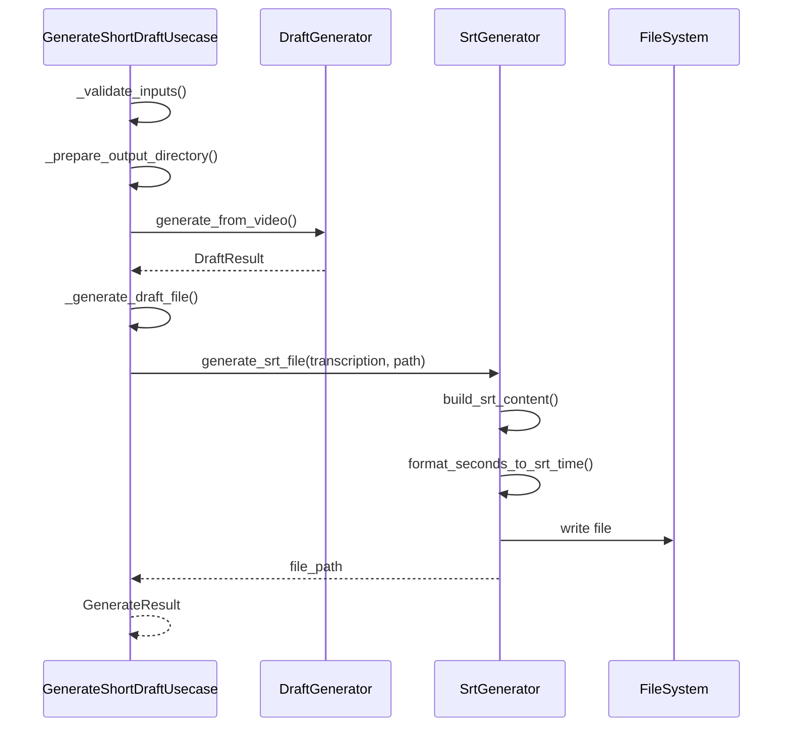
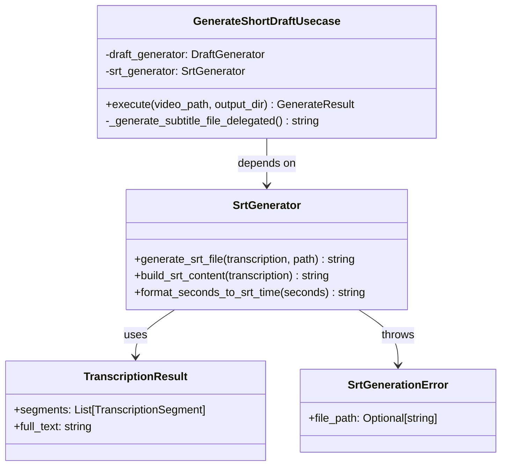

# SRTGenerator 切り出し設計書

## 概要

`GenerateShortDraftUsecase`クラスから SRT 生成処理を切り出し、`SrtGenerator`サービスクラスとして独立させることで、Usecase の責任を軽減し、単一責任原則に従った設計に改善する。

## 現在の問題点

### 責任の混在

`GenerateShortDraftUsecase`が以下の複数の責任を持っている：

1. **フロー制御** - 全体の処理順序管理
2. **入力検証** - パラメータの妥当性チェック
3. **出力ディレクトリ管理** - ディレクトリ作成・準備
4. **Markdown ファイル生成** - 企画書ファイルの作成
5. **SRT ファイル生成** - 字幕ファイルの作成 ← **切り出し対象**
6. **時刻フォーマット変換** - SRT 形式の時刻変換 ← **切り出し対象**

### 具体的な切り出し対象メソッド

- `_generate_subtitle_file()` - SRT ファイル生成のメイン処理
- `_build_srt_content()` - SRT 形式の内容構築
- `_format_seconds_to_srt_time()` - SRT 形式の時刻変換

## 設計方針

### 1. 単一責任原則の適用

- **Usecase**: フロー制御と入出力管理に専念
- **SrtGenerator**: SRT 生成処理に特化

### 2. 依存性注入パターンの継続

- `SrtGenerator`を`GenerateShortDraftUsecase`に DI で注入
- テスタビリティの向上

### 3. エラーハンドリングの分離

- SRT 生成固有のエラーは`SrtGenerator`内で処理
- Usecase は結果の成功/失敗のみを判定

## クラス設計

### SrtGenerator クラス

```python
class SrtGenerator:
    """SRT字幕ファイル生成サービス

    TranscriptionResultからSRT形式の字幕ファイルを生成する責務を持つ。
    時刻フォーマット変換、SRT形式の構築、ファイル出力を担当。
    """

    def generate_srt_file(
        self,
        transcription: TranscriptionResult,
        output_file_path: str
    ) -> str:
        """SRT字幕ファイルを生成

        Args:
            transcription: 文字起こし結果
            output_file_path: 出力ファイルパス

        Returns:
            生成されたファイルのパス

        Raises:
            SrtGenerationError: SRT生成に失敗した場合
        """

    def build_srt_content(self, transcription: TranscriptionResult) -> str:
        """SRT形式の内容を構築

        Args:
            transcription: 文字起こし結果

        Returns:
            SRT形式の文字列
        """

    def format_seconds_to_srt_time(self, seconds: float) -> str:
        """秒数をSRT形式の時刻に変換

        Args:
            seconds: 変換する秒数

        Returns:
            SRT形式の時刻文字列（hh:mm:ss,mmm）
        """
```

### 例外クラス

```python
class SrtGenerationError(Exception):
    """SRT生成関連のエラー"""

    def __init__(self, message: str, file_path: Optional[str] = None):
        super().__init__(message)
        self.file_path = file_path
```

### 更新後の GenerateShortDraftUsecase

```python
class GenerateShortDraftUsecase:
    """ショート動画企画書生成ユースケース

    責務をフロー制御と入出力管理に限定し、
    具体的な生成処理は各サービスクラスに委譲する。
    """

    def __init__(
        self,
        draft_generator: DraftGenerator,
        srt_generator: SrtGenerator  # 新規追加
    ):
        self.draft_generator = draft_generator
        self.srt_generator = srt_generator

    def execute(self, video_path: str, output_dir: str) -> GenerateResult:
        """実行メソッド - SRT生成処理を委譲"""
        try:
            # 既存の処理...
            draft_result = self.draft_generator.generate_from_video(
                video_path, output_dir
            )

            draft_file_path = self._generate_draft_file(
                draft_result, video_path, output_dir
            )

            # SRT生成を委譲
            subtitle_file_path = self._generate_subtitle_file_delegated(
                draft_result, video_path, output_dir
            )

            return GenerateResult(...)

        except Exception as e:
            return GenerateResult(...)

    def _generate_subtitle_file_delegated(
        self,
        draft_result: DraftResult,
        video_path: str,
        output_dir: str
    ) -> str:
        """SRT生成をSrtGeneratorに委譲"""
        video_name = Path(video_path).stem
        subtitle_file_path = Path(output_dir) / f"{video_name}_subtitle.srt"

        return self.srt_generator.generate_srt_file(
            draft_result.original_transcription,
            str(subtitle_file_path)
        )
```

## 処理フロー図



## クラス関係図



## 実装手順

### Phase 1: SrtGenerator クラスの作成

1. `src/service/srt_generator.py`ファイル作成
2. `SrtGenerationError`例外クラス実装
3. `SrtGenerator`クラス実装
   - `generate_srt_file()`メソッド
   - `build_srt_content()`メソッド
   - `format_seconds_to_srt_time()`メソッド

### Phase 2: GenerateShortDraftUsecase の更新

1. コンストラクタに`SrtGenerator`の依存性追加
2. `_generate_subtitle_file_delegated()`メソッド実装
3. 既存の SRT 関連メソッドを削除
   - `_generate_subtitle_file()`
   - `_build_srt_content()`
   - `_format_seconds_to_srt_time()`

### Phase 3: DI コンテナの更新

1. `main.py`または該当する DI コンテナで`SrtGenerator`のインスタンス化
2. `GenerateShortDraftUsecase`への注入設定

### Phase 4: テストの更新

1. `SrtGenerator`用の単体テスト作成
2. `GenerateShortDraftUsecase`のテスト更新（モック使用）

## 期待される効果

### 1. 責任の明確化

- **Usecase**: フロー制御に専念
- **SrtGenerator**: SRT 生成に特化

### 2. テスタビリティの向上

- SRT 生成ロジックを独立してテスト可能
- Usecase テストでのモック化が容易

### 3. 保守性の向上

- SRT 形式の仕様変更時の影響範囲を限定
- 新しい字幕形式（VTT 等）への拡張が容易

### 4. 再利用性の向上

- 他の Usecase からも SrtGenerator を利用可能
- SRT 生成機能の独立した利用

## 注意点

### 1. エラーハンドリング

- `SrtGenerationError`を適切にキャッチして`GenerateResult`に変換
- ファイルパス情報の保持

### 2. ファイルパス管理

- Usecase でファイルパス生成、SrtGenerator で実際の生成
- 責任の境界を明確に

### 3. 既存テストへの影響

- モック設定の追加が必要
- テストデータの調整

この設計により、各クラスの責任が明確になり、保守性とテスタビリティが大幅に向上します。
