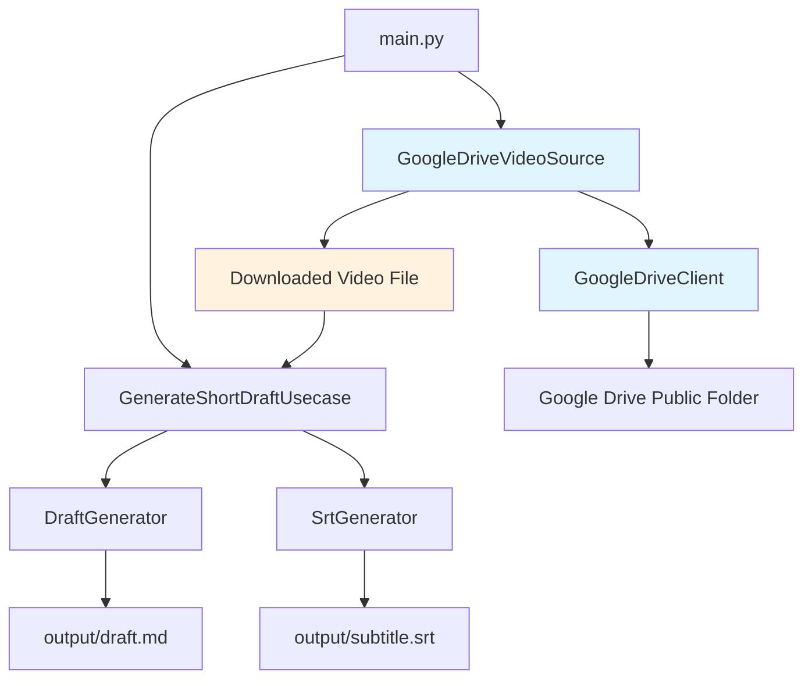

# Google Drive 連携機能設計書

**作成日時**: 2025-07-10 14:58
**対象**: ショート動画設計図生成プロジェクト
**機能**: Google Drive 公開フォルダからの動画ファイル取得・処理機能

## 1. 概要

### 1.1 目的

Google Drive の公開フォルダから動画ファイルを自動取得し、既存のショート動画企画書生成機能と連携する仕組みを構築する。

### 1.2 要件

- Google Drive の共有フォルダ URL（`https://drive.google.com/drive/folders/[フォルダID]?usp=sharing`）を指定
- フォルダ内のファイル名が最も若い（アルファベット順で最初の）動画ファイルを自動選択
- ダウンロードしたファイルは output ディレクトリに保存
- 将来的な複数ファイル処理への拡張性を確保

### 1.3 技術方針

- HTML スクレイピングによる公開フォルダアクセス（認証不要）
- 既存アーキテクチャとの整合性を保持
- 段階的な機能拡張が可能な設計

## 2. システム設計

### 2.1 全体アーキテクチャ



### 2.2 新規追加コンポーネント

#### 2.2.1 データ構造

```python
# src/models/drive.py
from dataclasses import dataclass
from typing import List, Optional

@dataclass
class DriveFile:
    """Google Driveファイル情報"""
    name: str
    file_id: str
    download_url: str
    size: Optional[int] = None

@dataclass
class DriveFolder:
    """Google Driveフォルダ情報"""
    folder_id: str
    files: List[DriveFile]
```

#### 2.2.2 GoogleDriveClient

```python
# src/clients/google_drive_client.py
import re
import requests
from bs4 import BeautifulSoup
from typing import Optional, List
from urllib.parse import unquote
from pathlib import Path

from ..models.drive import DriveFile, DriveFolder

class GoogleDriveError(Exception):
    """Google Drive関連のベース例外"""
    pass

class FolderAccessError(GoogleDriveError):
    """フォルダアクセスエラー"""
    def __init__(self, message: str, folder_url: str):
        super().__init__(message)
        self.folder_url = folder_url

class FileDownloadError(GoogleDriveError):
    """ファイルダウンロードエラー"""
    def __init__(self, message: str, file_name: str):
        super().__init__(message)
        self.file_name = file_name

class NoVideoFileError(GoogleDriveError):
    """動画ファイルが見つからないエラー"""
    def __init__(self, message: str, folder_url: str):
        super().__init__(message)
        self.folder_url = folder_url

class GoogleDriveClient:
    """Google Drive公開フォルダからのファイル取得クライアント

    公開されているGoogle Driveフォルダから動画ファイルを検索・ダウンロードします。
    認証は不要ですが、フォルダが公開設定されている必要があります。

    Example:
        >>> client = GoogleDriveClient()
        >>> folder = client.list_files("https://drive.google.com/drive/folders/abc123")
        >>> video_file = client.select_earliest_video_file(folder)
        >>> if video_file:
        ...     path = client.download_file(video_file, "output/")
        ...     print(f"Downloaded: {path}")
        Downloaded: output/video.mp4
    """

    def __init__(self, session: Optional[requests.Session] = None):
        """GoogleDriveClientを初期化

        Args:
            session: HTTPセッション（テスト用）
        """
        self.session = session or requests.Session()
        self.session.headers.update({
            'User-Agent': 'Mozilla/5.0 (compatible; ShortMovieDraftGenerator/1.0)'
        })

        # サポートする動画ファイル拡張子
        self.video_extensions = {'.mp4', '.avi', '.mov', '.mkv', '.wmv', '.flv', '.webm'}

    def extract_folder_id(self, folder_url: str) -> str:
        """フォルダURLからフォルダIDを抽出

        Args:
            folder_url: Google DriveフォルダのURL

        Returns:
            抽出されたフォルダID

        Raises:
            FolderAccessError: URLが無効な場合
        """
        pattern = r'/folders/([a-zA-Z0-9_-]+)'
        match = re.search(pattern, folder_url)

        if not match:
            raise FolderAccessError(
                f"無効なGoogle DriveフォルダURLです: {folder_url}",
                folder_url
            )

        return match.group(1)

    def list_files(self, folder_url: str) -> DriveFolder:
        """公開フォルダのファイル一覧を取得

        Args:
            folder_url: Google DriveフォルダのURL

        Returns:
            フォルダ情報とファイル一覧

        Raises:
            FolderAccessError: フォルダにアクセスできない場合
        """
        try:
            folder_id = self.extract_folder_id(folder_url)

            # 公開フォルダのHTMLを取得
            response = self.session.get(folder_url, timeout=30)
            response.raise_for_status()

            # HTMLからファイル情報を抽出
            files = self._parse_folder_html(response.text, folder_id)

            return DriveFolder(folder_id=folder_id, files=files)

        except requests.RequestException as e:
            raise FolderAccessError(
                f"Google Driveフォルダへのアクセスに失敗しました: {str(e)}",
                folder_url
            )
        except Exception as e:
            raise FolderAccessError(
                f"フォルダ情報の取得に失敗しました: {str(e)}",
                folder_url
            )

    def download_file(self, file: DriveFile, output_dir: str) -> str:
        """ファイルをダウンロード

        Args:
            file: ダウンロードするファイル情報
            output_dir: 出力ディレクトリ

        Returns:
            ダウンロードされたファイルのパス

        Raises:
            FileDownloadError: ダウンロードに失敗した場合
        """
        try:
            output_path = Path(output_dir)
            output_path.mkdir(parents=True, exist_ok=True)

            file_path = output_path / file.name

            # ダウンロード用URLを構築
            download_url = f"https://drive.google.com/uc?export=download&id={file.file_id}"

            response = self.session.get(download_url, stream=True, timeout=300)
            response.raise_for_status()

            # ファイルを保存
            with open(file_path, 'wb') as f:
                for chunk in response.iter_content(chunk_size=8192):
                    if chunk:
                        f.write(chunk)

            return str(file_path)

        except Exception as e:
            raise FileDownloadError(
                f"ファイルのダウンロードに失敗しました: {str(e)}",
                file.name
            )

    def select_earliest_video_file(self, folder: DriveFolder) -> Optional[DriveFile]:
        """最も若いファイル名の動画ファイルを選択

        Args:
            folder: 検索対象のフォルダ

        Returns:
            選択されたファイル（見つからない場合はNone）
        """
        video_files = [
            f for f in folder.files
            if any(f.name.lower().endswith(ext) for ext in self.video_extensions)
        ]

        if not video_files:
            return None

        # ファイル名でソート（アルファベット順、大文字小文字を区別しない）
        return sorted(video_files, key=lambda f: f.name.lower())[0]

    def _parse_folder_html(self, html: str, folder_id: str) -> List[DriveFile]:
        """フォルダのHTMLからファイル情報を抽出

        Args:
            html: フォルダページのHTML
            folder_id: フォルダID

        Returns:
            ファイル情報のリスト
        """
        soup = BeautifulSoup(html, 'html.parser')
        files = []

        # Google DriveのHTMLからファイル情報を抽出
        # 実装詳細はGoogle DriveのHTML構造に依存
        # ここでは概念的な実装を示す

        # data-target属性やJavaScriptから情報を抽出
        script_tags = soup.find_all('script')
        for script in script_tags:
            if script.string and 'file' in script.string.lower():
                # JavaScriptからファイル情報を正規表現で抽出
                file_matches = re.findall(
                    r'"([^"]+\.(?:mp4|avi|mov|mkv|wmv|flv|webm))".*?"([a-zA-Z0-9_-]+)"',
                    script.string,
                    re.IGNORECASE
                )

                for file_name, file_id in file_matches:
                    files.append(DriveFile(
                        name=unquote(file_name),
                        file_id=file_id,
                        download_url=f"https://drive.google.com/uc?export=download&id={file_id}"
                    ))

        return files
```

#### 2.2.3 VideoSource インターフェース

```python
# src/sources/__init__.py
from typing import Protocol

class VideoSource(Protocol):
    """動画ソースのプロトコル"""

    def get_video_path(self, output_dir: str) -> str:
        """動画ファイルのパスを取得（必要に応じてダウンロード）

        Args:
            output_dir: 出力ディレクトリ

        Returns:
            動画ファイルのパス
        """
        ...

    def cleanup(self) -> None:
        """リソースのクリーンアップ"""
        ...

# src/sources/local_video_source.py
class LocalVideoSource:
    """ローカルファイルソース"""

    def __init__(self, video_path: str):
        """LocalVideoSourceを初期化

        Args:
            video_path: ローカル動画ファイルのパス
        """
        self.video_path = video_path

    def get_video_path(self, output_dir: str) -> str:
        """ローカルファイルパスをそのまま返す

        Args:
            output_dir: 出力ディレクトリ（使用しない）

        Returns:
            ローカル動画ファイルのパス
        """
        return self.video_path

    def cleanup(self) -> None:
        """ローカルファイルはクリーンアップ不要"""
        pass

# src/sources/google_drive_video_source.py
from typing import Optional
from ..clients.google_drive_client import GoogleDriveClient, NoVideoFileError

class GoogleDriveVideoSource:
    """Google Driveソース"""

    def __init__(self, folder_url: str, drive_client: GoogleDriveClient):
        """GoogleDriveVideoSourceを初期化

        Args:
            folder_url: Google DriveフォルダのURL
            drive_client: Google Driveクライアント
        """
        self.folder_url = folder_url
        self.drive_client = drive_client
        self.downloaded_file_path: Optional[str] = None

    def get_video_path(self, output_dir: str) -> str:
        """Google Driveから動画ファイルをダウンロードしてパスを返す

        Args:
            output_dir: 出力ディレクトリ

        Returns:
            ダウンロードされた動画ファイルのパス

        Raises:
            NoVideoFileError: 動画ファイルが見つからない場合
        """
        # フォルダからファイル一覧取得
        folder = self.drive_client.list_files(self.folder_url)

        # 最も若いファイル名の動画ファイルを選択
        video_file = self.drive_client.select_earliest_video_file(folder)

        if not video_file:
            raise NoVideoFileError(
                "フォルダ内に動画ファイルが見つかりません",
                self.folder_url
            )

        # ダウンロード実行
        self.downloaded_file_path = self.drive_client.download_file(video_file, output_dir)

        return self.downloaded_file_path

    def cleanup(self) -> None:
        """ダウンロードしたファイルの削除（オプション）

        現在の要件では削除しないが、将来的な拡張のために用意
        """
        # 将来的にはダウンロードファイルの削除オプションを実装
        pass
```

#### 2.2.4 Usecase クラスの拡張

```python
# src/usecases/generate_short_draft_usecase.py に追加

from ..sources.google_drive_video_source import GoogleDriveVideoSource
from ..clients.google_drive_client import GoogleDriveClient

class GenerateShortDraftUsecase:
    # 既存のコードは変更なし

    def execute_from_drive(self, drive_folder_url: str, output_dir: str) -> GenerateResult:
        """Google Driveフォルダから企画書とSRTファイルを生成

        Args:
            drive_folder_url: Google DriveフォルダのURL
            output_dir: 出力ディレクトリのパス

        Returns:
            処理結果（GenerateResult）
        """
        try:
            self._validate_drive_inputs(drive_folder_url, output_dir)

            self._prepare_output_directory(output_dir)

            # Google Driveから動画ファイルを取得
            drive_client = GoogleDriveClient()
            video_source = GoogleDriveVideoSource(drive_folder_url, drive_client)

            video_path = video_source.get_video_path(output_dir)

            # 既存の処理フローを実行
            draft_result = self.draft_generator.generate_from_video(video_path, output_dir)

            draft_file_path = self._generate_draft_file(
                draft_result, video_path, output_dir
            )

            subtitle_file_path = self._generate_subtitle_file_delegated(
                draft_result, video_path, output_dir
            )

            # クリーンアップ
            video_source.cleanup()

            return GenerateResult(
                draft_file_path=draft_file_path,
                subtitle_file_path=subtitle_file_path,
                success=True,
            )

        except Exception as e:
            return GenerateResult(
                draft_file_path="",
                subtitle_file_path="",
                success=False,
                error_message=str(e),
            )

    def _validate_drive_inputs(self, drive_folder_url: str, output_dir: str) -> None:
        """Google Drive入力パラメータの検証

        Args:
            drive_folder_url: Google DriveフォルダのURL
            output_dir: 出力ディレクトリのパス

        Raises:
            InputValidationError: 入力が無効な場合
        """
        if not drive_folder_url or not drive_folder_url.strip():
            raise InputValidationError(
                "Google DriveフォルダURLが指定されていません", "drive_folder_url"
            )

        if "drive.google.com/drive/folders/" not in drive_folder_url:
            raise InputValidationError(
                "無効なGoogle DriveフォルダURLです", "drive_folder_url"
            )

        if not output_dir or not output_dir.strip():
            raise InputValidationError(
                "出力ディレクトリが指定されていません", "output_dir"
            )
```

### 2.3 CLI インターフェースの拡張

```python
# src/main.py の拡張

@click.group()
def cli():
    """ショート動画設計図生成ツール"""
    pass

@cli.command()
@click.argument("video_path", type=click.Path(exists=True, path_type=Path))
@click.argument("output_dir", type=click.Path(path_type=Path))
@click.option("--verbose", "-v", is_flag=True, help="詳細なログを出力します")
def local(video_path: Path, output_dir: Path, verbose: bool) -> None:
    """ローカル動画ファイルから企画書を生成

    VIDEO_PATH: 処理する動画ファイルのパス
    OUTPUT_DIR: 企画書と字幕ファイルの出力ディレクトリ

    例:
        poetry run python src/main.py local input/video.mp4 output/
    """
    # 既存のmain関数の処理をここに移動

@cli.command()
@click.argument("folder_url", type=str)
@click.argument("output_dir", type=click.Path(path_type=Path))
@click.option("--verbose", "-v", is_flag=True, help="詳細なログを出力します")
def drive(folder_url: str, output_dir: Path, verbose: bool) -> None:
    """Google Driveフォルダから企画書を生成

    FOLDER_URL: Google Driveの公開フォルダURL
    OUTPUT_DIR: 企画書と字幕ファイルの出力ディレクトリ

    例:
        poetry run python src/main.py drive "https://drive.google.com/drive/folders/abc123?usp=sharing" output/
    """
    try:
        if verbose:
            click.echo("=== ショート動画設計図生成プロジェクト（Google Drive連携） ===")
            click.echo(f"Google DriveフォルダURL: {folder_url}")
            click.echo(f"出力ディレクトリ: {output_dir}")
            click.echo("")

        container = DIContainer()

        if verbose:
            click.echo("✓ 依存関係の初期化が完了しました")
            click.echo("🔍 Google Driveフォルダから動画ファイルを検索中...")

        result = container.generate_usecase.execute_from_drive(folder_url, str(output_dir))

        if result.success:
            click.echo("🎉 処理が正常に完了しました！")
            click.echo("")
            click.echo("生成されたファイル:")
            click.echo(f"  📄 企画書: {result.draft_file_path}")
            click.echo(f"  📝 字幕: {result.subtitle_file_path}")

            if verbose:
                click.echo("")
                click.echo("次のステップ:")
                click.echo("1. 企画書を確認して、気に入った企画を選択してください")
                click.echo("2. 字幕ファイルを動画編集ソフトで読み込んでください")
                click.echo("3. 企画書の時間指定に従って動画をカットしてください")

        else:
            click.echo("❌ 処理中にエラーが発生しました", err=True)
            click.echo(f"エラー内容: {result.error_message}", err=True)
            sys.exit(1)

    except KeyboardInterrupt:
        click.echo("\n⚠️  処理が中断されました", err=True)
        sys.exit(1)
    except Exception as e:
        click.echo(f"❌ 予期しないエラーが発生しました: {str(e)}", err=True)
        if verbose:
            import traceback
            click.echo("\nスタックトレース:", err=True)
            click.echo(traceback.format_exc(), err=True)
        sys.exit(1)

if __name__ == "__main__":
    cli()
```

## 3. 将来拡張への対応

### 3.1 複数ファイル処理

```python
# src/usecases/batch_generate_usecase.py
from typing import List
from enum import Enum

class FileSelectionStrategy(Enum):
    EARLIEST_NAME = "earliest_name"
    LATEST_NAME = "latest_name"
    ALL_FILES = "all_files"

class BatchGenerateShortDraftUsecase:
    """複数動画ファイルの一括処理ユースケース"""

    def __init__(self, single_usecase: GenerateShortDraftUsecase):
        self.single_usecase = single_usecase

    def execute_batch_from_drive(
        self,
        folder_url: str,
        output_dir: str,
        strategy: FileSelectionStrategy = FileSelectionStrategy.ALL_FILES,
        max_files: int = 5
    ) -> List[GenerateResult]:
        """Google Driveフォルダから複数ファイルを処理

        Args:
            folder_url: Google DriveフォルダのURL
            output_dir: 出力ディレクトリ
            strategy: ファイル選択戦略
            max_files: 最大処理ファイル数

        Returns:
            各ファイルの処理結果リスト
        """
        # 実装詳細は将来のフェーズで追加
        pass
```

### 3.2 設定管理の拡張

```python
# .env.example に追加
# Google Drive設定
GOOGLE_DRIVE_DOWNLOAD_TIMEOUT=300
GOOGLE_DRIVE_RETRY_COUNT=3
GOOGLE_DRIVE_CHUNK_SIZE=8192
```

## 4. テスト戦略

### 4.1 単体テスト

```python
# tests/test_clients/test_google_drive_client.py
import pytest
from unittest.mock import Mock, patch
from src.clients.google_drive_client import GoogleDriveClient, FolderAccessError

class TestGoogleDriveClient:

    def test_extract_folder_id_success(self):
        client = GoogleDriveClient()
        url = "https://drive.google.com/drive/folders/abc123def456?usp=sharing"
        folder_id = client.extract_folder_id(url)
        assert folder_id == "abc123def456"

    def test_extract_folder_id_invalid_url(self):
        client = GoogleDriveClient()
        with pytest.raises(FolderAccessError):
            client.extract_folder_id("invalid_url")

    @patch('requests.Session.get')
    def test_list_files_success(self, mock_get):
        # モックレスポンスの設定
        mock_response = Mock()
        mock_response.text = "<html>mock html with file data</html>"
        mock_response.raise_for_status.return_value = None
        mock_get.return_value = mock_response

        client = GoogleDriveClient()
        # テスト実装
```

### 4.2 統合テスト

```python
# tests/test_integration/test_google_drive_integration.py
import pytest
from src.usecases.generate_short_draft_usecase import GenerateShortDraftUsecase

class TestGoogleDriveIntegration:

    @pytest.mark.integration
    def test_execute_from_drive_success(self):
        # 実際のGoogle Drive公開フォルダを使用したテスト
        # テスト用の公開フォルダを事前に準備
        pass
```

## 5. 依存関係の追加

### 5.1 pyproject.toml

```toml
[tool.poetry.dependencies]
# 既存の依存関係に追加
requests = "^2.31.0"
beautifulsoup4 = "^4.12.0"
lxml = "^4.9.0"  # BeautifulSoupのパーサー用
```

## 6. エラーハンドリング

### 6.1 エラー分類と対応

| エラー種別           | 原因                             | 対応方法                       |
| -------------------- | -------------------------------- | ------------------------------ |
| FolderAccessError    | フォルダ URL が無効/アクセス不可 | URL の確認を促すメッセージ     |
| NoVideoFileError     | フォルダ内に動画ファイルなし     | フォルダ内容の確認を促す       |
| FileDownloadError    | ダウンロード失敗                 | リトライ機能、ネットワーク確認 |
| InputValidationError | 入力パラメータ不正               | 正しい形式の説明               |

### 6.2 ログ出力

```python
import logging

# ログ設定
logging.basicConfig(
    level=logging.INFO,
    format='%(asctime)s - %(name)s - %(levelname)s - %(message)s'
)

logger = logging.getLogger(__name__)

# 使用例
logger.info(f"Google Driveフォルダにアクセス中: {folder_url}")
logger.info(f"動画ファイルを発見: {video_file.name}")
logger.info(f"ダウンロード完了: {downloaded_path}")
```

## 7. 実装スケジュール

### Phase 1: 基本機能実装

1. GoogleDriveClient の実装
2. VideoSource インターフェースの実装
3. Usecase クラスの拡張
4. CLI インターフェースの拡張

### Phase 2: テストとエラーハンドリング

1. 単体テストの実装
2. 統合テストの実装
3. エラーハンドリングの強化
4. ログ機能の追加

### Phase 3: 将来拡張への準備

1. 複数ファイル処理の基盤実装
2. 設定管理の拡張
3. パフォーマンス最適化
4. ドキュメント整備

## 8. 使用例

### 8.1 基本的な使用方法

```bash
# ローカルファイルの処理（既存機能）
poetry run python src/main.py local input/video.mp4 output/

# Google Driveフォルダからの処理（新機能）
poetry run python src/main.py drive "https://drive.google.com/drive/folders/abc123?usp=sharing" output/

# 詳細ログ付きで実行
poetry run python src/main.py drive "https://drive.google.com/drive/folders/abc123?usp=sharing" output/ --verbose
```

### 8.2 プログラムからの使用

```python
from src.main import DIContainer

# DIコンテナの初期化
container = DIContainer()

# Google Driveから処理
result = container.generate_usecase.execute_from_drive(
    "https://drive.google.com/drive/folders/abc123?usp=sharing",
    "output/"
)

if result.success:
    print(f"企画書: {result.draft_file_path}")
    print(f"字幕: {result.subtitle_file_path}")
else:
    print(f"エラー: {result.error_message}")
```

## 9. まとめ

この設計により、以下の目標を達成できます：

1. **既存機能との互換性**: 既存のローカルファイル処理機能は変更なし
2. **拡張性**: 将来の複数ファイル処理や他のクラウドサービス連携に対応可能
3. **保守性**: 責務が明確に分離された設計
4. **テスタビリティ**: 依存性注入により単体テストが容易
5. **ユーザビリティ**: 直感的な CLI インターフェース

段階的な実装により、リスクを最小化しながら機能を追加できる設計となっています。
