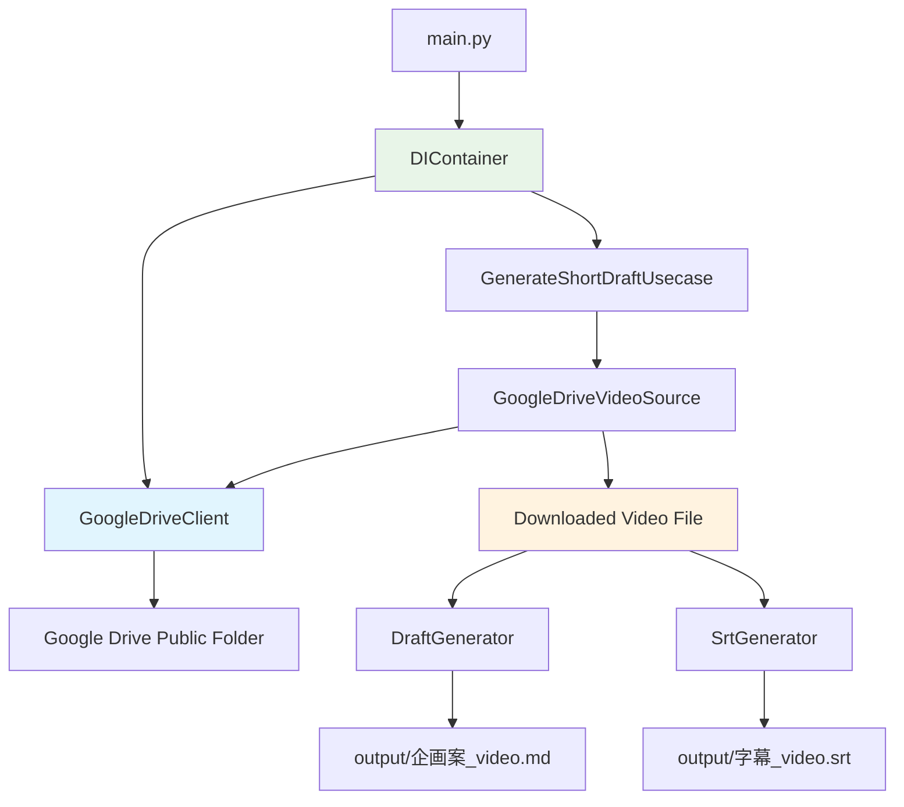

# Google Drive 連携機能設計書（修正版）

**作成日時**: 2025-07-10 15:02
**対象**: ショート動画設計図生成プロジェクト
**機能**: Google Drive 公開フォルダからの動画ファイル取得・処理機能
**修正内容**: 現在の実装構造に合わせて DIContainer 活用方式に変更

## 1. 概要

### 1.1 目的

Google Drive の公開フォルダから動画ファイルを自動取得し、既存のショート動画企画書生成機能と連携する仕組みを構築する。

### 1.2 要件

- Google Drive の共有フォルダ URL（`https://drive.google.com/drive/folders/[フォルダID]?usp=sharing`）を指定
- フォルダ内のファイル名が最も若い（アルファベット順で最初の）動画ファイルを自動選択
- ダウンロードしたファイルは output ディレクトリに保存
- 既存の DIContainer 構造を活用
- GoogleDriveClient の初期化は Usecase の外側（DIContainer）で実行

### 1.3 技術方針

- HTML スクレイピングによる公開フォルダアクセス（認証不要）
- 既存の DIContainer パターンを拡張
- 依存性注入によるテスタビリティの確保

## 2. システム設計

### 2.1 全体アーキテクチャ



### 2.2 実装方針

#### 2.2.1 DIContainer の拡張

既存の DIContainer に GoogleDriveClient を追加し、Usecase に注入します：

```python
# src/main.py の修正

from src.clients.google_drive_client import GoogleDriveClient  # 新規追加

class DIContainer:
    """依存性注入コンテナ

    アプリケーションで使用するサービスの初期化と依存関係の管理を行います。
    """

    def __init__(self) -> None:
        """環境変数を読み込み、各サービスを初期化"""
        load_dotenv()

        self.openai_api_key = self._get_required_env("OPENAI_API_KEY")
        self.chatgpt_model = os.getenv("CHATGPT_MODEL", "gpt-4o")
        self.whisper_model = os.getenv("WHISPER_MODEL", "whisper-1")

        # 既存のクライアント
        self.whisper_client = WhisperClient(api_key=self.openai_api_key, model=self.whisper_model)
        self.chatgpt_client = ChatGPTClient(api_key=self.openai_api_key, model=self.chatgpt_model)

        # 新規追加: Google Driveクライアント
        self.google_drive_client = GoogleDriveClient()

        self.prompt_builder = PromptBuilder()

        self.draft_generator = DraftGenerator(
            whisper_client=self.whisper_client,
            chatgpt_client=self.chatgpt_client,
            prompt_builder=self.prompt_builder,
        )

        self.srt_generator = SrtGenerator()

        # Google Driveクライアントを注入
        self.generate_usecase = GenerateShortDraftUsecase(
            draft_generator=self.draft_generator,
            srt_generator=self.srt_generator,
            google_drive_client=self.google_drive_client  # 新規追加
        )
```

#### 2.2.2 CLI インターフェースの拡張

既存の main 関数を拡張して Google Drive 対応を追加：

```python
# src/main.py の拡張

@click.command()
@click.argument("input_source", type=str)
@click.argument("output_dir", type=click.Path(path_type=Path))
@click.option("--verbose", "-v", is_flag=True, help="詳細なログを出力します")
@click.option("--drive", is_flag=True, help="Google DriveフォルダURLとして処理")
def main(input_source: str, output_dir: Path, verbose: bool, drive: bool) -> None:
    """動画ファイルまたはGoogle Driveフォルダからショート動画企画書を生成

    INPUT_SOURCE: 動画ファイルのパスまたはGoogle DriveフォルダURL
    OUTPUT_DIR: 企画書と字幕ファイルの出力ディレクトリ

    例:
        # ローカルファイル
        poetry run python src/main.py input/video.mp4 output/

        # Google Driveフォルダ
        poetry run python src/main.py "https://drive.google.com/drive/folders/abc123?usp=sharing" output/ --drive
    """
    try:
        if verbose:
            mode_text = "Google Drive連携" if drive else "ローカルファイル"
            click.echo(f"=== ショート動画設計図生成プロジェクト（{mode_text}） ===")
            click.echo(f"入力ソース: {input_source}")
            click.echo(f"出力ディレクトリ: {output_dir}")
            click.echo("")

        container = DIContainer()

        if verbose:
            click.echo("✓ 依存関係の初期化が完了しました")
            if drive:
                click.echo("🔍 Google Driveフォルダから動画ファイルを検索中...")
            else:
                click.echo("📹 動画の処理を開始します...")

        # Google Driveモードかローカルファイルモードかで処理を分岐
        if drive:
            result = container.generate_usecase.execute_from_drive(input_source, str(output_dir))
        else:
            # 既存の処理（ローカルファイル）
            result = container.generate_usecase.execute(input_source, str(output_dir))

        if result.success:
            click.echo("🎉 処理が正常に完了しました！")
            click.echo("")
            click.echo("生成されたファイル:")
            click.echo(f"  📄 企画書: {result.draft_file_path}")
            click.echo(f"  📝 字幕: {result.subtitle_file_path}")

            if verbose:
                click.echo("")
                click.echo("次のステップ:")
                click.echo("1. 企画書を確認して、気に入った企画を選択してください")
                click.echo("2. 字幕ファイルを動画編集ソフトで読み込んでください")
                click.echo("3. 企画書の時間指定に従って動画をカットしてください")

        else:
            click.echo("❌ 処理中にエラーが発生しました", err=True)
            click.echo(f"エラー内容: {result.error_message}", err=True)
            sys.exit(1)

    except KeyboardInterrupt:
        click.echo("\n⚠️  処理が中断されました", err=True)
        sys.exit(1)
    except Exception as e:
        click.echo(f"❌ 予期しないエラーが発生しました: {str(e)}", err=True)
        if verbose:
            import traceback
            click.echo("\nスタックトレース:", err=True)
            click.echo(traceback.format_exc(), err=True)
        sys.exit(1)
```

## 3. 新規追加コンポーネント

### 3.1 データ構造

```python
# src/models/drive.py
from dataclasses import dataclass
from typing import List, Optional

@dataclass
class DriveFile:
    """Google Driveファイル情報"""
    name: str
    file_id: str
    download_url: str
    size: Optional[int] = None

@dataclass
class DriveFolder:
    """Google Driveフォルダ情報"""
    folder_id: str
    files: List[DriveFile]
```

### 3.2 GoogleDriveClient

```python
# src/clients/google_drive_client.py
import re
import requests
from bs4 import BeautifulSoup
from typing import Optional, List
from urllib.parse import unquote
from pathlib import Path

from ..models.drive import DriveFile, DriveFolder

class GoogleDriveError(Exception):
    """Google Drive関連のベース例外"""
    pass

class FolderAccessError(GoogleDriveError):
    """フォルダアクセスエラー"""
    def __init__(self, message: str, folder_url: str):
        super().__init__(message)
        self.folder_url = folder_url

class FileDownloadError(GoogleDriveError):
    """ファイルダウンロードエラー"""
    def __init__(self, message: str, file_name: str):
        super().__init__(message)
        self.file_name = file_name

class NoVideoFileError(GoogleDriveError):
    """動画ファイルが見つからないエラー"""
    def __init__(self, message: str, folder_url: str):
        super().__init__(message)
        self.folder_url = folder_url

class GoogleDriveClient:
    """Google Drive公開フォルダからのファイル取得クライアント"""

    def __init__(self, session: Optional[requests.Session] = None):
        """GoogleDriveClientを初期化"""
        self.session = session or requests.Session()
        self.session.headers.update({
            'User-Agent': 'Mozilla/5.0 (compatible; ShortMovieDraftGenerator/1.0)'
        })

        # サポートする動画ファイル拡張子
        self.video_extensions = {'.mp4', '.avi', '.mov', '.mkv', '.wmv', '.flv', '.webm'}

    def extract_folder_id(self, folder_url: str) -> str:
        """フォルダURLからフォルダIDを抽出"""
        pattern = r'/folders/([a-zA-Z0-9_-]+)'
        match = re.search(pattern, folder_url)

        if not match:
            raise FolderAccessError(
                f"無効なGoogle DriveフォルダURLです: {folder_url}",
                folder_url
            )

        return match.group(1)

    def list_files(self, folder_url: str) -> DriveFolder:
        """公開フォルダのファイル一覧を取得"""
        try:
            folder_id = self.extract_folder_id(folder_url)

            # 公開フォルダのHTMLを取得
            response = self.session.get(folder_url, timeout=30)
            response.raise_for_status()

            # HTMLからファイル情報を抽出
            files = self._parse_folder_html(response.text, folder_id)

            return DriveFolder(folder_id=folder_id, files=files)

        except requests.RequestException as e:
            raise FolderAccessError(
                f"Google Driveフォルダへのアクセスに失敗しました: {str(e)}",
                folder_url
            )
        except Exception as e:
            raise FolderAccessError(
                f"フォルダ情報の取得に失敗しました: {str(e)}",
                folder_url
            )

    def download_file(self, file: DriveFile, output_dir: str) -> str:
        """ファイルをダウンロード"""
        try:
            output_path = Path(output_dir)
            output_path.mkdir(parents=True, exist_ok=True)

            file_path = output_path / file.name

            # ダウンロード用URLを構築
            download_url = f"https://drive.google.com/uc?export=download&id={file.file_id}"

            response = self.session.get(download_url, stream=True, timeout=300)
            response.raise_for_status()

            # ファイルを保存
            with open(file_path, 'wb') as f:
                for chunk in response.iter_content(chunk_size=8192):
                    if chunk:
                        f.write(chunk)

            return str(file_path)

        except Exception as e:
            raise FileDownloadError(
                f"ファイルのダウンロードに失敗しました: {str(e)}",
                file.name
            )

    def select_earliest_video_file(self, folder: DriveFolder) -> Optional[DriveFile]:
        """最も若いファイル名の動画ファイルを選択"""
        video_files = [
            f for f in folder.files
            if any(f.name.lower().endswith(ext) for ext in self.video_extensions)
        ]

        if not video_files:
            return None

        # ファイル名でソート（アルファベット順、大文字小文字を区別しない）
        return sorted(video_files, key=lambda f: f.name.lower())[0]

    def _parse_folder_html(self, html: str, folder_id: str) -> List[DriveFile]:
        """フォルダのHTMLからファイル情報を抽出"""
        soup = BeautifulSoup(html, 'html.parser')
        files = []

        # Google DriveのHTMLからファイル情報を抽出
        # 実装詳細はGoogle DriveのHTML構造に依存
        script_tags = soup.find_all('script')
        for script in script_tags:
            if script.string and 'file' in script.string.lower():
                # JavaScriptからファイル情報を正規表現で抽出
                file_matches = re.findall(
                    r'"([^"]+\.(?:mp4|avi|mov|mkv|wmv|flv|webm))".*?"([a-zA-Z0-9_-]+)"',
                    script.string,
                    re.IGNORECASE
                )

                for file_name, file_id in file_matches:
                    files.append(DriveFile(
                        name=unquote(file_name),
                        file_id=file_id,
                        download_url=f"https://drive.google.com/uc?export=download&id={file_id}"
                    ))

        return files
```

### 3.3 VideoSource インターフェース

```python
# src/sources/__init__.py
from typing import Protocol

class VideoSource(Protocol):
    """動画ソースのプロトコル"""

    def get_video_path(self, output_dir: str) -> str:
        """動画ファイルのパスを取得（必要に応じてダウンロード）"""
        ...

    def cleanup(self) -> None:
        """リソースのクリーンアップ"""
        ...

# src/sources/google_drive_video_source.py
from typing import Optional
from ..clients.google_drive_client import GoogleDriveClient, NoVideoFileError

class GoogleDriveVideoSource:
    """Google Driveソース"""

    def __init__(self, folder_url: str, drive_client: GoogleDriveClient):
        """GoogleDriveVideoSourceを初期化"""
        self.folder_url = folder_url
        self.drive_client = drive_client
        self.downloaded_file_path: Optional[str] = None

    def get_video_path(self, output_dir: str) -> str:
        """Google Driveから動画ファイルをダウンロードしてパスを返す"""
        # フォルダからファイル一覧取得
        folder = self.drive_client.list_files(self.folder_url)

        # 最も若いファイル名の動画ファイルを選択
        video_file = self.drive_client.select_earliest_video_file(folder)

        if not video_file:
            raise NoVideoFileError(
                "フォルダ内に動画ファイルが見つかりません",
                self.folder_url
            )

        # ダウンロード実行
        self.downloaded_file_path = self.drive_client.download_file(video_file, output_dir)

        return self.downloaded_file_path

    def cleanup(self) -> None:
        """ダウンロードしたファイルの削除（オプション）"""
        # 現在の要件では削除しない
        pass
```

### 3.4 Usecase クラスの拡張

```python
# src/usecases/generate_short_draft_usecase.py の修正

from ..sources.google_drive_video_source import GoogleDriveVideoSource
from ..clients.google_drive_client import GoogleDriveClient

class GenerateShortDraftUsecase:
    """ショート動画企画書生成ユースケース"""

    def __init__(
        self,
        draft_generator: DraftGenerator,
        srt_generator: SrtGenerator,
        google_drive_client: GoogleDriveClient  # 新規追加
    ):
        """GenerateShortDraftUsecaseを初期化

        Args:
            draft_generator: 企画書生成サービス
            srt_generator: SRT字幕ファイル生成サービス
            google_drive_client: Google Driveクライアント（DIContainerから注入）
        """
        self.draft_generator = draft_generator
        self.srt_generator = srt_generator
        self.google_drive_client = google_drive_client  # 新規追加

    # 既存のexecuteメソッドは変更なし

    def execute_from_drive(self, drive_folder_url: str, output_dir: str) -> GenerateResult:
        """Google Driveフォルダから企画書とSRTファイルを生成

        Args:
            drive_folder_url: Google DriveフォルダのURL
            output_dir: 出力ディレクトリのパス

        Returns:
            処理結果（GenerateResult）
        """
        try:
            self._validate_drive_inputs(drive_folder_url, output_dir)

            self._prepare_output_directory(output_dir)

            # 注入されたGoogle Driveクライアントを使用
            video_source = GoogleDriveVideoSource(drive_folder_url, self.google_drive_client)

            video_path = video_source.get_video_path(output_dir)

            # 既存の処理フローを実行
            draft_result = self.draft_generator.generate_from_video(video_path, output_dir)

            draft_file_path = self._generate_draft_file(
                draft_result, video_path, output_dir
            )

            subtitle_file_path = self._generate_subtitle_file_delegated(
                draft_result, video_path, output_dir
            )

            # クリーンアップ
            video_source.cleanup()

            return GenerateResult(
                draft_file_path=draft_file_path,
                subtitle_file_path=subtitle_file_path,
                success=True,
            )

        except Exception as e:
            return GenerateResult(
                draft_file_path="",
                subtitle_file_path="",
                success=False,
                error_message=str(e),
            )

    def _validate_drive_inputs(self, drive_folder_url: str, output_dir: str) -> None:
        """Google Drive入力パラメータの検証"""
        if not drive_folder_url or not drive_folder_url.strip():
            raise InputValidationError(
                "Google DriveフォルダURLが指定されていません", "drive_folder_url"
            )

        if "drive.google.com/drive/folders/" not in drive_folder_url:
            raise InputValidationError(
                "無効なGoogle DriveフォルダURLです", "drive_folder_url"
            )

        if not output_dir or not output_dir.strip():
            raise InputValidationError(
                "出力ディレクトリが指定されていません", "output_dir"
            )
```

## 4. 依存関係の追加

### 4.1 pyproject.toml

```toml
[tool.poetry.dependencies]
# 既存の依存関係に追加
requests = "^2.31.0"
beautifulsoup4 = "^4.12.0"
lxml = "^4.9.0"  # BeautifulSoupのパーサー用
```

## 5. 使用例

### 5.1 基本的な使用方法

```bash
# ローカルファイルの処理（既存機能）
poetry run python src/main.py input/video.mp4 output/

# Google Driveフォルダからの処理（新機能）
poetry run python src/main.py "https://drive.google.com/drive/folders/abc123?usp=sharing" output/ --drive

# 詳細ログ付きで実行
poetry run python src/main.py "https://drive.google.com/drive/folders/abc123?usp=sharing" output/ --drive --verbose
```

## 6. 実装スケジュール

### Phase 1: 基本機能実装

1. データ構造（DriveFile, DriveFolder）の実装
2. GoogleDriveClient の実装
3. GoogleDriveVideoSource の実装
4. Usecase クラスの拡張
5. DIContainer の拡張
6. CLI インターフェースの拡張

### Phase 2: テストとエラーハンドリング

1. 単体テストの実装
2. 統合テストの実装
3. エラーハンドリングの強化

### Phase 3: 将来拡張への準備

1. 複数ファイル処理の基盤実装
2. パフォーマンス最適化

## 7. まとめ

この修正版設計では、以下の点を改善しました：

1. **DIContainer 活用**: 既存の DIContainer パターンを拡張して GoogleDriveClient を管理
2. **依存性注入**: GoogleDriveClient を Usecase のコンストラクタで注入
3. **既存構造維持**: 現在の main.py 構造を最大限活用
4. **段階的実装**: 既存機能に影響を与えない拡張方式

この設計により、既存のアーキテクチャとの整合性を保ちながら、Google Drive 連携機能を安全に追加できます。
