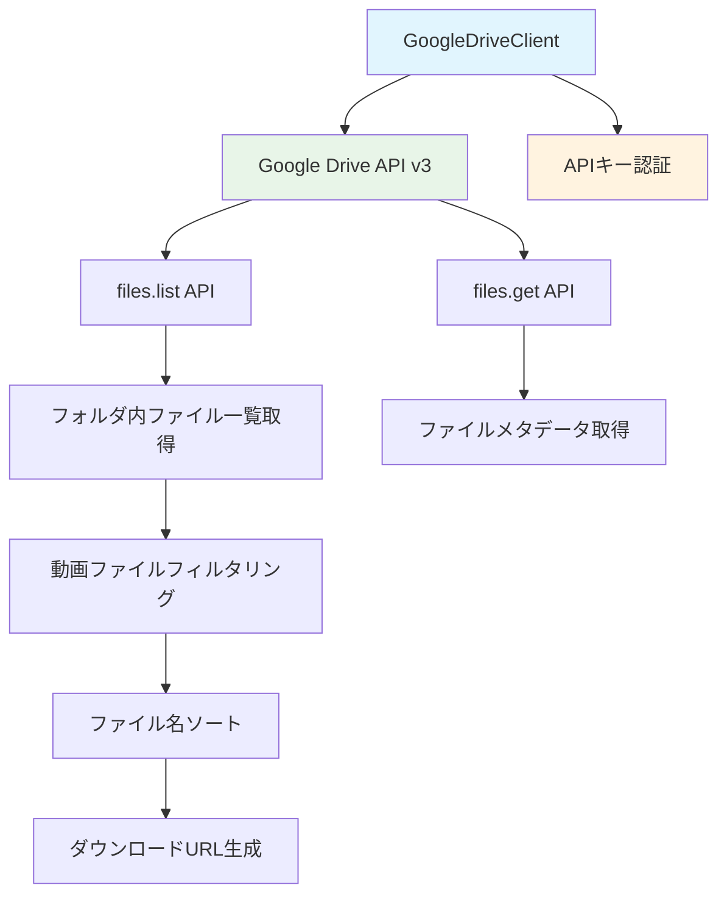

# Google Drive API実装変更設計書

**作成日時**: 2025-07-10 21:00
**対象**: `src/clients/google_drive_client.py`
**変更内容**: HTMLスクレイピングからGoogle Drive API v3への移行
**認証方式**: APIキーを使用した公開ファイルアクセス

## 1. 現在の実装の問題点

現在の`GoogleDriveClient`はHTMLスクレイピングを使用しており、以下の問題があります：

### 1.1 技術的問題
- **信頼性の問題**: Google DriveのHTML構造変更により動作しなくなるリスク
- **パフォーマンス**: HTMLパースとBeautifulSoupによる処理が重い
- **メンテナンス性**: HTML構造に依存した脆弱な実装
- **エラーハンドリング**: スクレイピング特有の不安定性

### 1.2 現在の実装分析

```python
# 現在のスクレイピング実装の問題箇所
def _parse_folder_html(self, html: str, folder_id: str) -> List[DriveFile]:
    soup = BeautifulSoup(html, "html.parser")
    files = []

    script_tags = soup.find_all("script")
    for script in script_tags:
        script_content = getattr(script, 'string', None)
        if script_content and isinstance(script_content, str) and "file" in script_content.lower():
            # 正規表現による脆弱なファイル情報抽出
            file_matches = re.findall(
                r'"([^"]+\.(?:mp4|avi|mov|mkv|wmv|flv|webm))".*?"([a-zA-Z0-9_-]+)"',
                script_content,
                re.IGNORECASE
            )
```

この実装は以下の問題があります：
- HTML構造の変更に脆弱
- 正規表現による不安定なパース
- JavaScriptコンテンツに依存

## 2. Google Drive API v3への移行設計

### 2.1 新しいアーキテクチャ



### 2.2 API設計

#### 2.2.1 新しいGoogleDriveClient

```python
# src/clients/google_drive_client.py (新実装)
import os
import requests
from typing import Optional, List
from pathlib import Path
from urllib.parse import urlparse, parse_qs

from ..models.drive import DriveFile, DriveFolder

class GoogleDriveClient:
    """Google Drive API v3を使用したファイル取得クライアント

    APIキーを使用して公開フォルダからファイル情報を取得します。
    認証が不要で、公開設定されたフォルダのみアクセス可能です。

    Example:
        >>> client = GoogleDriveClient(api_key="your_api_key")
        >>> folder = client.list_files("https://drive.google.com/drive/folders/abc123?usp=sharing")
        >>> video_file = client.select_earliest_video_file(folder)
        >>> if video_file:
        ...     path = client.download_file(video_file, "output/")
        ...     print(f"ダウンロード完了: {path}")
        ダウンロード完了: output/sample_video.mp4
    """

    def __init__(self, api_key: str, session: Optional[requests.Session] = None):
        """GoogleDriveClientを初期化

        Args:
            api_key: Google Drive API v3のAPIキー
            session: HTTPセッション（テスト用）
        """
        self.api_key = api_key
        self.session = session or requests.Session()
        self.base_url = "https://www.googleapis.com/drive/v3"

        # サポートする動画ファイル拡張子
        self.video_extensions = {".mp4", ".avi", ".mov", ".mkv", ".wmv", ".flv", ".webm"}

        # 動画ファイルのMIMEタイプ
        self.video_mime_types = {
            "video/mp4",
            "video/avi",
            "video/quicktime",
            "video/x-msvideo",
            "video/x-ms-wmv",
            "video/x-flv",
            "video/webm"
        }

    def extract_folder_id(self, folder_url: str) -> str:
        """フォルダURLからフォルダIDを抽出

        Args:
            folder_url: Google DriveフォルダURL

        Returns:
            抽出されたフォルダID

        Raises:
            FolderAccessError: 無効なURLの場合
        """
        try:
            # URLパースによる安全な抽出
            if "/folders/" in folder_url:
                folder_id = folder_url.split("/folders/")[1].split("?")[0].split("/")[0]
                return folder_id
            else:
                raise FolderAccessError(f"無効なGoogle DriveフォルダURLです: {folder_url}", folder_url)
        except Exception as e:
            raise FolderAccessError(f"フォルダIDの抽出に失敗しました: {str(e)}", folder_url)

    def list_files(self, folder_url: str) -> DriveFolder:
        """公開フォルダのファイル一覧を取得

        Args:
            folder_url: Google DriveフォルダURL

        Returns:
            フォルダ情報（DriveFolder）

        Raises:
            FolderAccessError: フォルダアクセスに失敗した場合
        """
        try:
            folder_id = self.extract_folder_id(folder_url)

            # Google Drive API v3でファイル一覧を取得
            params = {
                "q": f"'{folder_id}' in parents and trashed=false",
                "fields": "files(id,name,mimeType,size,webContentLink)",
                "key": self.api_key
            }

            response = self.session.get(f"{self.base_url}/files", params=params, timeout=30)
            response.raise_for_status()

            data = response.json()

            if "error" in data:
                raise FolderAccessError(
                    f"Google Drive APIエラー: {data['error']['message']}",
                    folder_url
                )

            files = self._parse_api_response(data.get("files", []))

            return DriveFolder(folder_id=folder_id, files=files)

        except requests.RequestException as e:
            raise FolderAccessError(
                f"Google Drive APIへのアクセスに失敗しました: {str(e)}",
                folder_url
            )
        except Exception as e:
            raise FolderAccessError(
                f"フォルダ情報の取得に失敗しました: {str(e)}",
                folder_url
            )

    def download_file(self, file: DriveFile, output_dir: str) -> str:
        """ファイルをダウンロード

        Args:
            file: ダウンロード対象のファイル情報
            output_dir: 出力ディレクトリパス

        Returns:
            ダウンロードされたファイルのパス

        Raises:
            FileDownloadError: ダウンロードに失敗した場合
        """
        try:
            output_path = Path(output_dir)
            output_path.mkdir(parents=True, exist_ok=True)

            file_path = output_path / file.name

            # Google Drive API v3のダウンロードエンドポイント
            download_url = f"{self.base_url}/files/{file.file_id}?alt=media&key={self.api_key}"

            response = self.session.get(download_url, stream=True, timeout=300)
            response.raise_for_status()

            # ファイルを保存
            with open(file_path, "wb") as f:
                for chunk in response.iter_content(chunk_size=8192):
                    if chunk:
                        f.write(chunk)

            return str(file_path)

        except Exception as e:
            raise FileDownloadError(
                f"ファイルのダウンロードに失敗しました: {str(e)}",
                file.name
            )

    def select_earliest_video_file(self, folder: DriveFolder) -> Optional[DriveFile]:
        """最も若いファイル名の動画ファイルを選択

        Args:
            folder: 検索対象のフォルダ情報

        Returns:
            選択された動画ファイル（見つからない場合はNone）
        """
        video_files = [
            f for f in folder.files
            if any(f.name.lower().endswith(ext) for ext in self.video_extensions)
        ]

        if not video_files:
            return None

        # ファイル名でソート（アルファベット順、大文字小文字を区別しない）
        return sorted(video_files, key=lambda f: f.name.lower())[0]

    def _parse_api_response(self, files_data: List[dict]) -> List[DriveFile]:
        """Google Drive APIレスポンスからファイル情報を抽出

        Args:
            files_data: APIから取得したファイルデータのリスト

        Returns:
            DriveFileオブジェクトのリスト
        """
        files = []

        for file_data in files_data:
            # 動画ファイルのみを対象とする
            mime_type = file_data.get("mimeType", "")
            file_name = file_data.get("name", "")

            is_video = (
                any(file_name.lower().endswith(ext) for ext in self.video_extensions) or
                mime_type in self.video_mime_types
            )

            if is_video:
                files.append(DriveFile(
                    name=file_name,
                    file_id=file_data["id"],
                    download_url=f"{self.base_url}/files/{file_data['id']}?alt=media&key={self.api_key}",
                    size=int(file_data.get("size", 0)) if file_data.get("size") else None
                ))

        return files
```

### 2.3 環境変数設定

#### 2.3.1 .env.example の更新

```bash
# 既存の設定
OPENAI_API_KEY=your_openai_api_key_here
CHATGPT_MODEL=gpt-4o
WHISPER_MODEL=whisper-1

# 新規追加: Google Drive API設定
GOOGLE_DRIVE_API_KEY=your_google_drive_api_key_here
```

#### 2.3.2 DIContainerの更新

```python
# src/main.py の DIContainer クラス更新
class DIContainer:
    def __init__(self) -> None:
        load_dotenv()

        # 既存の設定
        self.openai_api_key = self._get_required_env("OPENAI_API_KEY")
        self.chatgpt_model = os.getenv("CHATGPT_MODEL", "gpt-4o")
        self.whisper_model = os.getenv("WHISPER_MODEL", "whisper-1")

        # 新規追加: Google Drive API設定
        self.google_drive_api_key = self._get_required_env("GOOGLE_DRIVE_API_KEY")

        # クライアントの初期化
        self.whisper_client = WhisperClient(api_key=self.openai_api_key, model=self.whisper_model)
        self.chatgpt_client = ChatGPTClient(api_key=self.openai_api_key, model=self.chatgpt_model)

        # Google Drive APIキーを渡すように変更
        self.google_drive_client = GoogleDriveClient(api_key=self.google_drive_api_key)

        # 残りは既存のまま
        self.prompt_builder = PromptBuilder()
        self.draft_generator = DraftGenerator(
            whisper_client=self.whisper_client,
            chatgpt_client=self.chatgpt_client,
            prompt_builder=self.prompt_builder,
        )
        self.srt_generator = SrtGenerator()
        self.generate_usecase = GenerateShortDraftUsecase(
            draft_generator=self.draft_generator,
            srt_generator=self.srt_generator,
            google_drive_client=self.google_drive_client
        )
```

### 2.4 依存関係の更新

#### 2.4.1 pyproject.toml の変更

```toml
[tool.poetry.dependencies]
python = "^3.8.1"
openai = "^1.0.0"
python-dotenv = "^1.0.0"
click = "^8.0.0"
ffmpeg-python = "^0.2.0"
requests = "^2.31.0"
# beautifulsoup4 = "^4.12.0"  # 削除: スクレイピング不要
# lxml = "^4.9.0"             # 削除: スクレイピング不要
```

### 2.5 エラーハンドリングの改善

#### 2.5.1 新しい例外クラス

```python
# src/clients/google_drive_client.py に追加

class GoogleDriveAPIError(GoogleDriveError):
    """Google Drive API関連のエラー"""
    def __init__(self, message: str, api_error_code: Optional[str] = None):
        super().__init__(message)
        self.api_error_code = api_error_code

class APIKeyError(GoogleDriveError):
    """APIキー関連のエラー"""
    def __init__(self, message: str):
        super().__init__(message)

class QuotaExceededError(GoogleDriveError):
    """API使用量制限エラー"""
    def __init__(self, message: str):
        super().__init__(message)
```

#### 2.5.2 詳細なエラーハンドリング

```python
def list_files(self, folder_url: str) -> DriveFolder:
    try:
        # ... 既存のコード ...

        response = self.session.get(f"{self.base_url}/files", params=params, timeout=30)
        response.raise_for_status()

        data = response.json()

        # APIエラーの詳細処理
        if "error" in data:
            error_info = data["error"]
            error_code = error_info.get("code")
            error_message = error_info.get("message", "不明なエラー")

            if error_code == 403:
                if "quota" in error_message.lower():
                    raise QuotaExceededError(f"API使用量制限に達しました: {error_message}")
                else:
                    raise APIKeyError(f"APIキーが無効または権限がありません: {error_message}")
            elif error_code == 404:
                raise FolderAccessError(f"フォルダが見つからないか、公開されていません: {error_message}", folder_url)
            else:
                raise GoogleDriveAPIError(f"Google Drive APIエラー: {error_message}", str(error_code))

        # ... 残りのコード ...

    except requests.RequestException as e:
        if hasattr(e, 'response') and e.response is not None:
            if e.response.status_code == 403:
                raise APIKeyError("APIキーが無効です。GOOGLE_DRIVE_API_KEYを確認してください。")
            elif e.response.status_code == 404:
                raise FolderAccessError("フォルダが見つからないか、公開されていません。", folder_url)

        raise FolderAccessError(f"Google Drive APIへのアクセスに失敗しました: {str(e)}", folder_url)
```

## 3. 移行手順

### 3.1 Phase 1: 依存関係の更新
1. `pyproject.toml`から`beautifulsoup4`と`lxml`を削除
2. Google Drive APIキーの環境変数設定を追加
3. `poetry install`で依存関係を更新

### 3.2 Phase 2: 実装の置き換え
1. `GoogleDriveClient`クラスの完全な書き換え
2. APIキー認証の実装
3. Google Drive API v3エンドポイントの使用

### 3.3 Phase 3: テストと検証
1. 既存のテストケースの更新
2. API制限とエラーハンドリングのテスト
3. 実際のGoogle Driveフォルダでの動作確認

## 4. セキュリティ考慮事項

### 4.1 APIキーの管理
- 環境変数での管理を徹底
- `.env`ファイルの`.gitignore`登録確認
- APIキーの権限を最小限に制限

### 4.2 API使用量制限
- Google Drive APIの1日あたりの制限を考慮
- レート制限に対する適切なエラーハンドリング
- 必要に応じてリトライ機能の実装

### 4.3 公開フォルダのみアクセス
- APIキー認証では公開フォルダのみアクセス可能
- プライベートフォルダへのアクセス試行時の適切なエラー処理

## 5. 利点

### 5.1 技術的利点
- **安定性**: 公式APIによる安定したアクセス
- **パフォーマンス**: HTMLパース不要で高速
- **メンテナンス性**: APIの仕様変更に対する耐性
- **エラーハンドリング**: 詳細なエラー情報の取得

### 5.2 運用面の利点
- **信頼性**: Google公式APIによる保証
- **拡張性**: 将来的な機能追加が容易
- **デバッグ**: APIレスポンスによる明確なエラー情報

## 6. 注意事項

### 6.1 API制限
- Google Drive APIには1日あたりの使用量制限があります
- 大量のファイルアクセスを行う場合は制限に注意

### 6.2 公開設定の必要性
- APIキー認証では公開設定されたフォルダのみアクセス可能
- フォルダの共有設定で「リンクを知っている全員」に設定する必要

### 6.3 APIキーの取得
- Google Cloud Consoleでプロジェクトを作成
- Drive APIを有効化
- APIキーを作成し、必要に応じて制限を設定

## 7. 実装後の確認項目

- [ ] 既存のインターフェースとの互換性確認
- [ ] エラーハンドリングの動作確認
- [ ] APIキー設定の動作確認
- [ ] 実際のGoogle Driveフォルダでのテスト
- [ ] パフォーマンスの改善確認
- [ ] セキュリティ設定の確認

この設計により、より安定で保守性の高いGoogle Drive連携機能を実現できます。
