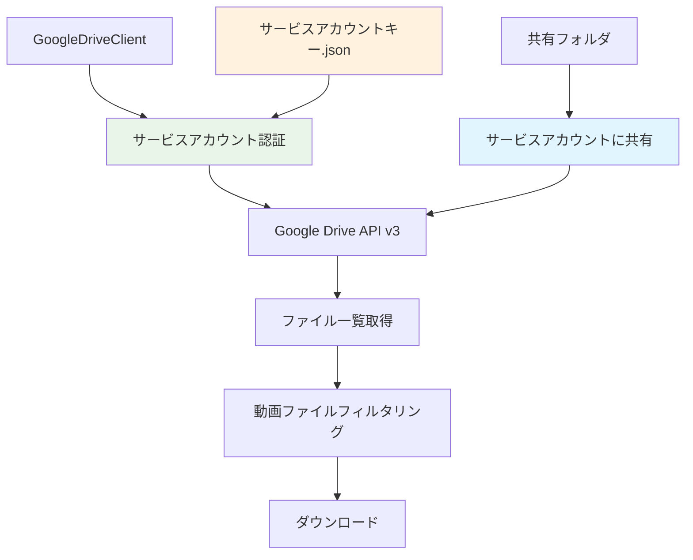

# Google Drive サービスアカウント認証変更設計書

**作成日時**: 2025-07-10 21:36
**対象**: `src/clients/google_drive_client.py`
**変更内容**: APIキー認証からサービスアカウント認証への移行
**理由**: APIキー認証では公開フォルダのみアクセス可能だが、サービスアカウント認証では共有フォルダにアクセス可能

## 1. 問題の分析

### 1.1 現在の問題
- APIキー認証では「一般公開」フォルダのみアクセス可能
- 「リンクを知っている全員」設定のフォルダには404エラーでアクセス不可
- セキュリティ上、フォルダを一般公開にしたくない

### 1.2 解決策
サービスアカウント認証を使用することで：
- フォルダの公開設定を変更せずにアクセス可能
- サービスアカウントに直接共有権限を付与
- より安全な認証方式

## 2. サービスアカウント認証の設計

### 2.1 アーキテクチャ変更



### 2.2 必要な変更

#### 2.2.1 依存関係の追加

```toml
# pyproject.toml
[tool.poetry.dependencies]
python = "^3.8.1"
openai = "^1.0.0"
python-dotenv = "^1.0.0"
click = "^8.0.0"
ffmpeg-python = "^0.2.0"
requests = "^2.31.0"
google-auth = "^2.23.0"           # 新規追加
google-auth-oauthlib = "^1.1.0"   # 新規追加
google-auth-httplib2 = "^0.2.0"   # 新規追加
google-api-python-client = "^2.100.0"  # 新規追加
```

#### 2.2.2 新しいGoogleDriveClient実装

```python
# src/clients/google_drive_client.py
import os
import json
from typing import Optional, List
from pathlib import Path
from google.auth.transport.requests import Request
from google.oauth2 import service_account
from googleapiclient.discovery import build
from googleapiclient.http import MediaIoBaseDownload
import io

from ..models.drive import DriveFile, DriveFolder

class GoogleDriveClient:
    """Google Drive API v3 サービスアカウント認証クライアント

    サービスアカウントを使用して共有フォルダからファイル情報を取得します。
    フォルダの公開設定を変更せず、サービスアカウントに共有権限を付与するだけで使用可能です。

    Example:
        >>> client = GoogleDriveClient(service_account_path="path/to/service-account.json")
        >>> folder = client.list_files("https://drive.google.com/drive/folders/abc123?usp=sharing")
        >>> video_file = client.select_earliest_video_file(folder)
        >>> if video_file:
        ...     path = client.download_file(video_file, "output/")
        ...     print(f"ダウンロード完了: {path}")
        ダウンロード完了: output/sample_video.mp4
    """

    def __init__(self, service_account_path: str):
        """GoogleDriveClientを初期化

        Args:
            service_account_path: サービスアカウントキーファイルのパス
        """
        self.service_account_path = service_account_path
        self.scopes = ['https://www.googleapis.com/auth/drive.readonly']

        # サポートする動画ファイル拡張子
        self.video_extensions = {".mp4", ".avi", ".mov", ".mkv", ".wmv", ".flv", ".webm"}

        # 動画ファイルのMIMEタイプ
        self.video_mime_types = {
            "video/mp4",
            "video/avi",
            "video/quicktime",
            "video/x-msvideo",
            "video/x-ms-wmv",
            "video/x-flv",
            "video/webm"
        }

        # Google Drive APIサービスを初期化
        self.service = self._build_service()

    def _build_service(self):
        """Google Drive APIサービスを構築"""
        try:
            # サービスアカウントキーファイルから認証情報を読み込み
            credentials = service_account.Credentials.from_service_account_file(
                self.service_account_path,
                scopes=self.scopes
            )

            # Google Drive APIサービスを構築
            service = build('drive', 'v3', credentials=credentials)
            return service

        except FileNotFoundError:
            raise GoogleDriveError(f"サービスアカウントキーファイルが見つかりません: {self.service_account_path}")
        except json.JSONDecodeError:
            raise GoogleDriveError(f"サービスアカウントキーファイルの形式が正しくありません: {self.service_account_path}")
        except Exception as e:
            raise GoogleDriveError(f"Google Drive APIサービスの初期化に失敗しました: {str(e)}")

    def extract_folder_id(self, folder_url: str) -> str:
        """フォルダURLからフォルダIDを抽出

        Args:
            folder_url: Google DriveフォルダURL

        Returns:
            抽出されたフォルダID

        Raises:
            FolderAccessError: 無効なURLの場合
        """
        try:
            if "/folders/" in folder_url:
                folder_id = folder_url.split("/folders/")[1].split("?")[0].split("/")[0]
                return folder_id
            else:
                raise FolderAccessError(f"無効なGoogle DriveフォルダURLです: {folder_url}", folder_url)
        except Exception as e:
            raise FolderAccessError(f"フォルダIDの抽出に失敗しました: {str(e)}", folder_url)

    def list_files(self, folder_url: str) -> DriveFolder:
        """共有フォルダのファイル一覧を取得

        Args:
            folder_url: Google DriveフォルダURL

        Returns:
            フォルダ情報（DriveFolder）

        Raises:
            FolderAccessError: フォルダアクセスに失敗した場合
        """
        try:
            folder_id = self.extract_folder_id(folder_url)

            # まずフォルダ自体の情報を取得してアクセス可能かテスト
            try:
                folder_info = self.service.files().get(fileId=folder_id).execute()
                print(f"DEBUG: フォルダ名: {folder_info.get('name', 'N/A')}")
                print(f"DEBUG: フォルダMIMEタイプ: {folder_info.get('mimeType', 'N/A')}")
            except Exception as e:
                raise FolderAccessError(
                    f"フォルダにアクセスできません。サービスアカウント（{self._get_service_account_email()}）に"
                    f"フォルダの共有権限が付与されているか確認してください。\n"
                    f"Google Driveでフォルダを右クリック → 共有 → サービスアカウントのメールアドレスを追加してください。",
                    folder_url
                )

            # フォルダ内のファイル一覧を取得
            query = f"'{folder_id}' in parents and trashed=false"
            results = self.service.files().list(
                q=query,
                fields="files(id,name,mimeType,size,webContentLink)"
            ).execute()

            files_data = results.get('files', [])

            # デバッグ用: 取得したファイル一覧を表示
            print(f"DEBUG: フォルダ内のファイル数: {len(files_data)}")
            for file_data in files_data:
                print(f"DEBUG: ファイル名: {file_data.get('name', 'N/A')}, MIMEタイプ: {file_data.get('mimeType', 'N/A')}")

            files = self._parse_api_response(files_data)

            print(f"DEBUG: 動画ファイルとして認識されたファイル数: {len(files)}")
            for file in files:
                print(f"DEBUG: 動画ファイル: {file.name}")

            return DriveFolder(folder_id=folder_id, files=files)

        except FolderAccessError:
            raise
        except Exception as e:
            raise FolderAccessError(f"フォルダ情報の取得に失敗しました: {str(e)}", folder_url)

    def download_file(self, file: DriveFile, output_dir: str) -> str:
        """ファイルをダウンロード

        Args:
            file: ダウンロード対象のファイル情報
            output_dir: 出力ディレクトリパス

        Returns:
            ダウンロードされたファイルのパス

        Raises:
            FileDownloadError: ダウンロードに失敗した場合
        """
        try:
            output_path = Path(output_dir)
            output_path.mkdir(parents=True, exist_ok=True)

            file_path = output_path / file.name

            # Google Drive APIでファイルをダウンロード
            request = self.service.files().get_media(fileId=file.file_id)

            with open(file_path, "wb") as f:
                downloader = MediaIoBaseDownload(f, request)
                done = False
                while done is False:
                    status, done = downloader.next_chunk()
                    if status:
                        print(f"DEBUG: ダウンロード進行状況: {int(status.progress() * 100)}%")

            return str(file_path)

        except Exception as e:
            raise FileDownloadError(f"ファイルのダウンロードに失敗しました: {str(e)}", file.name)

    def select_earliest_video_file(self, folder: DriveFolder) -> Optional[DriveFile]:
        """最も若いファイル名の動画ファイルを選択

        Args:
            folder: 検索対象のフォルダ情報

        Returns:
            選択された動画ファイル（見つからない場合はNone）
        """
        video_files = [
            f for f in folder.files
            if any(f.name.lower().endswith(ext) for ext in self.video_extensions)
        ]

        if not video_files:
            return None

        # ファイル名でソート（アルファベット順、大文字小文字を区別しない）
        return sorted(video_files, key=lambda f: f.name.lower())[0]

    def _parse_api_response(self, files_data: List[dict]) -> List[DriveFile]:
        """Google Drive APIレスポンスからファイル情報を抽出

        Args:
            files_data: APIから取得したファイルデータのリスト

        Returns:
            DriveFileオブジェクトのリスト
        """
        files = []

        for file_data in files_data:
            # 動画ファイルのみを対象とする
            mime_type = file_data.get("mimeType", "")
            file_name = file_data.get("name", "")

            is_video = (
                any(file_name.lower().endswith(ext) for ext in self.video_extensions) or
                mime_type in self.video_mime_types
            )

            if is_video:
                files.append(DriveFile(
                    name=file_name,
                    file_id=file_data["id"],
                    download_url=f"https://drive.google.com/uc?export=download&id={file_data['id']}",
                    size=int(file_data.get("size", 0)) if file_data.get("size") else None
                ))

        return files

    def _get_service_account_email(self) -> str:
        """サービスアカウントのメールアドレスを取得"""
        try:
            with open(self.service_account_path, 'r') as f:
                service_account_info = json.load(f)
                return service_account_info.get('client_email', 'unknown')
        except:
            return 'unknown'
```

#### 2.2.3 環境変数設定の変更

```bash
# .env.example
# OpenAI API設定
OPENAI_API_KEY=your_openai_api_key_here
CHATGPT_MODEL=gpt-4o
WHISPER_MODEL=whisper-1

# Google Drive API設定（サービスアカウント）
GOOGLE_SERVICE_ACCOUNT_PATH=path/to/service-account-key.json
```

#### 2.2.4 DIContainerの更新

```python
# src/main.py の DIContainer クラス更新
class DIContainer:
    def __init__(self) -> None:
        load_dotenv()

        # 既存の設定
        self.openai_api_key = self._get_required_env("OPENAI_API_KEY")
        self.chatgpt_model = os.getenv("CHATGPT_MODEL", "gpt-4o")
        self.whisper_model = os.getenv("WHISPER_MODEL", "whisper-1")

        # Google Drive API設定（サービスアカウント）
        self.google_service_account_path = self._get_required_env("GOOGLE_SERVICE_ACCOUNT_PATH")

        # クライアントの初期化
        self.whisper_client = WhisperClient(api_key=self.openai_api_key, model=self.whisper_model)
        self.chatgpt_client = ChatGPTClient(api_key=self.openai_api_key, model=self.chatgpt_model)

        # サービスアカウントパスを渡すように変更
        self.google_drive_client = GoogleDriveClient(service_account_path=self.google_service_account_path)

        # 残りは既存のまま
        self.prompt_builder = PromptBuilder()
        self.draft_generator = DraftGenerator(
            whisper_client=self.whisper_client,
            chatgpt_client=self.chatgpt_client,
            prompt_builder=self.prompt_builder,
        )
        self.srt_generator = SrtGenerator()
        self.generate_usecase = GenerateShortDraftUsecase(
            draft_generator=self.draft_generator,
            srt_generator=self.srt_generator,
            google_drive_client=self.google_drive_client
        )

    def _get_required_env(self, key: str) -> str:
        """必須環境変数を取得"""
        value = os.getenv(key)
        if not value:
            click.echo(f"エラー: 環境変数 {key} が設定されていません", err=True)
            click.echo("以下の環境変数を設定してください:", err=True)
            click.echo("  OPENAI_API_KEY=your_openai_api_key", err=True)
            click.echo("  GOOGLE_SERVICE_ACCOUNT_PATH=path/to/service-account-key.json", err=True)
            click.echo("", err=True)
            click.echo("オプション:", err=True)
            click.echo("  CHATGPT_MODEL=gpt-4o  # デフォルト: gpt-4o", err=True)
            click.echo("  WHISPER_MODEL=whisper-1  # デフォルト: whisper-1", err=True)
            sys.exit(1)
        return value
```

## 3. サービスアカウント設定手順

### 3.1 Google Cloud Console設定

1. **Google Cloud Consoleにアクセス**
   - https://console.cloud.google.com/

2. **プロジェクトの作成または選択**
   - 新規プロジェクトを作成するか、既存のプロジェクトを選択

3. **Google Drive APIの有効化**
   - APIとサービス → ライブラリ
   - "Google Drive API"を検索して有効化

4. **サービスアカウントの作成**
   - IAMと管理 → サービスアカウント
   - 「サービスアカウントを作成」をクリック
   - 名前: `shortmovie-drive-access`
   - 説明: `ショート動画プロジェクト用Google Driveアクセス`

5. **サービスアカウントキーの作成**
   - 作成したサービスアカウントをクリック
   - 「キー」タブ → 「キーを追加」→ 「新しいキーを作成」
   - 形式: JSON
   - ダウンロードしたJSONファイルを安全な場所に保存

### 3.2 Google Driveフォルダ共有設定

1. **Google Driveでフォルダを右クリック**
2. **「共有」を選択**
3. **サービスアカウントのメールアドレスを追加**
   - JSONファイル内の`client_email`の値をコピー
   - 共有ダイアログに貼り付け
   - 権限: 「閲覧者」
4. **「送信」をクリック**

### 3.3 プロジェクト設定

1. **サービスアカウントキーファイルの配置**
   ```bash
   mkdir -p credentials
   cp /path/to/downloaded-service-account-key.json credentials/service-account-key.json
   ```

2. **環境変数の設定**
   ```bash
   # .env ファイルに追加
   GOOGLE_SERVICE_ACCOUNT_PATH=credentials/service-account-key.json
   ```

3. **gitignoreの更新**
   ```gitignore
   # 既存の内容
   .env

   # 新規追加
   credentials/
   *.json
   ```

## 4. 利点とセキュリティ

### 4.1 利点
- **セキュリティ**: フォルダを一般公開する必要がない
- **柔軟性**: 特定のサービスアカウントのみにアクセス権限を付与
- **管理性**: 権限の追加・削除が容易
- **監査**: アクセスログの追跡が可能

### 4.2 セキュリティ考慮事項
- **キーファイルの管理**: サービスアカウントキーファイルは機密情報
- **権限の最小化**: 必要最小限の権限（読み取り専用）のみ付与
- **定期的なローテーション**: 定期的にサービスアカウントキーを更新

## 5. 移行手順

### 5.1 Phase 1: 依存関係の更新
1. `pyproject.toml`にGoogle API関連ライブラリを追加
2. `poetry install`で依存関係を更新

### 5.2 Phase 2: 実装の変更
1. `GoogleDriveClient`クラスの完全な書き換え
2. サービスアカウント認証の実装
3. Google API Python Clientの使用

### 5.3 Phase 3: 設定とテスト
1. サービスアカウントの作成と設定
2. フォルダ共有権限の設定
3. 実際のGoogle Driveフォルダでの動作確認

## 6. エラーハンドリング

### 6.1 認証エラー
- サービスアカウントキーファイルの存在確認
- JSONファイルの形式検証
- 権限不足の場合の適切なエラーメッセージ

### 6.2 アクセス権限エラー
- フォルダ共有設定の確認指示
- サービスアカウントメールアドレスの表示
- 具体的な設定手順の案内

## 7. 後方互換性

既存の[`DriveFile`](src/models/drive.py:8)、[`DriveFolder`](src/models/drive.py:35)データ構造は変更せず、[`GoogleDriveVideoSource`](src/sources/google_drive_video_source.py:7)との互換性を維持します。

## 8. まとめ

この変更により、以下が実現されます：

1. **セキュリティの向上**: フォルダの一般公開が不要
2. **使いやすさの向上**: 共有権限の設定のみで利用可能
3. **安定性の向上**: 公式Google APIライブラリの使用
4. **保守性の向上**: 標準的な認証方式の採用

サービスアカウント認証により、より安全で実用的なGoogle Drive連携機能を提供できます。
