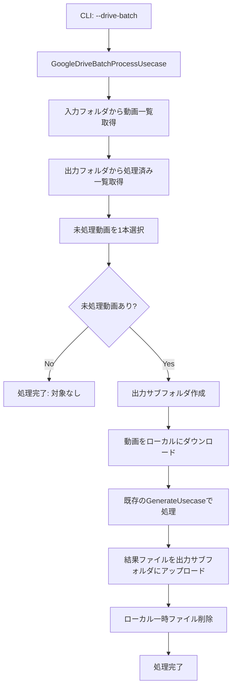

# Google Driveバッチ処理機能拡張設計書

**作成日時**: 2025-01-11 09:10:00
**対象プロジェクト**: ショート動画設計図生成プロジェクト

## 概要

既存のローカルバッチ処理機能を拡張し、入力ディレクトリと出力ディレクトリの両方をGoogle Driveフォルダで指定できるバッチ処理機能を追加する。既存の`_find_unprocessed_video`ロジックをGoogle Drive対応に拡張し、同じ動画の重複処理を防ぐ仕組みを実装する。

## 要件分析

### 現在の実装状況
- **ローカルバッチ処理**: [`tasks/250710_2355_バッチ処理CLI機能拡張設計書.md`](tasks/250710_2355_バッチ処理CLI機能拡張設計書.md)で設計済み（未実装）
- **Google Drive連携**: [`src/clients/google_drive_client.py`](src/clients/google_drive_client.py) - 単一フォルダからの処理
- **未処理動画検出**: ローカルディレクトリベースの`_find_unprocessed_video`ロジック設計済み

### 新要件
1. **Google Drive入力フォルダ**: 複数動画ファイルから未処理を1本選択
2. **Google Drive出力フォルダ**: 動画名のサブフォルダ作成による処理済み判定
3. **重複処理防止**: 出力フォルダ内のサブフォルダ存在チェック
4. **既存機能維持**: ローカル処理・単一Google Drive処理は継続サポート

## システム設計

### 1. アーキテクチャ概要



### 2. 新しいユースケース: GoogleDriveBatchProcessUsecase

#### クラス設計
```python
class GoogleDriveBatchProcessUsecase:
    """Google Drive入力・出力対応バッチ処理ユースケース

    Google Driveフォルダ間でのバッチ処理を実行し、
    既存の_find_unprocessed_videoロジックをGoogle Drive対応に拡張する。
    """

    def __init__(self,
                 generate_usecase: GenerateShortDraftUsecase,
                 google_drive_client: GoogleDriveClient):
        self.generate_usecase = generate_usecase
        self.google_drive_client = google_drive_client

    def execute_drive_batch(self,
                           input_folder_url: str,
                           output_folder_url: str) -> GoogleDriveBatchResult:
        """Google Drive間でのバッチ処理実行

        Args:
            input_folder_url: 入力Google DriveフォルダURL
            output_folder_url: 出力Google DriveフォルダURL

        Returns:
            処理結果（GoogleDriveBatchResult）
        """
```

#### 未処理動画検出ロジック（Google Drive対応）
```python
def _find_unprocessed_video_from_drive(self,
                                      input_folder_url: str,
                                      output_folder_url: str) -> Optional[DriveFile]:
    """Google Driveフォルダから未処理動画を1本検出

    既存の_find_unprocessed_videoロジックをGoogle Drive対応に拡張

    処理ロジック:
    1. 入力フォルダから動画ファイル一覧を取得
    2. ファイル名順でソート（安定した処理順序）
    3. 出力フォルダ内に同名サブフォルダが存在しない動画を検索
    4. 最初に見つかった未処理動画を返す
    """
    try:
        # 1. 入力フォルダから動画ファイル一覧を取得
        input_folder = self.google_drive_client.list_files(input_folder_url)
        video_files = [f for f in input_folder.files
                      if self._is_video_file(f)]

        if not video_files:
            return None

        # 2. ファイル名順でソート（既存ロジックと同様の安定した処理順序）
        video_files.sort(key=lambda x: x.name)

        # 3. 出力フォルダIDを取得
        output_folder_id = self.google_drive_client.extract_folder_id(output_folder_url)

        # 4. 未処理動画を検索
        for video_file in video_files:
            video_name = Path(video_file.name).stem

            # 出力フォルダ内に同名サブフォルダが存在しない場合は未処理
            if not self.google_drive_client.folder_exists(output_folder_id, video_name):
                return video_file

        return None

    except Exception as e:
        raise GoogleDriveError(f"未処理動画の検出に失敗しました: {str(e)}")
```

### 3. GoogleDriveClient拡張

#### 新規メソッド
```python
def folder_exists(self, parent_folder_id: str, folder_name: str) -> bool:
    """指定した親フォルダ内に特定の名前のフォルダが存在するかチェック"""
    query = f"'{parent_folder_id}' in parents and name='{folder_name}' and mimeType='application/vnd.google-apps.folder' and trashed=false"

    results = self.service.files().list(
        q=query,
        fields="files(id,name)",
        supportsAllDrives=True,
        includeItemsFromAllDrives=True
    ).execute()

    return len(results.get('files', [])) > 0

def create_folder(self, parent_folder_id: str, folder_name: str) -> str:
    """指定した親フォルダ内にサブフォルダを作成"""
    folder_metadata = {
        'name': folder_name,
        'parents': [parent_folder_id],
        'mimeType': 'application/vnd.google-apps.folder'
    }

    folder = self.service.files().create(
        body=folder_metadata,
        supportsAllDrives=True
    ).execute()

    return folder['id']

def list_folders(self, folder_url: str) -> List[DriveFile]:
    """フォルダ内のサブフォルダ一覧を取得"""
    folder = self.list_files(folder_url)
    return [f for f in folder.files if f.mime_type == 'application/vnd.google-apps.folder']
```

### 4. 出力構造設計

#### Google Drive出力フォルダ構造
```
output_folder/
├── video01/
│   ├── draft.md
│   ├── subtitle.srt
│   └── video01.mp4
└── video02/
    ├── draft.md
    ├── subtitle.srt
    └── video02.mp4
```

#### 処理済み判定ロジック
- **判定方法**: 出力フォルダ内の動画名サブフォルダの存在
- **利点**:
  - シンプルで確実な判定
  - 既存のローカルバッチ処理設計と一貫性
  - Google Drive APIの標準機能のみ使用

### 5. CLIインターフェース拡張

#### 新しいコマンドオプション
```python
@click.command()
@click.argument("input_source", type=str, required=False)
@click.argument("output_dir", type=click.Path(path_type=Path), required=False)
@click.option("--batch", is_flag=True, help="バッチ処理モード（ローカル）")
@click.option("--drive-batch", is_flag=True, help="Google Driveバッチ処理モード")
@click.option("--input-drive-folder", type=str, help="入力Google DriveフォルダURL")
@click.option("--output-drive-folder", type=str, help="出力Google DriveフォルダURL")
@click.option("--drive", is_flag=True, help="Google DriveフォルダURLとして処理")
@click.option("--verbose", "-v", is_flag=True, help="詳細なログを出力")
```

#### コマンド使用例
```bash
# Google Drive間バッチ処理
poetry run python src/main.py --drive-batch \
  --input-drive-folder "https://drive.google.com/drive/folders/input_folder_id" \
  --output-drive-folder "https://drive.google.com/drive/folders/output_folder_id"

# 環境変数での設定
export INPUT_DRIVE_FOLDER="https://drive.google.com/drive/folders/input_folder_id"
export OUTPUT_DRIVE_FOLDER="https://drive.google.com/drive/folders/output_folder_id"
poetry run python src/main.py --drive-batch

# 詳細ログ付き
poetry run python src/main.py --drive-batch \
  --input-drive-folder "https://drive.google.com/..." \
  --output-drive-folder "https://drive.google.com/..." \
  --verbose
```

### 6. データ構造拡張

#### 新しい結果モデル
```python
@dataclass
class GoogleDriveBatchResult:
    """Google Driveバッチ処理結果"""
    success: bool
    processed_video: Optional[str] = None
    output_folder_id: Optional[str] = None
    draft_url: Optional[str] = None
    subtitle_url: Optional[str] = None
    video_url: Optional[str] = None
    message: Optional[str] = None
    error_message: Optional[str] = None

    @classmethod
    def no_unprocessed_videos(cls) -> 'GoogleDriveBatchResult':
        """処理対象がない場合の結果"""
        return cls(
            success=True,
            message="処理対象の動画がありません"
        )

    @classmethod
    def from_error(cls, error_message: str) -> 'GoogleDriveBatchResult':
        """エラー結果の生成"""
        return cls(
            success=False,
            error_message=error_message
        )
```

### 7. 環境変数拡張

#### .env設定追加
```bash
# 既存設定
OPENAI_API_KEY=your_openai_api_key_here
CHATGPT_MODEL=gpt-4o
WHISPER_MODEL=whisper-1
GOOGLE_SERVICE_ACCOUNT_PATH=path/to/service-account-key.json

# ローカルバッチ処理用
INPUT_DIR=input/
OUTPUT_DIR=output/

# Google Driveバッチ処理用（新規追加）
INPUT_DRIVE_FOLDER=https://drive.google.com/drive/folders/input_folder_id
OUTPUT_DRIVE_FOLDER=https://drive.google.com/drive/folders/output_folder_id
```

## 実装計画

### Phase 1: GoogleDriveClient拡張
1. **フォルダ操作メソッド追加**
   - [`src/clients/google_drive_client.py`](src/clients/google_drive_client.py)に`folder_exists()`, `create_folder()`, `list_folders()`追加

2. **テスト実装**
   - [`tests/test_clients/test_google_drive_client.py`](tests/test_clients/test_google_drive_client.py)にフォルダ操作のテスト追加

### Phase 2: GoogleDriveBatchProcessUsecase実装
1. **新しいユースケース作成**
   - [`src/usecases/google_drive_batch_process_usecase.py`](src/usecases/google_drive_batch_process_usecase.py)の新規作成
   - 未処理動画検出ロジック実装
   - 出力構造管理ロジック実装

2. **データ構造拡張**
   - [`src/models/result.py`](src/models/result.py)に`GoogleDriveBatchResult`追加

### Phase 3: CLI拡張
1. **main.py拡張**
   - `--drive-batch`オプション追加
   - `--input-drive-folder`, `--output-drive-folder`オプション追加
   - Google Driveバッチモードの分岐処理

2. **環境変数対応**
   - [`DIContainer`](src/main.py:18)に`INPUT_DRIVE_FOLDER`, `OUTPUT_DRIVE_FOLDER`の読み込み追加
   - [`.env.example`](.env.example)の更新

### Phase 4: 統合テスト
1. **エンドツーエンドテスト**
   - Google Drive間でのバッチ処理フロー
   - 未処理動画検出の正確性
   - 重複処理防止の確認

## 互換性とマイグレーション

### 既存機能への影響
- **ゼロ影響**: 既存のコマンドライン引数は完全に維持
- **追加のみ**: 新しいオプションとユースケースのみ追加
- **デフォルト動作**: `--drive-batch`フラグがない場合は既存動作

### 段階的移行
1. **Phase 1**: 新機能追加（既存機能は無変更）
2. **Phase 2**: 新機能のテスト・検証
3. **Phase 3**: ドキュメント更新

## テスト戦略

### 単体テスト
- [`tests/test_clients/test_google_drive_client.py`](tests/test_clients/test_google_drive_client.py) - フォルダ操作メソッド
- [`tests/test_usecases/test_google_drive_batch_process_usecase.py`](tests/test_usecases/test_google_drive_batch_process_usecase.py) - バッチ処理ロジック

### 統合テスト
- Google Drive間でのバッチ処理フロー
- 未処理動画検出の正確性
- 環境変数とコマンドライン引数の優先順位

### エラーケーステスト
- 入力フォルダが存在しない場合
- 出力フォルダへのアクセス権限がない場合
- 処理対象動画がない場合
- Google Drive API制限エラー

## 運用考慮事項

### ログ出力
```python
# Google Driveバッチ処理開始
click.echo("🔄 Google Driveバッチ処理を開始します...")
click.echo(f"📁 入力フォルダ: {input_folder_url}")
click.echo(f"📁 出力フォルダ: {output_folder_url}")

# 処理対象動画
click.echo(f"🎬 処理対象動画: {video_file.name}")

# 出力フォルダ作成
click.echo(f"📂 出力サブフォルダ作成: {video_name}/")

# 処理完了
click.echo(f"✅ 処理完了: {video_name}/")
click.echo(f"  📄 企画書: {draft_url}")
click.echo(f"  📝 字幕: {subtitle_url}")
click.echo(f"  🎬 動画: {video_url}")
```

### エラーハンドリング
- **Google Drive API制限**: リトライ機能とレート制限対応
- **ネットワークエラー**: 一時的な接続エラーのリトライ
- **権限エラー**: 明確なエラーメッセージとサービスアカウント設定ガイド

### パフォーマンス考慮
- **並列処理対応**: 将来的な複数動画同時処理への拡張性
- **キャッシュ機能**: フォルダ一覧の一時キャッシュ
- **帯域幅制御**: 大容量動画ファイルのダウンロード・アップロード制御

## 使用例

### 基本的なGoogle Driveバッチ処理
```bash
# コマンドライン引数で指定
poetry run python src/main.py --drive-batch \
  --input-drive-folder "https://drive.google.com/drive/folders/1ABC123..." \
  --output-drive-folder "https://drive.google.com/drive/folders/1XYZ789..." \
  --verbose

# 環境変数で設定
export INPUT_DRIVE_FOLDER="https://drive.google.com/drive/folders/1ABC123..."
export OUTPUT_DRIVE_FOLDER="https://drive.google.com/drive/folders/1XYZ789..."
poetry run python src/main.py --drive-batch --verbose
```

### シェルスクリプトでのループ処理
```bash
#!/bin/bash
# process_all_drive_videos.sh

export INPUT_DRIVE_FOLDER="https://drive.google.com/drive/folders/1ABC123..."
export OUTPUT_DRIVE_FOLDER="https://drive.google.com/drive/folders/1XYZ789..."

while true; do
    echo "Google Driveバッチ処理を実行中..."
    poetry run python src/main.py --drive-batch --verbose

    if [ $? -ne 0 ]; then
        echo "処理対象がないか、エラーが発生しました"
        break
    fi

    echo "次の動画を処理します..."
    sleep 5
done

echo "全ての動画の処理が完了しました"
```

## まとめ

この設計により以下を実現する：

1. **Google Drive完全対応**: 入力・出力両方をGoogle Driveフォルダで指定可能
2. **重複処理防止**: 既存の`_find_unprocessed_video`ロジックをGoogle Drive対応に拡張
3. **既存機能の完全保持**: ローカル処理・単一Google Drive処理は無変更
4. **柔軟な設定**: 環境変数とコマンドライン引数による設定
5. **スケーラブルな運用**: シェルスクリプトでのループ処理・並列処理対応
6. **明確な処理状態**: Google Driveフォルダ構造による処理済み判定
7. **段階的な実装**: 既存コードへの影響を最小化した拡張

次のステップとして、この設計に基づいた実装を段階的に行う。
