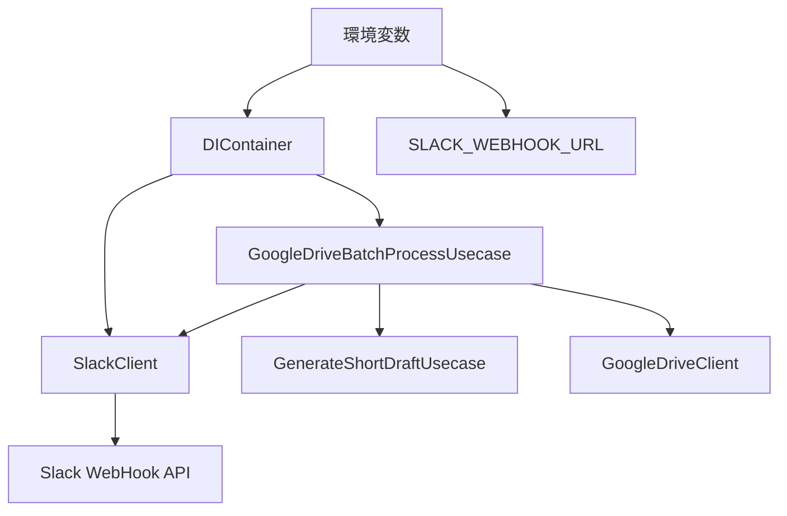

# Google Drive バッチ処理 Slack 通知統合設計書

**作成日時**: 2025-01-11 17:58
**対象機能**: Google Drive バッチ処理での Slack 通知機能統合

## 概要

Google Drive バッチ処理において、動画処理の開始・完了・失敗時に Slack へ通知を送信する機能を実装します。既存の[`SlackClient`](../src/clients/slack_client.py)を活用し、バッチ処理の進捗をリアルタイムで監視できるようにします。

## 要件

### 機能要件

1. **動画処理開始時の通知**

   - 未処理動画を発見した時点で通知
   - 含める情報：動画ファイル名、Google Drive 上の動画 URL

2. **台本生成完了時の通知**

   - 1 本の動画処理が正常完了した時点で通知
   - 含める情報：動画ファイル名、出力フォルダの Google Drive URL

3. **台本生成失敗時の通知**
   - 1 本の動画処理が失敗した時点で通知
   - 含める情報：エラー理由、失敗した動画ファイル名

### 非機能要件

- Slack 通知は**オプション機能**として実装（環境変数未設定時は通知なし）
- 既存の処理フローに影響を与えない
- 通知送信失敗時も処理は継続

## システム設計

### アーキテクチャ図



### クラス設計

#### 1. SlackClient 拡張

既存の[`SlackClient`](../src/clients/slack_client.py)に動画処理専用メソッドを追加：

```python
class SlackClient:
    # 既存メソッド...

    def send_video_processing_start(
        self,
        video_name: str,
        video_url: str
    ) -> None:
        """動画処理開始通知を送信"""

    def send_video_processing_success(
        self,
        video_name: str,
        output_folder_url: str,
        processing_time: float
    ) -> None:
        """動画処理成功通知を送信"""

    def send_video_processing_error(
        self,
        video_name: str,
        error_message: str
    ) -> None:
        """動画処理失敗通知を送信"""
```

#### 2. DIContainer 拡張

[`DIContainer`](../src/main.py:19-96)に SlackClient 統合：

```python
class DIContainer:
    def __init__(self) -> None:
        # 既存の初期化...

        # Slack設定（オプション）
        self.slack_webhook_url = os.getenv("SLACK_WEBHOOK_URL")
        self.slack_client = None
        if self.slack_webhook_url:
            self.slack_client = SlackClient(self.slack_webhook_url)

        # GoogleDriveBatchProcessUsecaseにSlackClient注入
        self.google_drive_batch_usecase = GoogleDriveBatchProcessUsecase(
            generate_usecase=self.generate_usecase,
            google_drive_client=self.google_drive_client,
            slack_client=self.slack_client  # 新規追加
        )
```

#### 3. GoogleDriveBatchProcessUsecase 拡張

[`GoogleDriveBatchProcessUsecase`](../src/usecases/google_drive_batch_process_usecase.py)に Slack 通知統合：

```python
class GoogleDriveBatchProcessUsecase:
    def __init__(
        self,
        generate_usecase: GenerateShortDraftUsecase,
        google_drive_client: GoogleDriveClient,
        slack_client: Optional[SlackClient] = None  # 新規追加
    ):
        self.generate_usecase = generate_usecase
        self.google_drive_client = google_drive_client
        self.slack_client = slack_client  # 新規追加

    def execute_drive_batch(
        self,
        input_folder_url: str,
        output_folder_url: str
    ) -> GoogleDriveBatchResult:
        """Google Drive間でのバッチ処理実行（Slack通知統合版）"""
```

## 実装詳細

### 1. SlackClient 拡張実装

#### 動画処理開始通知

```python
def send_video_processing_start(self, video_name: str, video_url: str) -> None:
    """動画処理開始通知を送信

    Args:
        video_name: 処理対象の動画ファイル名
        video_url: Google Drive上の動画URL
    """
    try:
        message = f"🎬 動画処理を開始しました\n" \
                 f"📁 ファイル名: {video_name}\n" \
                 f"🔗 URL: {video_url}"

        self.send_message(message)

    except Exception as e:
        # 通知失敗時はログ出力のみ（処理は継続）
        print(f"警告: Slack通知の送信に失敗しました: {e}")
```

#### 動画処理成功通知

```python
def send_video_processing_success(
    self,
    video_name: str,
    output_folder_url: str,
    processing_time: float
) -> None:
    """動画処理成功通知を送信

    Args:
        video_name: 処理完了した動画ファイル名
        output_folder_url: 出力フォルダのGoogle Drive URL
        processing_time: 処理時間（秒）
    """
    try:
        message = f"✅ 台本生成が完了しました\n" \
                 f"📁 ファイル名: {video_name}\n" \
                 f"📂 出力フォルダ: {output_folder_url}\n" \
                 f"⏱️ 処理時間: {processing_time:.1f}秒"

        self.send_message(message)

    except Exception as e:
        print(f"警告: Slack通知の送信に失敗しました: {e}")
```

#### 動画処理失敗通知

```python
def send_video_processing_error(self, video_name: str, error_message: str) -> None:
    """動画処理失敗通知を送信

    Args:
        video_name: 処理に失敗した動画ファイル名
        error_message: エラーメッセージ
    """
    try:
        message = f"❌ 台本生成に失敗しました\n" \
                 f"📁 ファイル名: {video_name}\n" \
                 f"💥 エラー理由: {error_message}"

        self.send_message(message)

    except Exception as e:
        print(f"警告: Slack通知の送信に失敗しました: {e}")
```

### 2. GoogleDriveBatchProcessUsecase 統合実装

#### execute_drive_batch メソッド拡張

```python
def execute_drive_batch(self, input_folder_url: str, output_folder_url: str) -> GoogleDriveBatchResult:
    """Google Drive間でのバッチ処理実行（Slack通知統合版）"""
    start_time = time.time()

    try:
        unprocessed_video = self._find_unprocessed_video_from_drive(input_folder_url, output_folder_url)

        if not unprocessed_video:
            return GoogleDriveBatchResult.no_unprocessed_videos()

        # 🔔 動画処理開始通知
        if self.slack_client:
            video_url = f"https://drive.google.com/file/d/{unprocessed_video.id}/view"
            self.slack_client.send_video_processing_start(
                unprocessed_video.name,
                video_url
            )

        # 既存の処理ロジック...
        video_name = Path(unprocessed_video.name).stem
        output_folder_id = self.google_drive_client.extract_folder_id(output_folder_url)

        # サブフォルダ作成または取得
        if not self.google_drive_client.folder_exists(output_folder_id, video_name):
            output_subfolder_id = self.google_drive_client.create_folder(video_name, output_folder_id)
        else:
            query = f"'{output_folder_id}' in parents and name='{video_name}' and mimeType='application/vnd.google-apps.folder'"
            results = self.google_drive_client.service.files().list(q=query, fields="files(id)", supportsAllDrives=True).execute()
            output_subfolder_id = results["files"][0]["id"]

        with tempfile.TemporaryDirectory() as temp_dir:
            video_path = self.google_drive_client.download_file(unprocessed_video, temp_dir)

            result = self.generate_usecase.execute(video_path, temp_dir)

            if not result.success:
                # 🔔 動画処理失敗通知
                if self.slack_client:
                    self.slack_client.send_video_processing_error(
                        unprocessed_video.name,
                        result.error_message or "処理に失敗しました"
                    )
                return GoogleDriveBatchResult.from_error(result.error_message or "処理に失敗しました")

            # ファイルアップロード
            draft_url = self.google_drive_client.upload_file(result.draft_file_path, output_subfolder_id)
            subtitle_url = self.google_drive_client.upload_file(result.subtitle_file_path, output_subfolder_id)
            video_url = self.google_drive_client.upload_file(video_path, output_subfolder_id)

            # 🔔 動画処理成功通知
            if self.slack_client:
                output_folder_url = f"https://drive.google.com/drive/folders/{output_subfolder_id}"
                processing_time = time.time() - start_time
                self.slack_client.send_video_processing_success(
                    unprocessed_video.name,
                    output_folder_url,
                    processing_time
                )

            return GoogleDriveBatchResult(
                success=True,
                processed_video=unprocessed_video.name,
                output_folder_id=output_subfolder_id,
                draft_url=draft_url,
                subtitle_url=subtitle_url,
                video_url=video_url,
                message=f"動画 '{unprocessed_video.name}' の処理が完了しました",
            )

    except Exception as e:
        # 🔔 動画処理失敗通知（例外発生時）
        if self.slack_client and 'unprocessed_video' in locals():
            self.slack_client.send_video_processing_error(
                unprocessed_video.name,
                str(e)
            )
        return GoogleDriveBatchResult.from_error(str(e))
```

### 3. 環境変数設定

#### .env.example 更新

```bash
# 既存の設定...
OPENAI_API_KEY=your_openai_api_key_here
GOOGLE_SERVICE_ACCOUNT_PATH=path/to/service-account-key.json

# Google Drive設定
INPUT_DRIVE_FOLDER=https://drive.google.com/drive/folders/your_input_folder_id
OUTPUT_DRIVE_FOLDER=https://drive.google.com/drive/folders/your_output_folder_id

# Slack通知設定（オプション）
SLACK_WEBHOOK_URL=https://hooks.slack.com/services/YOUR/SLACK/WEBHOOK
```

## 通知メッセージ例

### 動画処理開始時

```
🎬 動画処理を開始しました
📁 ファイル名: sample_video.mp4
🔗 URL: https://drive.google.com/file/d/1ABC123.../view
```

### 台本生成完了時

```
✅ 台本生成が完了しました
📁 ファイル名: sample_video.mp4
📂 出力フォルダ: https://drive.google.com/drive/folders/1XYZ789...
⏱️ 処理時間: 45.2秒
```

### 台本生成失敗時

```
❌ 台本生成に失敗しました
📁 ファイル名: sample_video.mp4
💥 エラー理由: 音声の文字起こしに失敗しました
```

## テスト方針

### 単体テスト

1. **SlackClient 拡張メソッドのテスト**

   - 各通知メソッドの正常系・異常系
   - WebHook URL 無効時の例外処理

2. **GoogleDriveBatchProcessUsecase 統合テスト**
   - SlackClient 注入時・未注入時の動作
   - 通知送信失敗時の処理継続

### 統合テスト

1. **実際の Slack WebHook を使用した通知テスト**
2. **Google Drive バッチ処理での通知フロー確認**

## 実装順序

1. ✅ **設計書作成** - 本ドキュメント
2. ⏳ **SlackClient 拡張** - 動画処理専用メソッド追加
3. ⏳ **DIContainer 統合** - 環境変数対応と SlackClient 注入
4. ⏳ **GoogleDriveBatchProcessUsecase 統合** - 通知ロジック統合
5. ⏳ **環境変数設定例更新** - .env.example 更新
6. ⏳ **テスト実装** - 単体・統合テスト
7. ⏳ **動作確認** - 実際の Slack 環境での確認

## 注意事項

- Slack 通知はオプション機能のため、環境変数未設定時は通知なしで正常動作
- 通知送信失敗時も本来の処理は継続する
- 既存の[`SlackClient`](../src/clients/slack_client.py)の[`ProcessResult`](../src/clients/slack_client.py:12-21)データクラスは今回は使用せず、シンプルなメッセージ送信を採用
- Google Drive URL の構築は既存の API レスポンスから適切に生成する

この設計により、Google Drive バッチ処理の進捗を Slack でリアルタイム監視できるようになります。
