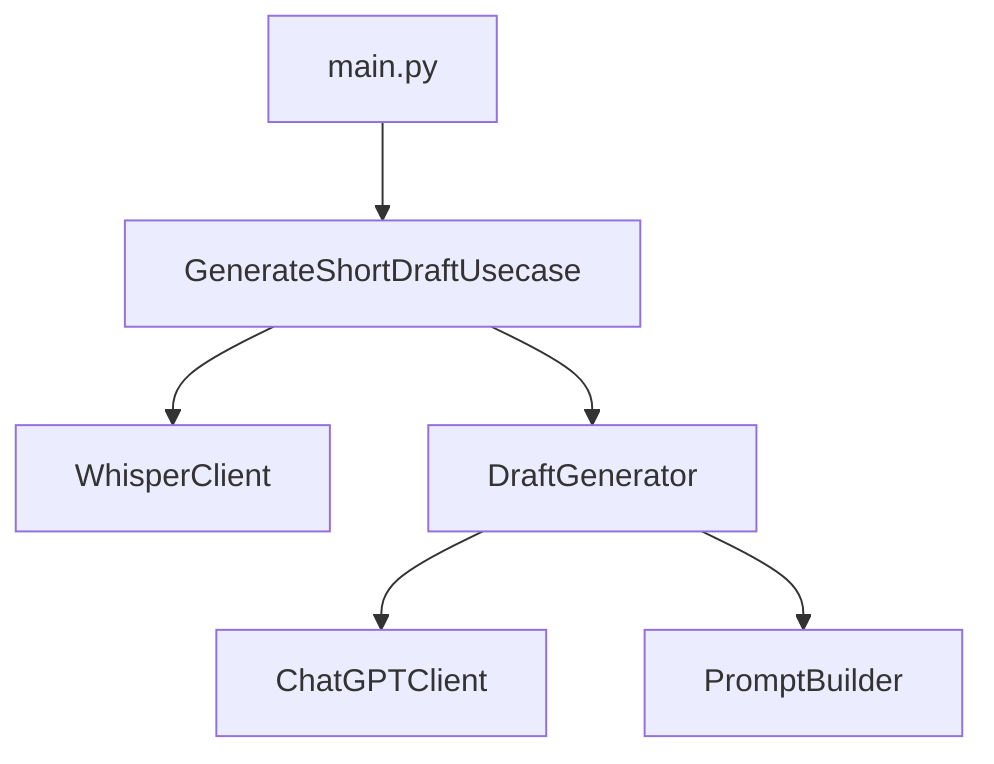
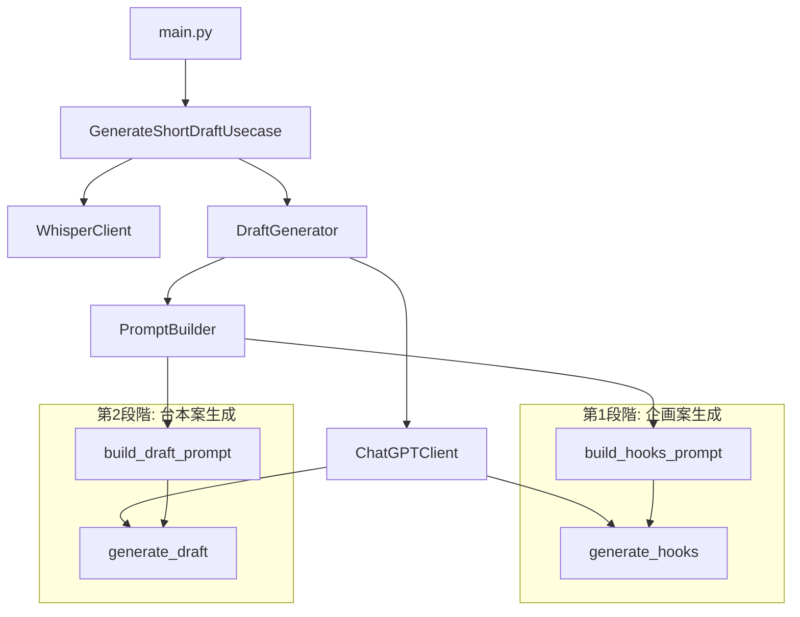

# 2段階動画企画生成ロジック設計書

## 概要

現在の一発出しの動画企画生成を、以下の2段階ロジックに変更する設計書です：

1. **第1段階**: `project/hooks_prompt.txt` をベースにしたプロンプトで企画案を10個生成
2. **第2段階**: `project/draft_prompt.txt` をベースにしたプロンプトで、各企画案に対して台本案を10個ずつ生成（合計100個）

## 現在の実装状況

### 既存のアーキテクチャ


### 現在の処理フロー
1. 動画ファイルから音声文字起こし（WhisperClient）
2. 文字起こし結果からプロンプト構築（PromptBuilder）
3. ChatGPTで企画書生成（ChatGPTClient）
4. 構造化データへの変換

## 新しい2段階生成ロジック設計

### 新しいアーキテクチャ


### 新しい処理フロー
1. **音声文字起こし** (既存と同じ)
   - WhisperClientで動画から文字起こし

2. **第1段階: 企画案生成**
   - `project/hooks_prompt.txt` をベースにプロンプト構築
   - ChatGPTで企画案10個を生成
   - HookProposalオブジェクトのリストとして構造化

3. **第2段階: 台本案生成**
   - 各企画案に対してループ処理
   - `project/draft_prompt.txt` をベースにプロンプト構築
   - 企画案の内容を含めてChatGPTで台本案10個を生成
   - ShortVideoProposalオブジェクトのリストとして構造化

4. **結果統合**
   - 全ての台本案（合計100個）を統合
   - 既存のDraftResult形式で返却

## データ構造設計

### 新しいモデル: HookProposal

```python
@dataclass
class HookProposal:
    """企画案データクラス"""
    first_hook: str          # 最初のフック
    second_hook: str         # 2番目のフック
    third_hook: str          # 3番目のフック
    last_conclusion: str     # 最後の結論
    summary: str             # 企画の要約
```

### 既存モデルの拡張: DraftResult

```python
@dataclass
class DraftResult:
    """企画書生成結果（拡張版）"""
    proposals: List[ShortVideoProposal]           # 台本案リスト（100個）
    hook_proposals: List[HookProposal]            # 企画案リスト（10個）
    original_transcription: TranscriptionResult   # 元の文字起こし結果
```

## 実装設計

**重要**: `project/` 以下のファイルは参考テキストであり、アプリケーションから直接参照しません。[`project/hooks_prompt.txt`](project/hooks_prompt.txt)と[`project/draft_prompt.txt`](project/draft_prompt.txt)の内容を参考にして、[`src/builders/prompt_builder.py`](src/builders/prompt_builder.py)内にハードコードされたプロンプトテンプレートとして実装します。

### 1. PromptBuilder クラスの拡張

既存の[`DRAFT_PROMPT_TEMPLATE`](src/builders/prompt_builder.py:23-80)を削除し、2つの新しいプロンプトテンプレートを追加します：

```python
class PromptBuilder:
    """ChatGPT用プロンプト生成クラス（拡張版）"""

    # project/hooks_prompt.txt の内容をベースにした企画案生成用プロンプト
    HOOKS_PROMPT_TEMPLATE = """# 依頼内容
以下の動画の書き起こしテキストから、切り抜き動画として適切なフックとなる要素を導出してください。

# ターゲット層：Z世代（10〜20代）

# 前提
- 動画の中で話している内容に切り抜き箇所は、以下のいずれかに当てはまることが望ましい：
- 登場人物の感情（驚き、怒り、笑い、感動など）が強く出ている場面
- ストーリー性・変化・結論・主張が明快な場面
- 特定の価値観・信念・メッセージが一言で表現できる場面
- 切り抜き動画に向いている箇所を **10 個**ピックアップしてください。
- 各クリップの長さは **約 1 分**を目安にしてください。
- この動画から切り抜き動画を作って **面白い**作品にしたいです。
- 絵文字は多く使用してください。
- ショート動画バズのコツは、視聴者を冒頭で惹きつける強烈なフックです、フックを意識してください。

# フックを作るための TIPS
- 1.驚きで惹きつける（Surprise）
- 例：「え、こんな政治家見たことない！」
- 理由：予想外の展開・人物像を予感させることで、続きを見たくなる。

- 2.問いかけで参加させる（Question）
- 例：「あなたはこの事実、知ってましたか？」
- 理由：視聴者に内心で"答えさせる"ことで当事者意識を生み出す。

- 3.極端な言い切りで目を引く（Bold Claim）
- 例：「政治って、ほぼ宗教です。」
- 理由：刺激的な主張が「本当に？」という好奇心を引き出す。

- 4.ギャップや矛盾を提示する（Contradiction / Tension）
- 例：「AI推進派の彼が、実は"反対派"だった理由とは」
- 理由：「一見正反対」に見える事実を並べることで、続きが気になる構造になる。

- 5.感情ワードを先出しする（Emotion First）
- 例：「怒りを覚えた出来事」
- 理由：感情を先に出すと、共感や興味が起点になりやすい。

- 6.カウントダウン/リスト構造で視認性UP（Numbered List）
- 例：「政治家のヤバい発言トップ3」
- 理由：数字が入ると「何が1位なのか？」と最後まで見たくなる。

- 7.キーワードに視覚的インパクトを入れる（Visual Word）
- 例：「年収300万円で"議員"ってどういうこと？」
- 理由：「数字」や「肩書き」などを冒頭に入れると注目が集まりやすい。

- 8.ターゲット特定型（If you're __）
- 例：「20代で政治に興味ない人、ちょっと来て」
- 理由：「これは自分向けの動画だ」と感じさせると離脱率が減る。

- 9.タイムプレッシャー／今だけ要素（Urgency）
- 例：「この制度、来月から変わります」
- 理由：すぐに知っておかないと損する感覚を植え付ける。

- 10.シーン説明＋謎かけ（Narrative Hook）
- 例：「居酒屋で突然"あの話"が始まった」
- 理由：ストーリー性の入り口と"何の話？"という謎を同時に

# 動画書き起こし

## 全体テキスト
{full_text}

## タイムスタンプ付きセグメント
{segments_text}

# 出力フォーマット
{{
  "items": [
    {{
      "first_hook": "",
      "second_hook": "",
      "third_hook": "",
      "last_conclusion": "",
      "summary": ""
    }},
    ...
  ]
}}

JSON形式以外の出力は一切含めず、上記形式で正確に回答してください。
"""

    # 台本案生成用プロンプト（既存のDRAFT_PROMPT_TEMPLATEを置き換え）
    DRAFT_PROMPT_TEMPLATE = """# 依頼内容
以下の企画案と動画の書き起こしテキストから、具体的な台本案を10個作成してください。

# 企画案
{hook_proposal}

# 動画書き起こし

## 全体テキスト
{full_text}

## タイムスタンプ付きセグメント
{segments_text}

# 次の点をjson形式でアウトプットとして出してください

{{
  "items": [
    {{
      "first_impact": "最初の2秒に含まれる、興味を惹くフレーズ",
      "last_conclusion": "動画の最後に来る結論。関心して終われる学び、共感できる内容、もしくは笑えるオチなど",
      "summary": "動画の主題。〇〇は〇〇なので〇〇である。ような端的な形式",
      "time_start": "開始時刻(hh:mm:ss)",
      "time_end": "終了時刻(hh:mm:ss)",
      "title": "魅力的なタイトル（30文字以内）",
      "caption": "SNS投稿用キャプション（100文字以内、ハッシュタグ含む）",
      "key_points": [
        "重要なポイント1",
        "重要なポイント2",
        "重要なポイント3"
      ]
    }},
    ...
  ]
}}

# ショート動画を作る主なポイントは以下の通りです。

## 冒頭2秒でインパクトを出す
* 冒頭の2秒はユーザーとの**最初の接点**であり、短い動画においては非常に大きい時間です。
* 基本的にフォロワー以外の動画が見られることが多いため、投稿者は**通りすがりの人**という認識を持つ必要があります。
* 通りすがりの人に丁寧な挨拶は不要であり、それよりも最初の数秒で「面白い」と思わせないと**スクロールされて消えていく**ため、**勝負にならない**とされています。
* バズった動画を分析した結果、伸びている動画の**9割はファーストビューを意識している**とのことです。
* 冒頭の2秒はYouTubeでいう**サムネイル**のようなもの

## 視聴時間をハックする（伸ばす）
* アルゴリズムの**7割が視聴時間**に関わっていると考えています。
* 個人的なデータとして、再生数と平均視聴時間にフル視聴率を掛け算した値は相関関係にあり、**すべては視聴時間に行き着く**とのことです。
* 「いいね！」やコメント率、シェア率よりも、**視聴時間の指標を重要視した方がバズる確率が高い**と述べています。
* 視聴時間を伸ばすためには、冒頭の2秒（サムネイル部分）以降の3秒目以降で**ユーザーが離脱しない内容**にする必要があります。
* ユーザーを**飽きさせない展開**を作り続けるのがコツです。
* トルコアイスの動画がお客を飽きさせない仕掛けを次々と繰り出すように、動画も5〜10秒程度で話を切り替えたり、色々なカットを使ったりする といった工夫が、視聴者を飽きさせないために有効だとされています。
* 終盤は視聴時間への寄与は少ないものの、最後に**共感や感動、オチ**などがあればユーザーの満足度が上がると考えられています。

JSON形式以外の出力は一切含めず、上記形式で正確に回答してください。
"""

    def build_hooks_prompt(self, transcription: TranscriptionResult) -> str:
        """企画案生成用プロンプトを構築"""
        self._validate_transcription(transcription)
        segments_text = self._format_segments(transcription.segments)

        return self.HOOKS_PROMPT_TEMPLATE.format(
            full_text=transcription.full_text,
            segments_text=segments_text
        )

    def build_draft_prompt(
        self,
        hook_proposal: HookProposal,
        transcription: TranscriptionResult
    ) -> str:
        """台本案生成用プロンプトを構築"""
        self._validate_transcription(transcription)
        segments_text = self._format_segments(transcription.segments)
        hook_proposal_text = self._format_hook_proposal(hook_proposal)

        return self.DRAFT_PROMPT_TEMPLATE.format(
            hook_proposal=hook_proposal_text,
            full_text=transcription.full_text,
            segments_text=segments_text
        )

    # 既存のbuild_draft_promptメソッドは削除

    def _format_hook_proposal(self, hook_proposal: HookProposal) -> str:
        """HookProposalを読みやすい形式にフォーマット"""
        return f"""第1フック: {hook_proposal.first_hook}
第2フック: {hook_proposal.second_hook}
第3フック: {hook_proposal.third_hook}
結論: {hook_proposal.last_conclusion}
要約: {hook_proposal.summary}"""
```

### 3. ChatGPTClient クラスの拡張

```python
class ChatGPTClient:
    """ChatGPT APIクライアント（拡張版）"""

    def generate_hooks(self, prompt: str) -> List[HookProposal]:
        """企画案生成"""
        raw_response = self._call_chatgpt_api(prompt)
        json_data = self._parse_json_response(raw_response)
        self._validate_hooks_response_structure(json_data)
        return self._convert_to_hook_proposals(json_data)

    def generate_draft(self, prompt: str) -> List[ShortVideoProposal]:
        """台本案生成（既存メソッド）"""
        # 既存の実装を維持
        pass

    def _validate_hooks_response_structure(self, data: Dict[str, Any]) -> None:
        """企画案レスポンスの構造検証"""
        pass

    def _convert_to_hook_proposals(self, data: Dict[str, Any]) -> List[HookProposal]:
        """JSONデータをHookProposalオブジェクトのリストに変換"""
        pass
```

### 4. DraftGenerator クラスの拡張

```python
class DraftGenerator:
    """企画書生成サービス（拡張版）"""

    def generate_draft(self, transcription: TranscriptionResult) -> DraftResult:
        """2段階生成ロジックによる企画書生成"""

        # 第1段階: 企画案生成
        hook_proposals = self._generate_hook_proposals(transcription)

        # 第2段階: 台本案生成
        all_proposals = []
        for hook_proposal in hook_proposals:
            draft_proposals = self._generate_draft_proposals(hook_proposal, transcription)
            all_proposals.extend(draft_proposals)

        return DraftResult(
            proposals=all_proposals,
            hook_proposals=hook_proposals,
            original_transcription=transcription
        )

    def _generate_hook_proposals(self, transcription: TranscriptionResult) -> List[HookProposal]:
        """第1段階: 企画案生成"""
        prompt = self.prompt_builder.build_hooks_prompt(transcription)
        return self.chatgpt_client.generate_hooks(prompt)

    def _generate_draft_proposals(
        self,
        hook_proposal: HookProposal,
        transcription: TranscriptionResult
    ) -> List[ShortVideoProposal]:
        """第2段階: 台本案生成"""
        prompt = self.prompt_builder.build_draft_prompt(hook_proposal, transcription)
        return self.chatgpt_client.generate_draft(prompt)
```

## エラーハンドリング設計

### 新しい例外クラス

```python
class HookGenerationError(DraftGeneratorError):
    """企画案生成エラー"""
    def __init__(self, message: str, transcription_file: Optional[str] = None):
        super().__init__(message)
        self.transcription_file = transcription_file

class PromptTemplateError(DraftGeneratorError):
    """プロンプトテンプレート読み込みエラー"""
    def __init__(self, message: str, template_file: str):
        super().__init__(message)
        self.template_file = template_file
```

### エラーハンドリング戦略

1. **プロンプトファイル読み込みエラー**
   - project/hooks_prompt.txt, project/draft_prompt.txt が存在しない場合
   - ファイル読み込み権限がない場合

2. **企画案生成エラー**
   - ChatGPT APIからの企画案生成に失敗した場合
   - レスポンスの構造が期待と異なる場合

3. **台本案生成エラー**
   - 企画案ごとの台本案生成でエラーが発生した場合
   - 部分的な失敗への対応（一部の企画案のみ成功した場合）

4. **リトライ戦略**
   - 企画案生成: 3回リトライ
   - 台本案生成: 各企画案につき3回リトライ
   - 部分的成功の許容（100個中80個以上成功すれば処理継続）

## パフォーマンス考慮事項

### API呼び出し回数
- 現在: 1回のChatGPT API呼び出し
- 変更後: 11回のChatGPT API呼び出し（企画案1回 + 台本案10回）

### 処理時間
- 推定処理時間: 現在の約11倍
- 並列処理の検討（台本案生成の並列化）

### レート制限対策
- API呼び出し間隔の調整
- 指数バックオフによるリトライ
- 進捗表示の実装

## 出力形式の変更

### 新しいマークダウン出力形式

```markdown
# ショート動画企画書（2段階生成版）

## 動画情報
- 元動画: input.mp4
- 生成日時: 2025-01-12 01:47:00
- 企画案数: 10個
- 台本案数: 100個

## 企画案一覧

### 企画案1
- **第1フック**: [first_hook]
- **第2フック**: [second_hook]
- **第3フック**: [third_hook]
- **結論**: [last_conclusion]
- **要約**: [summary]

#### 台本案1-1: [タイトル]
- **開始時刻**: 00:01:30
- **終了時刻**: 00:02:00
- **キャプション**: [キャプション内容]
- **キーポイント**:
  - ポイント1
  - ポイント2

#### 台本案1-2: [タイトル]
...

### 企画案2
...
```

## 実装順序

1. **HookProposalモデルの作成**
   - `src/models/hook.py` の作成

2. **project/draft_prompt.txt の作成**
   - 台本案生成用プロンプトテンプレート

3. **PromptBuilderの拡張**
   - hooks_prompt, draft_prompt 読み込み機能
   - 2つのプロンプト構築メソッド追加

4. **ChatGPTClientの拡張**
   - generate_hooks メソッド追加
   - 企画案用のバリデーション追加

5. **DraftGeneratorの拡張**
   - 2段階生成ロジックの実装
   - エラーハンドリングの強化

6. **テストの追加**
   - 各段階のユニットテスト
   - 統合テスト

## 後方互換性

- 既存のAPIインターフェースは維持
- DraftResultに新しいフィールド（hook_proposals）を追加
- 既存のproposalsフィールドは引き続き利用可能

## 設定可能項目

環境変数での制御を追加：

```bash
# 企画案生成数（デフォルト: 10）
HOOK_PROPOSALS_COUNT=10

# 台本案生成数（デフォルト: 10）
DRAFT_PROPOSALS_COUNT=10

# 並列処理の有効化（デフォルト: false）
ENABLE_PARALLEL_GENERATION=false

# 部分的成功の許容率（デフォルト: 0.8）
PARTIAL_SUCCESS_THRESHOLD=0.8
```

## まとめ

この設計により、以下が実現されます：

1. **段階的な企画生成**: フック重視の企画案から具体的な台本案への展開
2. **大量の選択肢**: 100個の台本案から最適なものを選択可能
3. **既存システムとの互換性**: 既存のインターフェースを維持
4. **拡張性**: 将来的な機能追加に対応可能な設計
5. **堅牢性**: エラーハンドリングとリトライ機能の強化

この設計書に基づいて実装を進めることで、より効果的なショート動画企画生成システムを構築できます。
