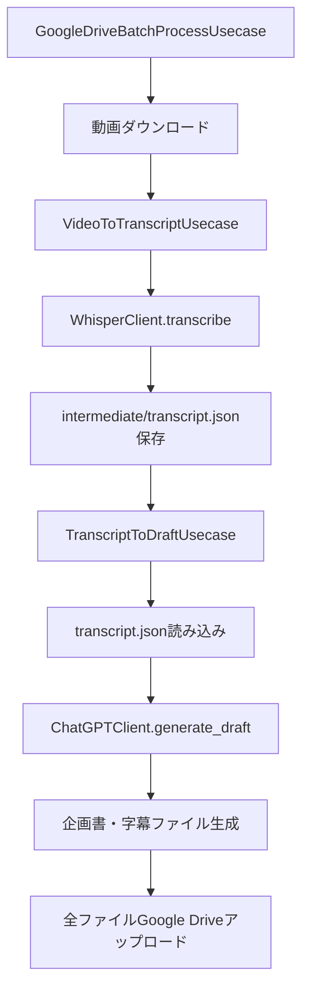

# Usecaseリファクタリング設計書

**作成日時**: 2025年1月12日 14:05
**対象**: GoogleDriveBatchProcessUsecaseの構造改善

## 概要

現在のGoogleDriveBatchProcessUsecaseが複雑すぎる問題を解決するため、以下の2つのUsecaseに分割してリファクタリングを実施しました。

- **VideoToTranscriptUsecase**: 動画→文字起こし→intermediate/transcript.json保存
- **TranscriptToDraftUsecase**: transcript.json→企画書・字幕生成

## 問題点と解決策

### 従来の問題点
1. **責務の混在**: 1つのUsecaseで動画処理から企画書生成まで全てを担当
2. **デバッグの困難さ**: 中間段階での確認ができない
3. **再利用性の低さ**: 文字起こし結果の再利用が困難

### 解決策
1. **責務の分離**: 各Usecaseが単一の責務を持つ
2. **中間ファイルの可視化**: transcript.jsonで文字起こし結果を確認可能
3. **段階的デバッグ**: 各フェーズで独立したテスト・デバッグが可能

## 新しいアーキテクチャ

### 処理フロー


### クラス構成

#### 1. VideoToTranscriptUsecase
```python
class VideoToTranscriptUsecase:
    def __init__(self, whisper_client: WhisperClient)
    def execute(self, video_path: str, intermediate_dir: str = "intermediate") -> VideoToTranscriptResult
```

**責務**:
- 動画ファイルの入力検証
- Whisper APIによる文字起こし実行
- 文字起こし結果をintermediate/{video_name}_transcript.jsonに保存

#### 2. TranscriptToDraftUsecase
```python
class TranscriptToDraftUsecase:
    def __init__(self, chatgpt_client: ChatGPTClient, prompt_builder: PromptBuilder, srt_generator: SrtGenerator)
    def execute(self, transcript_file_path: str, output_dir: str) -> TranscriptToDraftResult
```

**責務**:
- transcript.jsonファイルの読み込み・検証
- ChatGPT APIによる企画書生成
- 企画書Markdownファイルの出力
- SRT字幕ファイルの出力

#### 3. GoogleDriveBatchProcessUsecase（リファクタリング版）
```python
class GoogleDriveBatchProcessUsecase:
    def __init__(
        self,
        video_to_transcript_usecase: VideoToTranscriptUsecase,
        transcript_to_draft_usecase: TranscriptToDraftUsecase,
        google_drive_client: GoogleDriveClient
    )
```

**責務**:
- Google Driveからの動画ダウンロード
- 2つのUsecaseの順次実行（オーケストレーション）
- 結果ファイルのGoogle Driveアップロード

## 実装詳細

### 新規作成ファイル

#### `src/models/usecase_results.py`
新しいUsecaseの結果クラスを定義:
- `VideoToTranscriptResult`
- `TranscriptToDraftResult`

#### `src/usecases/video_to_transcript_usecase.py`
動画→文字起こし専用Usecase

#### `src/usecases/transcript_to_draft_usecase.py`
文字起こし→企画書専用Usecase

### 修正ファイル

#### `src/models/result.py`
- `GoogleDriveBatchResult`に`transcript_url`フィールド追加

#### `src/usecases/google_drive_batch_process_usecase.py`
- 2つの新しいUsecaseを使用するように修正
- `_prepare_output_subfolder`メソッドを追加

#### `src/main.py`
- DIContainerで新しいUsecaseを初期化
- バッチ処理結果表示に文字起こしファイルURLを追加

## 中間ファイル形式

### transcript.json
```json
{
  "video_name": "video1.mp4",
  "video_path": "/path/to/video1.mp4",
  "created_at": "2025-01-12T14:05:00+09:00",
  "full_text": "こんにちは、今日は...",
  "segments": [
    {
      "start_time": 0.0,
      "end_time": 3.5,
      "text": "こんにちは、今日は"
    }
  ]
}
```

### ファイル配置
```
intermediate/
├── video1_transcript.json
├── video2_transcript.json
└── ...

output/
├── video1_draft.md
├── video1_subtitle.srt
├── video2_draft.md
├── video2_subtitle.srt
└── ...
```

## 使用例とデバッグシナリオ

### 1. 通常の使用（2段階処理）
```python
# Phase 1: 動画→文字起こし
video_usecase = VideoToTranscriptUsecase(whisper_client)
transcript_result = video_usecase.execute("input/video.mp4")

# Phase 2: 文字起こし→企画書
draft_usecase = TranscriptToDraftUsecase(chatgpt_client, prompt_builder, srt_generator)
draft_result = draft_usecase.execute(transcript_result.transcript_file_path, "output/")
```

### 2. デバッグ用途（文字起こしスキップ）
```python
# 既存のtranscript.jsonから直接企画書生成
draft_usecase = TranscriptToDraftUsecase(chatgpt_client, prompt_builder, srt_generator)
draft_result = draft_usecase.execute("intermediate/video1_transcript.json", "output/")
```

### 3. 文字起こし結果の修正後の再実行
```python
# 1. transcript.jsonを手動編集
# 2. 修正されたファイルから企画書生成
draft_result = draft_usecase.execute("intermediate/video1_transcript_edited.json", "output/")
```

## メリット

### 1. デバッグ性の向上
- 各段階で中間ファイルを確認可能
- 問題発生箇所の特定が容易
- 段階的なテストが可能

### 2. 責務の明確化
- 各Usecaseが単一の責務を持つ
- コードの理解・保守が容易
- 単体テストの作成が簡単

### 3. 再利用性の向上
- TranscriptToDraftUsecaseは既存のtranscript.jsonからも実行可能
- 文字起こし結果の手動修正に対応
- 部分的な処理の再実行が可能

### 4. Google Drive連携の改善
- transcript.jsonもGoogle Driveにアップロード
- 後からの確認・修正が可能
- デバッグ情報の共有が容易

## 後方互換性

既存の`GenerateShortDraftUsecase`は維持されており、既存のCLIインターフェースは引き続き使用可能です。

## テスト計画

### 新規作成
- `tests/test_usecases/test_video_to_transcript_usecase.py`
- `tests/test_usecases/test_transcript_to_draft_usecase.py`

### 修正
- `tests/test_usecases/test_google_drive_batch_process_usecase.py`
- `tests/test_models/test_result.py`

## 今後の拡張可能性

1. **並列処理**: 複数動画の同時処理
2. **キャッシュ機能**: 文字起こし結果のキャッシュ
3. **設定可能な中間ディレクトリ**: プロジェクトごとの分離
4. **文字起こし結果の検証**: 自動品質チェック

## まとめ

このリファクタリングにより、Usecaseの構造がより明確になり、デバッグ性と再利用性が大幅に向上しました。特に、中間ファイル（transcript.json）の導入により、開発・デバッグ効率が大幅に改善されることが期待されます。
