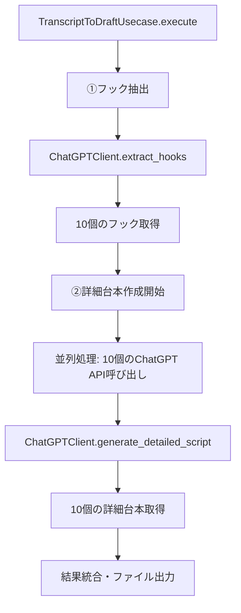
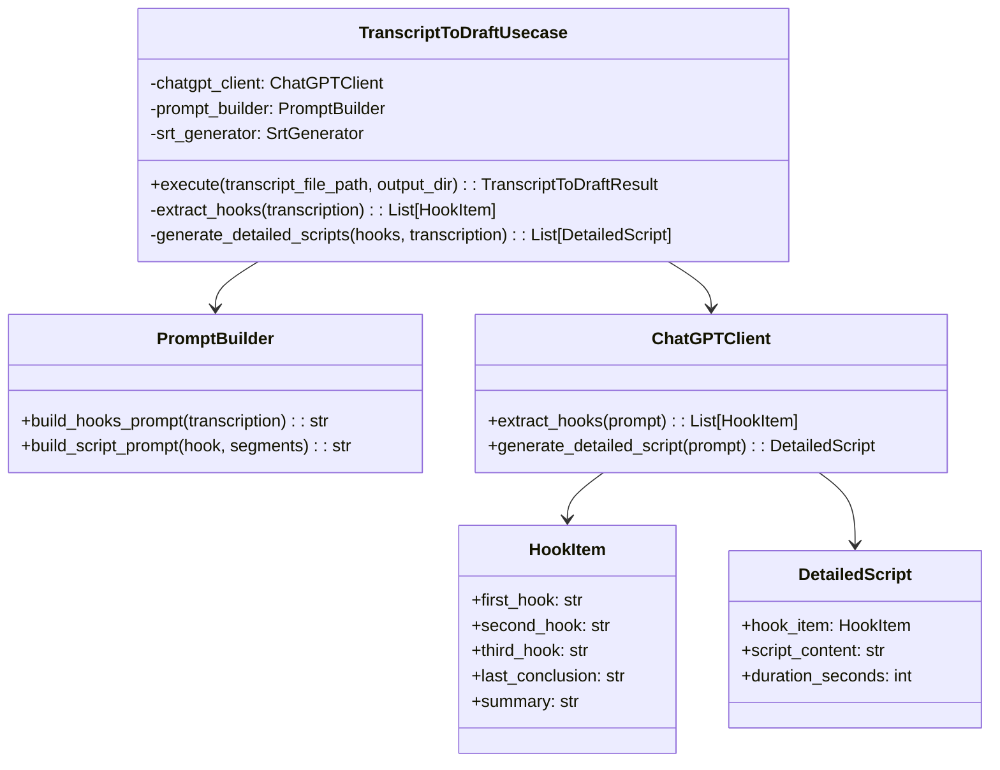

# 2段階動画企画生成リファクタリング設計書

**作成日時**: 2025年1月12日 14:39
**対象ファイル**: `src/usecases/transcript_to_draft_usecase.py`

## 概要

現在の`TranscriptToDraftUsecase`は仮のプロンプトを使用しているため、これを2段階構成にリファクタリングする。

### 現在の問題点
- 単一のプロンプトで企画書を生成している
- プロンプトが固定化されており、フック抽出と詳細台本作成が分離されていない
- 並列処理に対応していない

### 新しい構成
1. **フック抽出フェーズ**: 文字起こしから10個のフックを抽出
2. **詳細台本作成フェーズ**: 各フックに対して詳細台本を並列生成

## 要求仕様

### ①フック抽出（10個）
- プロンプト: `project/hooks_prompt.txt`の内容をベースにする
- 出力: 10個のフック情報（JSON形式）
- 各フックには以下の情報を含む：
  - `first_hook`: 最初のフック
  - `second_hook`: 2番目のフック
  - `third_hook`: 3番目のフック
  - `last_conclusion`: 最後の結論
  - `summary`: 要約

### ②詳細台本作成（並列実行）
- プロンプト: `project/draft_prompt.txt`の内容をベースにする
- 入力: フック情報 + 文字起こしセグメント
- 出力: 60秒以内の詳細台本
- 10個のフックに対して並列実行

## アーキテクチャ設計

### 処理フロー



### クラス関係図



## データ構造設計

### 新しいモデルクラス

#### HookItem
```python
@dataclass
class HookItem:
    """フック抽出結果の単一アイテム"""
    first_hook: str
    second_hook: str
    third_hook: str
    last_conclusion: str
    summary: str
```

#### HooksExtractionResult
```python
@dataclass
class HooksExtractionResult:
    """フック抽出の全体結果"""
    items: List[HookItem]
    original_transcription: TranscriptionResult
```

#### DetailedScript
```python
@dataclass
class DetailedScript:
    """詳細台本生成結果"""
    hook_item: HookItem
    script_content: str
    duration_seconds: int
    segments_used: List[TranscriptionSegment]
```

#### TwoPhaseResult
```python
@dataclass
class TwoPhaseResult:
    """2段階処理の最終結果"""
    hooks_result: HooksExtractionResult
    detailed_scripts: List[DetailedScript]
    success: bool
    error_message: Optional[str] = None
```

## PromptBuilder拡張設計

### 新しいメソッド

#### build_hooks_prompt
```python
def build_hooks_prompt(self, transcription: TranscriptionResult) -> str:
    """フック抽出用プロンプトを構築

    project/hooks_prompt.txtの内容をベースに、
    文字起こし結果を組み込んだプロンプトを生成
    """
```

#### build_script_prompt
```python
def build_script_prompt(self, hook_item: HookItem, segments: List[TranscriptionSegment]) -> str:
    """詳細台本作成用プロンプトを構築

    project/draft_prompt.txtの内容をベースに、
    フック情報とセグメント情報を組み込んだプロンプトを生成
    """
```

### プロンプトテンプレート管理

```python
class PromptBuilder:
    def __init__(self):
        self.hooks_template = self._load_hooks_template()
        self.script_template = self._load_script_template()

    def _load_hooks_template(self) -> str:
        """project/hooks_prompt.txtから読み込み"""

    def _load_script_template(self) -> str:
        """project/draft_prompt.txtから読み込み"""
```

## ChatGPTClient拡張設計

### 新しいメソッド

#### extract_hooks
```python
def extract_hooks(self, prompt: str) -> List[HookItem]:
    """フック抽出API呼び出し

    Returns:
        10個のHookItemのリスト
    """
```

#### generate_detailed_script
```python
def generate_detailed_script(self, prompt: str) -> DetailedScript:
    """詳細台本生成API呼び出し

    Returns:
        単一の詳細台本
    """
```

### 並列処理対応

```python
import asyncio
from concurrent.futures import ThreadPoolExecutor

def generate_detailed_scripts_parallel(
    self,
    hook_items: List[HookItem],
    segments: List[TranscriptionSegment]
) -> List[DetailedScript]:
    """10個のフックに対して並列で詳細台本を生成"""

    with ThreadPoolExecutor(max_workers=5) as executor:
        futures = []
        for hook_item in hook_items:
            prompt = self.prompt_builder.build_script_prompt(hook_item, segments)
            future = executor.submit(self.generate_detailed_script, prompt)
            futures.append(future)

        results = [future.result() for future in futures]

    return results
```

## TranscriptToDraftUsecase リファクタリング設計

### 新しい処理フロー

```python
def execute(self, transcript_file_path: str, output_dir: str) -> TranscriptToDraftResult:
    """2段階処理の実行"""

    # 1. 既存の前処理（入力検証、transcript読み込み）
    transcription = self._load_transcript(transcript_file_path)

    # 2. フェーズ1: フック抽出
    hooks_result = self._extract_hooks_phase(transcription)

    # 3. フェーズ2: 詳細台本作成（並列）
    detailed_scripts = self._generate_scripts_phase(hooks_result)

    # 4. 結果統合・ファイル出力
    return self._generate_output_files(hooks_result, detailed_scripts, output_dir)
```

### 新しいプライベートメソッド

```python
def _extract_hooks_phase(self, transcription: TranscriptionResult) -> HooksExtractionResult:
    """フェーズ1: フック抽出"""

def _generate_scripts_phase(self, hooks_result: HooksExtractionResult) -> List[DetailedScript]:
    """フェーズ2: 詳細台本作成（並列）"""

def _generate_output_files(
    self,
    hooks_result: HooksExtractionResult,
    detailed_scripts: List[DetailedScript],
    output_dir: str
) -> TranscriptToDraftResult:
    """結果統合とファイル出力"""
```

## 出力ファイル設計

### 新しい出力形式

#### hooks_result.json
```json
{
  "extraction_timestamp": "2025-01-12T14:39:00+09:00",
  "original_video": "video_name",
  "items": [
    {
      "first_hook": "...",
      "second_hook": "...",
      "third_hook": "...",
      "last_conclusion": "...",
      "summary": "..."
    }
  ]
}
```

#### detailed_scripts.md
```markdown
# 詳細台本集

## フック1: [summary]

### 台本構成
[00:00–00:06] ナレーション＋テロップ
...

## フック2: [summary]
...
```

## エラーハンドリング設計

### 新しい例外クラス

```python
class HooksExtractionError(TranscriptToDraftUsecaseError):
    """フック抽出エラー"""

class ScriptGenerationError(TranscriptToDraftUsecaseError):
    """台本生成エラー"""

class ParallelProcessingError(TranscriptToDraftUsecaseError):
    """並列処理エラー"""
```

### 部分失敗対応

- フック抽出が失敗した場合: 処理を中断
- 詳細台本生成で一部失敗した場合: 成功した分だけ出力
- 全て失敗した場合: エラーとして処理

## 実装順序

1. **新しいデータ構造の実装** (`src/models/`)
2. **PromptBuilderの拡張** (`src/builders/prompt_builder.py`)
3. **ChatGPTClientの拡張** (`src/clients/chatgpt_client.py`)
4. **TranscriptToDraftUsecaseのリファクタリング** (`src/usecases/transcript_to_draft_usecase.py`)
5. **テストの更新**
6. **統合テスト**

## 互換性への配慮

- 既存のAPIインターフェースは維持
- 出力ファイル形式は拡張（既存形式も併用）
- 設定により従来の単一フェーズ処理も選択可能

---

## 具体的な実装コード設計

### 1. 新しいモデルクラス (`src/models/hooks.py`)

```python
"""フック関連のデータ構造"""

from dataclasses import dataclass
from typing import List, Optional

from .transcription import TranscriptionResult, TranscriptionSegment


@dataclass
class HookItem:
    """フック抽出結果の単一アイテム

    Attributes:
        first_hook: 最初のフック
        second_hook: 2番目のフック
        third_hook: 3番目のフック
        last_conclusion: 最後の結論
        summary: 要約
    """
    first_hook: str
    second_hook: str
    third_hook: str
    last_conclusion: str
    summary: str


@dataclass
class HooksExtractionResult:
    """フック抽出の全体結果

    Attributes:
        items: フックアイテムのリスト（10個）
        original_transcription: 元の文字起こし結果
    """
    items: List[HookItem]
    original_transcription: TranscriptionResult


@dataclass
class DetailedScript:
    """詳細台本生成結果

    Attributes:
        hook_item: 対応するフックアイテム
        script_content: 台本内容
        duration_seconds: 想定再生時間（秒）
        segments_used: 使用されたセグメント
    """
    hook_item: HookItem
    script_content: str
    duration_seconds: int
    segments_used: List[TranscriptionSegment]


@dataclass
class TwoPhaseResult:
    """2段階処理の最終結果

    Attributes:
        hooks_result: フック抽出結果
        detailed_scripts: 詳細台本のリスト
        success: 処理成功フラグ
        error_message: エラーメッセージ（失敗時）
    """
    hooks_result: HooksExtractionResult
    detailed_scripts: List[DetailedScript]
    success: bool
    error_message: Optional[str] = None
```

### 2. PromptBuilder拡張実装

```python
"""ChatGPT用プロンプト生成モジュール（拡張版）"""

import os
from pathlib import Path
from typing import List

from ..models.transcription import TranscriptionResult, TranscriptionSegment
from ..models.hooks import HookItem


class PromptBuilder:
    """ChatGPT用プロンプト生成クラス（2段階対応版）"""

    def __init__(self):
        """プロンプトテンプレートを読み込み"""
        self.hooks_template = self._load_hooks_template()
        self.script_template = self._load_script_template()

    def _load_hooks_template(self) -> str:
        """フック抽出用テンプレートを読み込み"""
        template_path = Path("project/hooks_prompt.txt")
        if not template_path.exists():
            raise FileNotFoundError(f"フックプロンプトテンプレートが見つかりません: {template_path}")

        with open(template_path, "r", encoding="utf-8") as f:
            return f.read()

    def _load_script_template(self) -> str:
        """詳細台本用テンプレートを読み込み"""
        template_path = Path("project/draft_prompt.txt")
        if not template_path.exists():
            raise FileNotFoundError(f"台本プロンプトテンプレートが見つかりません: {template_path}")

        with open(template_path, "r", encoding="utf-8") as f:
            return f.read()

    def build_hooks_prompt(self, transcription: TranscriptionResult) -> str:
        """フック抽出用プロンプトを構築

        Args:
            transcription: 文字起こし結果

        Returns:
            フック抽出用プロンプト
        """
        self._validate_transcription(transcription)

        # セグメント情報をフォーマット
        segments_text = self._format_segments(transcription.segments)

        # テンプレートに文字起こし情報を埋め込み
        prompt = self.hooks_template + f"""

# 動画書き起こし

## 全体テキスト
{transcription.full_text}

## タイムスタンプ付きセグメント
{segments_text}
"""

        return prompt

    def build_script_prompt(self, hook_item: HookItem, segments: List[TranscriptionSegment]) -> str:
        """詳細台本作成用プロンプトを構築

        Args:
            hook_item: フック情報
            segments: 文字起こしセグメント

        Returns:
            詳細台本作成用プロンプト
        """
        # フック情報をJSON形式で整形
        item_json = f"""{{
    "first_hook": "{hook_item.first_hook}",
    "second_hook": "{hook_item.second_hook}",
    "third_hook": "{hook_item.third_hook}",
    "last_conclusion": "{hook_item.last_conclusion}",
    "summary": "{hook_item.summary}"
}}"""

        # セグメント情報をJSON形式で整形
        segments_json = "[\n"
        for segment in segments:
            segments_json += f"""    {{
        "start_time": {segment.start_time},
        "end_time": {segment.end_time},
        "text": "{segment.text}"
    }},\n"""
        segments_json = segments_json.rstrip(",\n") + "\n]"

        # テンプレートに情報を埋め込み
        prompt = self.script_template.replace("- `item`: {", f"- `item`: {item_json}")
        prompt = prompt.replace("- `segments`: [", f"- `segments`: {segments_json}")

        return prompt
```

### 3. ChatGPTClient拡張実装

```python
"""ChatGPT APIクライアントモジュール（拡張版）"""

import json
import time
from typing import Any, List
from concurrent.futures import ThreadPoolExecutor, as_completed

from openai import OpenAI

from ..models.hooks import HookItem, DetailedScript


class ChatGPTClient:
    """ChatGPT APIクライアント（2段階処理対応版）"""

    def extract_hooks(self, prompt: str) -> List[HookItem]:
        """フック抽出API呼び出し

        Args:
            prompt: フック抽出用プロンプト

        Returns:
            10個のHookItemのリスト
        """
        self._validate_prompt(prompt)

        raw_response = self._call_chatgpt_api(prompt)
        json_data = self._parse_json_response(raw_response)
        self._validate_hooks_response_structure(json_data)

        return self._convert_to_hook_items(json_data)

    def generate_detailed_script(self, prompt: str) -> DetailedScript:
        """詳細台本生成API呼び出し

        Args:
            prompt: 詳細台本生成用プロンプト

        Returns:
            単一の詳細台本
        """
        self._validate_prompt(prompt)

        raw_response = self._call_chatgpt_api(prompt)

        # 台本は構造化されたJSONではなくテキストとして返される
        return DetailedScript(
            hook_item=None,  # 後で設定
            script_content=raw_response,
            duration_seconds=60,  # デフォルト値
            segments_used=[]  # 後で設定
        )

    def generate_detailed_scripts_parallel(
        self,
        hook_items: List[HookItem],
        segments: List[TranscriptionSegment],
        prompt_builder
    ) -> List[DetailedScript]:
        """10個のフックに対して並列で詳細台本を生成

        Args:
            hook_items: フックアイテムのリスト
            segments: 文字起こしセグメント
            prompt_builder: プロンプトビルダー

        Returns:
            詳細台本のリスト
        """
        detailed_scripts = []

        # 並列処理（最大5並列）
        with ThreadPoolExecutor(max_workers=5) as executor:
            # 各フックに対してタスクを投入
            future_to_hook = {}
            for hook_item in hook_items:
                prompt = prompt_builder.build_script_prompt(hook_item, segments)
                future = executor.submit(self.generate_detailed_script, prompt)
                future_to_hook[future] = hook_item

            # 結果を収集
            for future in as_completed(future_to_hook):
                hook_item = future_to_hook[future]
                try:
                    script = future.result()
                    # フック情報を設定
                    script.hook_item = hook_item
                    script.segments_used = segments  # 全セグメントを設定
                    detailed_scripts.append(script)
                except Exception as e:
                    # 個別の失敗は警告として記録し、処理を継続
                    print(f"フック '{hook_item.summary}' の台本生成に失敗: {e}")

        return detailed_scripts

    def _validate_hooks_response_structure(self, data: dict[str, Any]) -> None:
        """フック抽出レスポンスJSONの構造検証"""
        if "items" not in data:
            raise ValidationError("レスポンスに'items'フィールドがありません")

        required_fields = [
            "first_hook",
            "second_hook",
            "third_hook",
            "last_conclusion",
            "summary"
        ]

        for i, item in enumerate(data["items"]):
            for field in required_fields:
                if field not in item:
                    raise ValidationError(
                        f"アイテム{i}に必須フィールド'{field}'がありません",
                        field_name=field,
                    )

    def _convert_to_hook_items(self, data: dict[str, Any]) -> List[HookItem]:
        """JSONデータをHookItemオブジェクトのリストに変換"""
        hook_items = []

        for item in data["items"]:
            hook_item = HookItem(
                first_hook=item["first_hook"],
                second_hook=item["second_hook"],
                third_hook=item["third_hook"],
                last_conclusion=item["last_conclusion"],
                summary=item["summary"]
            )
            hook_items.append(hook_item)

        return hook_items
```

### 4. TranscriptToDraftUsecase リファクタリング実装

```python
"""文字起こし→企画書ユースケース（2段階処理版）"""

import json
from datetime import datetime
from pathlib import Path
from zoneinfo import ZoneInfo
from typing import List

from ..models.hooks import HooksExtractionResult, DetailedScript


class HooksExtractionError(Exception):
    """フック抽出エラー"""
    pass


class ScriptGenerationError(Exception):
    """台本生成エラー"""
    pass


class TranscriptToDraftUsecase:
    """文字起こしファイルから企画書と字幕ファイルを生成するユースケース（2段階処理版）"""

    def execute(self, transcript_file_path: str, output_dir: str) -> TranscriptToDraftResult:
        """2段階処理による企画書と字幕ファイルの生成"""
        try:
            # 1. 既存の前処理
            self._validate_input(transcript_file_path, output_dir)
            self._prepare_output_directory(output_dir)
            transcription = self._load_transcript(transcript_file_path)

            # 2. フェーズ1: フック抽出
            hooks_result = self._extract_hooks_phase(transcription)

            # 3. フェーズ2: 詳細台本作成（並列）
            detailed_scripts = self._generate_scripts_phase(hooks_result)

            # 4. 結果統合・ファイル出力
            return self._generate_output_files(
                hooks_result,
                detailed_scripts,
                transcript_file_path,
                output_dir
            )

        except Exception as e:
            return TranscriptToDraftResult(
                success=False,
                draft_file_path="",
                subtitle_file_path="",
                error_message=str(e)
            )

    def _extract_hooks_phase(self, transcription: TranscriptionResult) -> HooksExtractionResult:
        """フェーズ1: フック抽出"""
        try:
            # フック抽出用プロンプトを構築
            hooks_prompt = self.prompt_builder.build_hooks_prompt(transcription)

            # ChatGPT APIでフック抽出
            hook_items = self.chatgpt_client.extract_hooks(hooks_prompt)

            return HooksExtractionResult(
                items=hook_items,
                original_transcription=transcription
            )

        except Exception as e:
            raise HooksExtractionError(f"フック抽出に失敗しました: {e}") from e

    def _generate_scripts_phase(self, hooks_result: HooksExtractionResult) -> List[DetailedScript]:
        """フェーズ2: 詳細台本作成（並列）"""
        try:
            # 並列で詳細台本を生成
            detailed_scripts = self.chatgpt_client.generate_detailed_scripts_parallel(
                hooks_result.items,
                hooks_result.original_transcription.segments,
                self.prompt_builder
            )

            if not detailed_scripts:
                raise ScriptGenerationError("全ての台本生成に失敗しました")

            return detailed_scripts

        except Exception as e:
            raise ScriptGenerationError(f"詳細台本生成に失敗しました: {e}") from e

    def _save_hooks_result(self, hooks_result: HooksExtractionResult, video_name: str, output_dir: str) -> str:
        """フック抽出結果をJSONファイルに保存"""
        hooks_file_path = Path(output_dir) / f"{video_name}_hooks.json"

        hooks_data = {
            "extraction_timestamp": self._get_current_datetime(),
            "original_video": video_name,
            "items": [
                {
                    "first_hook": item.first_hook,
                    "second_hook": item.second_hook,
                    "third_hook": item.third_hook,
                    "last_conclusion": item.last_conclusion,
                    "summary": item.summary
                }
                for item in hooks_result.items
            ]
        }

        with open(hooks_file_path, "w", encoding="utf-8") as f:
            json.dump(hooks_data, f, ensure_ascii=False, indent=2)

        return str(hooks_file_path)

    def _save_detailed_scripts(self, detailed_scripts: List[DetailedScript], video_name: str, output_dir: str) -> str:
        """詳細台本をMarkdownファイルに保存"""
        scripts_file_path = Path(output_dir) / f"{video_name}_detailed_scripts.md"

        content_lines = [
            "# 詳細台本集",
            "",
            f"**元動画**: {video_name}",
            f"**生成日時**: {self._get_current_datetime()}",
            f"**台本数**: {len(detailed_scripts)}",
            "",
            "---",
            ""
        ]

        for i, script in enumerate(detailed_scripts, 1):
            content_lines.extend([
                f"## フック{i}: {script.hook_item.summary}",
                "",
                f"**想定時間**: {script.duration_seconds}秒",
                "",
                "### フック詳細",
                f"- **First Hook**: {script.hook_item.first_hook}",
                f"- **Second Hook**: {script.hook_item.second_hook}",
                f"- **Third Hook**: {script.hook_item.third_hook}",
                f"- **Last Conclusion**: {script.hook_item.last_conclusion}",
                "",
                "### 台本内容",
                script.script_content,
                "",
                "---",
                ""
            ])

        content = "\n".join(content_lines)

        with open(scripts_file_path, "w", encoding="utf-8") as f:
            f.write(content)

        return str(scripts_file_path)
```

### 5. 使用例

```python
# 使用例
def main():
    # 依存性注入
    chatgpt_client = ChatGPTClient(api_key=os.getenv("OPENAI_API_KEY"))
    prompt_builder = PromptBuilder()
    srt_generator = SrtGenerator()

    # ユースケース実行
    usecase = TranscriptToDraftUsecase(chatgpt_client, prompt_builder, srt_generator)
    result = usecase.execute("intermediate/video_transcript.json", "output/")

    if result.success:
        print(f"✅ 処理完了")
        print(f"📄 詳細台本: {result.draft_file_path}")
        print(f"📝 字幕ファイル: {result.subtitle_file_path}")
    else:
        print(f"❌ 処理失敗: {result.error_message}")
```

---

この設計により、フック抽出と詳細台本作成の2段階処理を実現し、並列処理によるパフォーマンス向上を図る。
