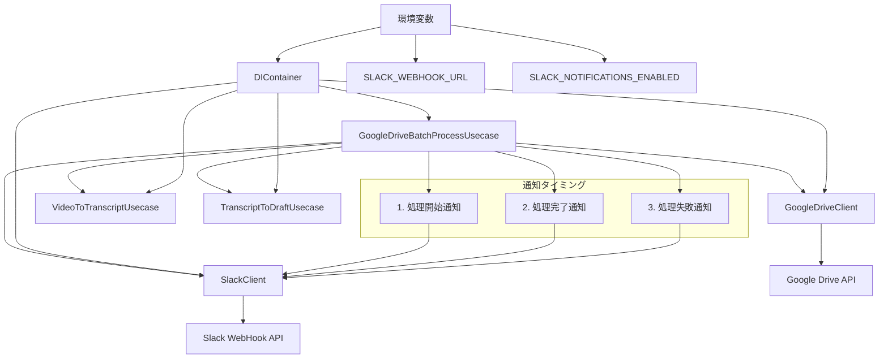
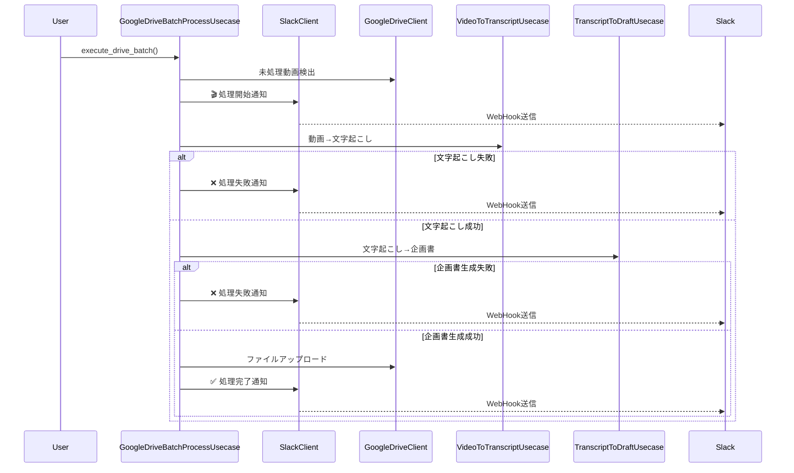

# Google Driveバッチ処理Slack通知機能設計書

## 作成日時
2025年7月12日 15:35

## 概要
Google Driveバッチ処理において、処理の開始・完了・失敗時にSlack通知を送信する機能を追加します。

## 要件

### 通知タイミングと内容

#### 1. 動画処理開始時の通知
- **タイミング**: 未処理動画を発見した時点
- **含める情報**:
  - 動画ファイル名
  - 入力フォルダのGoogle Drive URL

#### 2. 台本生成完了時の通知
- **タイミング**: 1本の動画処理が正常完了した時点
- **含める情報**:
  - 動画ファイル名
  - 出力サブフォルダのGoogle Drive URL

#### 3. 台本生成失敗時の通知
- **タイミング**: 1本の動画処理が失敗した時点
- **含める情報**:
  - エラー理由
  - 失敗した動画ファイル名

## 設計

### システム構成図



### 通知フロー図



### 1. 環境変数の追加

`.env`ファイルに以下の環境変数を追加：

```bash
# Slack通知設定
SLACK_WEBHOOK_URL=https://hooks.slack.com/services/...
SLACK_NOTIFICATIONS_ENABLED=true  # オプション：通知の有効/無効切り替え
```

### 2. DIContainerの拡張

`src/main.py`の`DIContainer`クラスにSlackClientを追加：

```python
class DIContainer:
    def __init__(self) -> None:
        # 既存の初期化...

        # Slack通知設定（オプショナル）
        self.slack_webhook_url = os.getenv("SLACK_WEBHOOK_URL")
        self.slack_notifications_enabled = os.getenv("SLACK_NOTIFICATIONS_ENABLED", "false").lower() == "true"

        # SlackClientの初期化（WebHook URLが設定されている場合のみ）
        self.slack_client = None
        if self.slack_webhook_url and self.slack_notifications_enabled:
            from src.clients.slack_client import SlackClient
            self.slack_client = SlackClient(self.slack_webhook_url)

        # GoogleDriveBatchProcessUsecaseにSlackClientを注入
        self.google_drive_batch_usecase = GoogleDriveBatchProcessUsecase(
            video_to_transcript_usecase=self.video_to_transcript_usecase,
            transcript_to_draft_usecase=self.transcript_to_draft_usecase,
            google_drive_client=self.google_drive_client,
            slack_client=self.slack_client,  # 新規追加
        )
```

### 3. GoogleDriveBatchProcessUsecaseの拡張

#### コンストラクタの変更

```python
class GoogleDriveBatchProcessUsecase:
    def __init__(
        self,
        video_to_transcript_usecase: VideoToTranscriptUsecase,
        transcript_to_draft_usecase: TranscriptToDraftUsecase,
        google_drive_client: GoogleDriveClient,
        slack_client: SlackClient | None = None,  # 新規追加
    ):
        self.video_to_transcript_usecase = video_to_transcript_usecase
        self.transcript_to_draft_usecase = transcript_to_draft_usecase
        self.google_drive_client = google_drive_client
        self.slack_client = slack_client  # 新規追加
```

#### 通知メソッドの追加

```python
def _send_processing_start_notification(self, video_file: DriveFile, input_folder_url: str) -> None:
    """動画処理開始通知を送信"""
    if not self.slack_client:
        return

    try:
        message = f"🎬 動画処理を開始しました\n" \
                 f"📁 ファイル名: {video_file.name}\n" \
                 f"🔗 入力フォルダ: {input_folder_url}"
        self.slack_client.send_message(message)
    except Exception as e:
        # 通知の失敗は処理を止めない
        print(f"Slack通知の送信に失敗しました: {e}")

def _send_processing_success_notification(self, video_name: str, output_subfolder_url: str) -> None:
    """動画処理完了通知を送信"""
    if not self.slack_client:
        return

    try:
        message = f"✅ 台本生成が完了しました\n" \
                 f"📁 動画ファイル名: {video_name}\n" \
                 f"🔗 出力フォルダ: {output_subfolder_url}"
        self.slack_client.send_message(message)
    except Exception as e:
        # 通知の失敗は処理を止めない
        print(f"Slack通知の送信に失敗しました: {e}")

def _send_processing_failure_notification(self, video_name: str, error_message: str) -> None:
    """動画処理失敗通知を送信"""
    if not self.slack_client:
        return

    try:
        message = f"❌ 台本生成に失敗しました\n" \
                 f"📁 動画ファイル名: {video_name}\n" \
                 f"💥 エラー理由: {error_message}"
        self.slack_client.send_message(message)
    except Exception as e:
        # 通知の失敗は処理を止めない
        print(f"Slack通知の送信に失敗しました: {e}")
```

#### execute_drive_batchメソッドの修正

```python
def execute_drive_batch(self, input_folder_url: str, output_folder_url: str) -> GoogleDriveBatchResult:
    """Google Drive間でのバッチ処理実行（Slack通知対応版）"""
    try:
        # 1. 未処理動画の検出
        unprocessed_video = self._find_unprocessed_video_from_drive(input_folder_url, output_folder_url)

        if not unprocessed_video:
            return GoogleDriveBatchResult.no_unprocessed_videos()

        # 2. 動画処理開始通知
        self._send_processing_start_notification(unprocessed_video, input_folder_url)

        # 3. 出力フォルダの準備
        video_name = Path(unprocessed_video.name).stem
        output_folder_id = self.google_drive_client.extract_folder_id(output_folder_url)
        output_subfolder_id = self._prepare_output_subfolder(output_folder_id, video_name)

        with tempfile.TemporaryDirectory() as temp_dir:
            # 4. 動画ダウンロード
            video_path = self.google_drive_client.download_file(unprocessed_video, temp_dir)

            # 5. Phase 1: 動画→文字起こし
            transcript_result = self.video_to_transcript_usecase.execute(video_path, temp_dir)

            if not transcript_result.success:
                error_msg = transcript_result.error_message or "文字起こし処理に失敗しました"
                self._send_processing_failure_notification(unprocessed_video.name, error_msg)
                return GoogleDriveBatchResult.from_error(error_msg)

            # 6. Phase 2: 文字起こし→企画書
            draft_result = self.transcript_to_draft_usecase.execute(transcript_result.transcript_file_path, temp_dir)

            if not draft_result.success:
                error_msg = draft_result.error_message or "企画書生成処理に失敗しました"
                self._send_processing_failure_notification(unprocessed_video.name, error_msg)
                return GoogleDriveBatchResult.from_error(error_msg)

            # 7. 結果ファイルのアップロード
            draft_url = self.google_drive_client.upload_file(draft_result.draft_file_path, output_subfolder_id)
            subtitle_url = self.google_drive_client.upload_file(draft_result.subtitle_file_path, output_subfolder_id)
            video_url = self.google_drive_client.upload_file(video_path, output_subfolder_id)
            transcript_url = self.google_drive_client.upload_file(transcript_result.transcript_file_path, output_subfolder_id)

            # 8. 出力サブフォルダのURLを生成
            output_subfolder_url = f"https://drive.google.com/drive/folders/{output_subfolder_id}"

            # 9. 処理完了通知
            self._send_processing_success_notification(unprocessed_video.name, output_subfolder_url)

            return GoogleDriveBatchResult(
                success=True,
                processed_video=unprocessed_video.name,
                output_folder_id=output_subfolder_id,
                draft_url=draft_url,
                subtitle_url=subtitle_url,
                video_url=video_url,
                transcript_url=transcript_url,
                message=f"動画 '{unprocessed_video.name}' の処理が完了しました",
            )

    except Exception as e:
        error_msg = str(e)
        # 動画名が取得できている場合は失敗通知を送信
        if 'unprocessed_video' in locals() and unprocessed_video:
            self._send_processing_failure_notification(unprocessed_video.name, error_msg)
        return GoogleDriveBatchResult.from_error(error_msg)
```

### 4. エラーハンドリング設計

#### 通知失敗時の対応
- Slack通知の失敗は、メイン処理を停止させない
- 通知失敗時はコンソールにエラーログを出力
- 通知機能が無効化されている場合は、通知メソッドは何もしない

#### 設定不備時の対応
- `SLACK_WEBHOOK_URL`が未設定の場合、SlackClientは初期化されない
- `SLACK_NOTIFICATIONS_ENABLED=false`の場合、通知は送信されない
- 無効なWebHook URLの場合、SlackClientの初期化時にエラーが発生

### 5. 通知メッセージフォーマット

#### 処理開始通知
```
🎬 動画処理を開始しました
📁 ファイル名: sample_video.mp4
🔗 入力フォルダ: https://drive.google.com/drive/folders/input_folder_id
```

#### 処理完了通知
```
✅ 台本生成が完了しました
📁 動画ファイル名: sample_video.mp4
🔗 出力フォルダ: https://drive.google.com/drive/folders/output_subfolder_id
```

#### 処理失敗通知
```
❌ 台本生成に失敗しました
📁 動画ファイル名: sample_video.mp4
💥 エラー理由: API呼び出しに失敗しました
```

## 実装手順

1. **環境変数の追加**: `.env.example`にSlack設定を追加
2. **DIContainerの修正**: SlackClientの初期化ロジックを追加
3. **GoogleDriveBatchProcessUsecaseの修正**:
   - コンストラクタにslack_clientパラメータを追加
   - 通知メソッドを追加
   - execute_drive_batchメソッドに通知呼び出しを追加
4. **テスト**: 各通知パターンの動作確認

## 注意事項

- Slack通知はオプショナル機能として実装し、設定されていない場合でも正常動作する
- 通知の失敗はメイン処理に影響を与えない
- 既存のSlackClientの実装を活用し、新たな依存関係は追加しない
- Google DriveのフォルダURLは、フォルダIDから生成する

## 関連ファイル

- `src/usecases/google_drive_batch_process_usecase.py` (修正対象)
- `src/main.py` (DIContainer修正)
- `src/clients/slack_client.py` (既存実装を活用)
- `.env.example` (環境変数追加)
